# 服务器-系统虚拟化技术

## 基本知识

### 定义

系统/服务器虚拟化是指将一台物理计算机系统虚 拟化为一台或者多台虚拟计算机系统。每个虚拟 的计算机系统（简称虚拟机）都拥有自己的虚拟 硬件（如CPU 、 内存和设备等） ，来提供一个独 立的虚拟机执行环境。虚拟化是在“硬件 ”和“软件 ”之间的一种抽象	 

核心：虚拟机监控器(VMM)

### 优点、好处、特性

- 封装性：以虚拟机为粒度封装（ 虚拟机快照(Snapshot)、克隆(Clone)、挂起、恢复）
- 隔离：互不干扰
  还有 分区、独立的概念
- 多实例：资源的使用、调度更为优化
- 硬件无关性： 不受物理限制	 
- 特权功能：虚拟化层具有更高特权

VMM对物理资源的虚拟可归结为	 

- 处理器虚拟化
- 内存虚拟化和
- I/O虚拟化

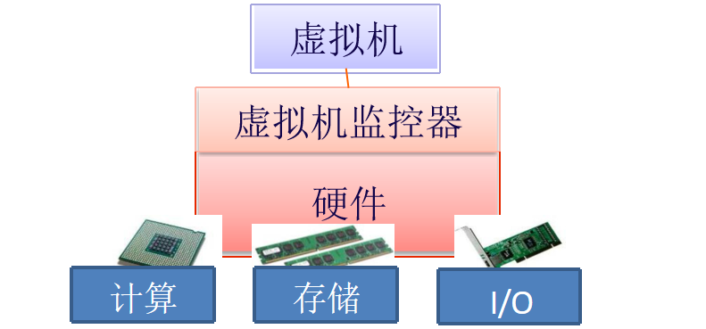

VMM需要完全控制系统资源

特权指令：操作和管理关键系统资源的指令（最高特权级/内核态）	 

敏感指令：操作全局资源的指令。例如修改虚拟机的运行模式获知 物理机的状态；读写敏感寄存器或者内存（时钟、中断寄存器）

- 特权解除：降低客户操作系统的特权级 别，而VMM运行在最高特权级	 

- 陷入-模拟	 当客户操作系统执行到特权 指令，才会陷入到最高特权 级的VMM模拟执行

虚拟化的要求：

1. 一致性：程序在虚拟机上的运行效果必须与物理机上的同程序的行为完全一  致。仅存在时间和可用资源带来的区别。
2. 高效性：机器指令中经常使用的那一部分应在没有VMM干预下执行。
3. 可控性：VMM对虚拟资源进行完全控制。

定理1：对于任何传统的第三代计算机，只要其敏 感指令是优先级指令的一个子集，就可以为其建  立VMM。
欲构造一个VMM，其充分条件是所有可能影响VMM正常工作的指令（即敏感指令）能够自陷并将控制  权移交给VMM。这就保证了资源控制；非特权指令则必  须（可以）被本地（物理机）执行——也就是更有效率地 执行。等价性也得到满足。

## 底层实现

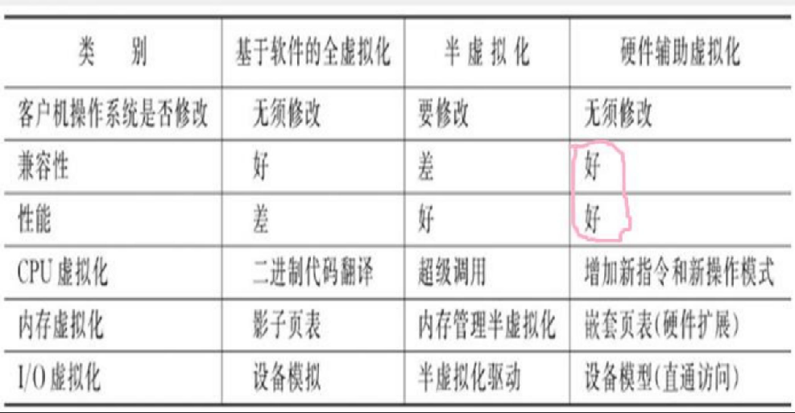

硬件辅助虚拟化

- 引入一种特殊的运行模式和指令，使得VMM和客户操作系统可运行在不同模式中，客户操作系统及其应用程序的所有敏感指令会陷入到VMM中    
- 不需要二进制翻译或半虚拟化

### CPU虚拟化

1. 虚拟CPU的正确运行是要保证虚拟机指令正确运行，现有的实  现技术包括模拟执行和监控执行
2. 调度问题是指VMM决定当前哪个虚拟CPU在物理CPU上运行   ,要保证隔离性、公平性和性能。

对于不同类型指令的处理：

1. 非特权指令直接在物理主机中运行
2. 关键指令分为三类：
   - 特权指令需要在特权模式中执行，当在特权模式之外执行特权指令时会发生陷入。
   - 控制敏感指令尝试改变使用资源的配置。
   - 行为敏感指令根据资源的配置情况会有不同的行为，包括在虚拟内存中进行的负载和存储操作。

VMM运行在管理模式时， CPU支持在用户模式运行虚拟机的  特权指令和非特权指令，则该CPU体系结构是可虚拟化的。

RISC的所有控制敏感指令和行为敏感指令都是特权指令，因此，RISC 的CPU体系结构是天然可虚拟化的。

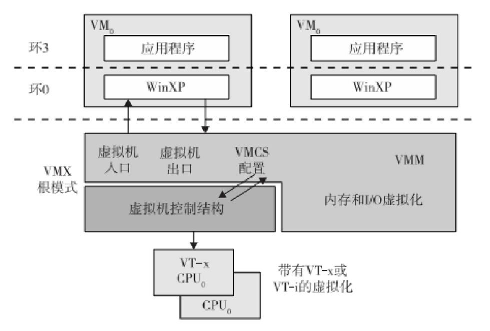

Intel为CPU引入了一种新的  模式，叫作VMX operation

- VMM执行的模式叫作VMX root operation模式
- VM执行的模式叫作VMX non-root operation模式

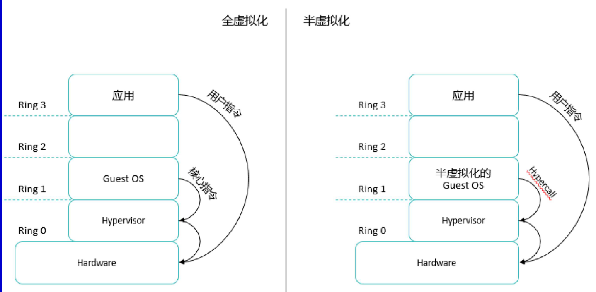

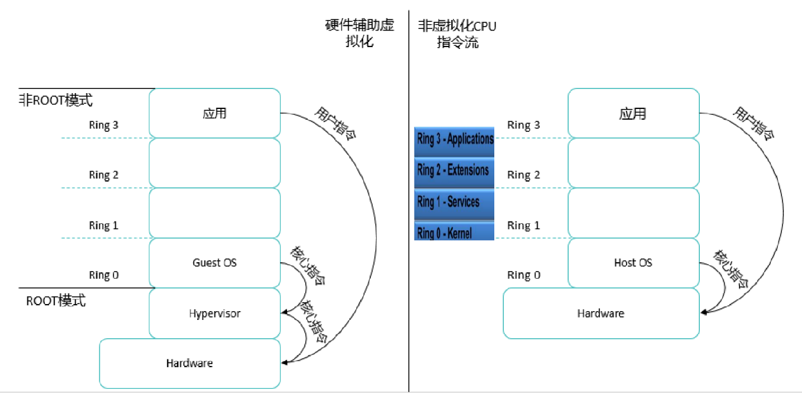

#### 多核CPU虚拟化

两个问题：一是应用程序编程者必须完全并行地使用 所有处理器核，二是软件必须明确地为处理器核分配任务。

在使用虚拟化的时候，可能实际用到的核比虚拟CPU少

| 物理核心                               | 虚拟核心                                       |
| -------------------------------------- | ---------------------------------------------- |
| 实际物理处理器核心                     | 一个操作系统可以看到比物理核心更多的虚拟核心。 |
| 负担更重，需要直接在核心上运行应用程序 | 硬件协助软件实现动态资源利用，软件设计更容易。 |
| 硬件不提供帮助，硬件设计更简单         | 硬件提供帮助，更复杂。                         |
| 资源管理较差                           | 资源管理更佳。                                 |
| 必须修改最低级别的系统软件             | 最低级别的系统软件无需修改。                   |

### 内存虚拟化

内存虚拟化技术把物理内存统一管理， 包装成多个虚拟的物理内存提供给若干虚拟机使用，每个虚拟机拥有各自独立的内存空间。

O.S.往往通过虚拟内存进行内存管理， 内存虚拟化需要对虚拟内存再进行虚拟化。

------

虚拟内存的管理包括3种地址：机器地址、物理地址、虚拟地址

两级映射：

- 客户操作系统仍旧负责从**虚拟地址**到虚拟机的**物理内存地址**的映 射
- VMM负责将**客户物理内存**映射到实际的**机器内存**上

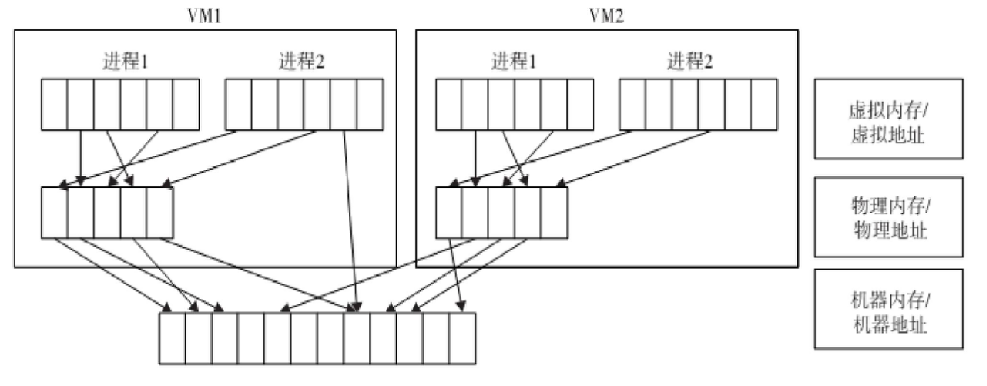

无虚拟机管理器：由MMU(Memory Management Unit)完成虚拟地址到物理地址的转换。

虚拟环境下：需要VMM再经过一次映射才能的得到机器地址。

解决办法：

1. VMM根据映射f和g生成的复合映射f.g，并直接将这个映射关系交给物理机器的MMU
   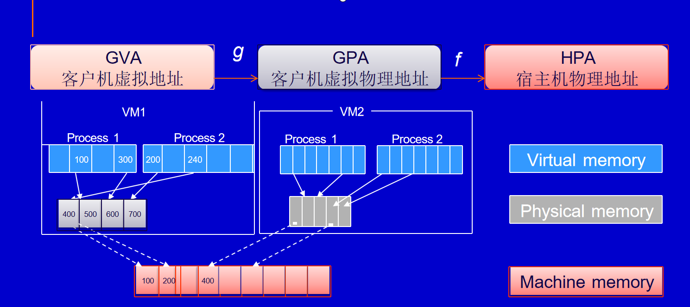
2. Intel采用EPT （扩  展页表） 的内存虚 拟化，在物理 MMU 中保存两个不同的页表，使得内存地址的两次映射 都在硬件中完成，进而达到提高性能的目的。

### I/O设备虚拟化

I/O设备虚拟化技术把真实的设备统一管理起来，包装成多个虚拟设备给若干个虚拟机使用，响应每个虚拟机的设备 访问请求和I/O请求。

需要实现：

1. 管理虚拟设备
2. 共享的物理硬件之   间I/O请求的路由选择

包含三种方式：

1. 全设备模拟: 一个设备的所有功能或总线结构（如设备    枚举、识别、中断和DMA）都可以在软件中复制。
2. 半虚拟化: 是Xen所采用的方法，是分离式驱动模型，由  前端驱动和后端驱动两部分构成。前端驱动运行在Domain U中，而后端驱动运行在Domain 0中，它们通过一块共享内存交互。
3. 直接I/O虚拟化: 让虚拟机直接访问设备硬件。它能获得  近乎本地的性能，并且CPU开销不高。

传统的IO访问：

1. I/O端口寄存器：被映射到I/O地址空间，通过IN/OUT指令访问
2. MMIO (Memory mapping I/O)寄存器：映射到物理地址空间，通过页表方式控制访问
3. 中断

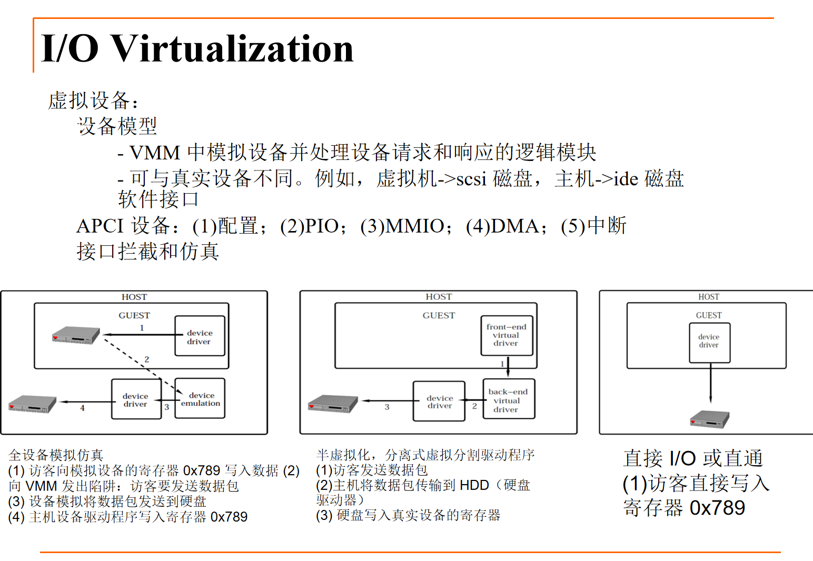

#### GPU虚拟化

当前可以商用的GPU虚拟化模式可以分为GPU直通模式、  GPU SR-IOV模式和GPU半虚拟化模式

- GPU直通模式， 没有对GPU功能性做任何限制，物理机的GPU驱动可以直接安装到 虚拟机内使用；缺点是不支持热迁移，在宿主机上不能操作设备，缺监控数据

- 当前只有AMD的两款GPU产品支持SRIOV(Single Root I/O Virtualization)  ,其本质是把一个PCI卡资源（PF/Physical Function/宿主机上的主设备）拆 分成多个小份（VF/Virtual Function），这些VF依然是符合PCI规范的endpoint设备

- GRID vGPU是NVIDIA的一项虚拟化技术，可以把一块GPU卡分片并分配 给虚拟机使用，和SR-IOV一样， 每个分片vGPU在物理上都是隔离的

下面是趋动科技的猎户座 （OrionX）AI 算力资源池化解决方案

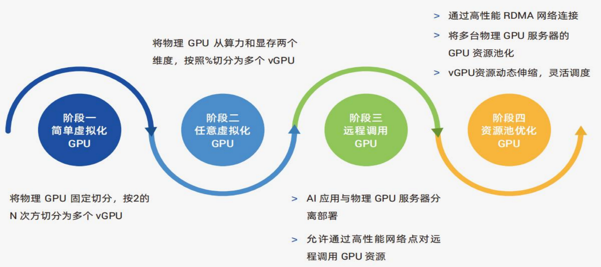

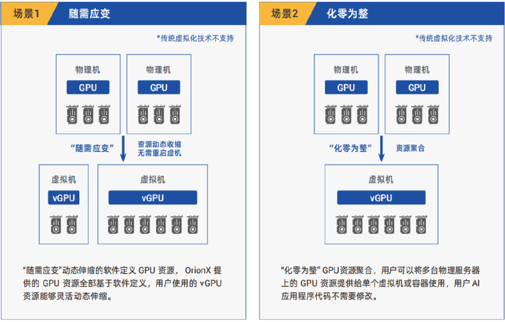

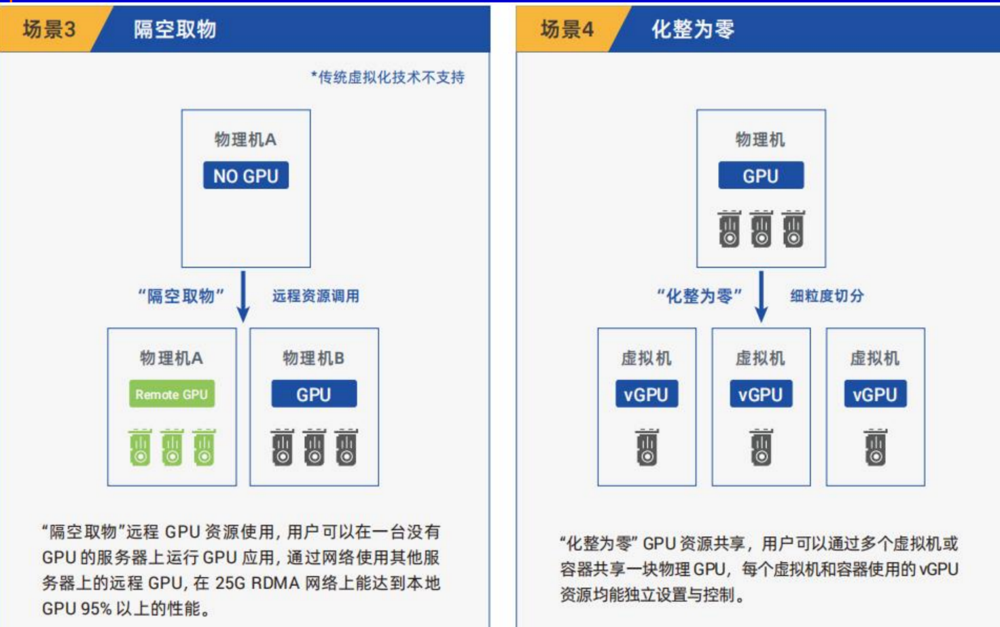

趋动科技的猎户座 （OrionX）AI 算力资源池化解决方案end

#### 网络适配器虚拟化

有三种虚拟化方法：

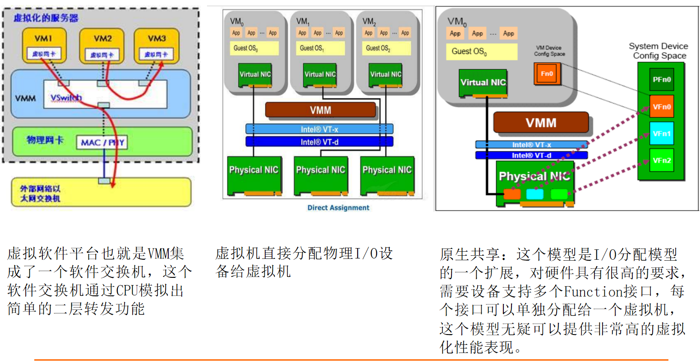

### 硬件辅助虚拟化（与上面3点无关）

硬件厂商不断开发新的硬件特性，旨在简化虚拟化技术，提高虚拟化性能和效率。第一代虚拟化技术包括Intel的VT-x和AMD的AMD-V，它们共同引入了一种特权模式，为虚拟机监视器（VMM）提供了更高的执行权限。此新模式使得特权和敏感调用可以直接进入虚拟化层，无需再进行二进制翻译或半虚拟化。

这些硬件特性还引入了一种重要的机制，用于保存虚拟机的状态，以便有效地进行虚拟化管理。在Intel的VT-x中，这个状态信息保存在虚拟机控制结构（VMCS）中，而在AMD的AMD-V中，它保存在虚拟机控制块（VMCB）中。

#### VT-x

VT-x
	   VMX 根操作：
	   完全权限，用于虚拟机监控器
	   VMX 非 root 操作：
	  非完全权限，用于客户软件
	   降低客户软件权限，不依赖环路
	   环路别名和环路压缩解决方案

虚拟机入口
- 从 VMM 过渡到虚拟机
- 进入 VMX 非 root 操作

从 VMCS 加载客户状态和退出标准
- 首次进入时使用 VMLAUNCH 指令 后续进入时使用 VMRESUME 指令

虚拟机退出
- 从客户机过渡到 VMM 时使用 VMEXIT 指令
- 进入 VMX 根操作
- 在 VMCS 中保存客户机状态
- 从 VMCS 加载 VMM 状态

-------------

虚拟机控制结构 (VMCS)

  VMCS 是内存中的控制结构
          - 每个处理器在任何时候都只有一个 VMCS 处于活动状态
    VMCS 有效载荷：

  - 虚拟机执行、虚拟机退出和虚拟机进入控制
  - 客户机和主机状态
  -  虚拟机退出信息字段
    VMCS 格式
  - VMPTRLD：建立指向所需 VMCS 的指针
  - VMREAD/VMWRITE：新的 VMCS 访问指令

> 相同： VMCS和虚拟寄存器的概念类似
>
> 不同：虚拟寄存器有软件控制， 而VMCS由CPU操作

几种Intel的IO虚拟化技术

1. Intel VT-d（直接I/O虚拟化技术）：
   - 增强虚拟机对物理设备的直接访问和控制。
   - 允许虚拟机直接与物理I/O设备通信，提高性能和效率。
2. Intel VMDq（虚拟设备队列）：
   - 提高多虚拟机环境中的网络性能。
   - 硬件级别管理和分发网络流量，实现带宽分配和隔离。
3. SR-IOV（单根I/O虚拟化）：
   - 允许物理I/O设备在多个虚拟机之间进行硬件级别的分区，每个虚拟机都可以获得直接而高效的访问。
   - SR-IOV通过创建虚拟功能（VFs）来实现，每个VF都表现为一个独立的物理设备，虚拟机可以直接与之通信，而无需经过VMM的干预。

## 虚拟化软件介绍

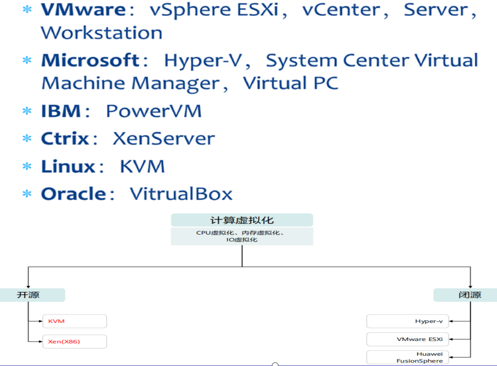

### XEN

- Xen是一个由剑桥大学开发的开源hypervisor程序。 
- Xen属于 微内核hypervisor  提供了一种客户操作系统可以直接访问物理设备的机制     	
- Xen提供了一个处于硬件和操作系统之间的虚拟环境 Xen系统的核心组件是hypervisor、内核和应用程序  
- 具有控制特权的客户操作系统称为Domain 0，其他客户操作 系统则称为Domain U 	
- Domain 0被首先启动。 Domain 0可以直接访问硬件和管理设 备。因此， Domain 0的一个任务是为所有Domain U分配和映射 硬件资源 

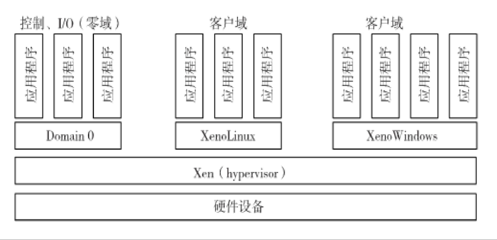

### KVM

不是从底层开始新写一个Hypervisor，而是基于Linux内核。

1. 通过加载新的模块使Linux内核变成一个Hypervisor。
2. 要求：x86架构及硬件支持虚拟化

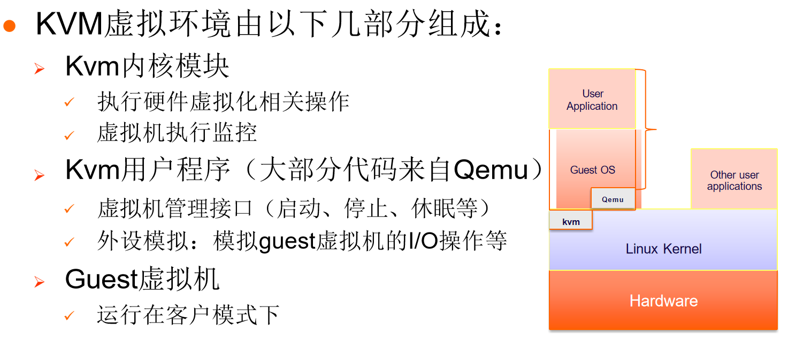

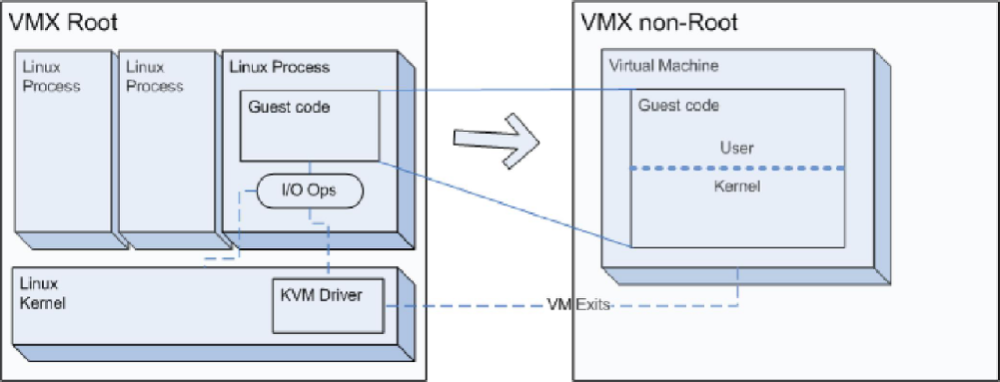

### Libvirt

Libvirt是用于管理虚拟化 平台的开源的API，后台  程序和管理工具。它可以 用于管理KVM、Xen、VMware ESX，QEMU和 其他虚拟化技术

### XEN和KVM的比较

## 虚拟机迁移与隔离技术

### 迁移技术

> 虚拟机可以从一台物理机器在线迁移至另一台物理机器。  发生失效时， 一个虚拟机可被另一个虚拟机替代。

一台虚拟机可能处于如下四种状态之一：

1. **非活跃状态**：虚拟机未启动或已停止，不占用系统资源。这是虚拟机的初始状态或已关闭状态。
2. **活跃状态**：虚拟机正在运行并占用系统资源，可以正常执行任务和处理请求。
3. **中止状态**：虚拟机的执行被中止，可能是由于某种错误或故障引起的，需要重新启动虚拟机才能继续运行。
4. **挂起状态**：虚拟机的当前状态被保存到磁盘，暂停了其运行，但保留了虚拟机的状态信息。可以在需要时恢复虚拟机的运行，继续执行。

虚拟机在线迁移的评价指标：

1. 微小的停机时间	 
2. 最低的网络带宽消耗	 
3. 合理的总迁移时间

------------

内存的迁移是虚拟机迁移最困难的部分

- 第一阶段， Push阶段。
- 第二阶段， Stop-and-Copy阶段。
- 第三阶段， Pull阶段。

实际上，迁移内存没有必要同时包含上述三个阶段， 目前大部分的迁移策略只包含其中的一个或者两个阶段。

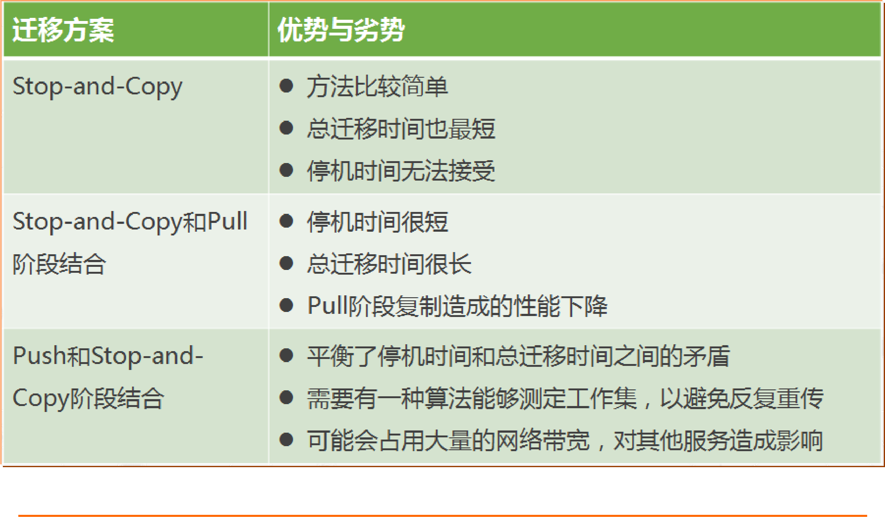

需要迁移的内容：

1. 内存迁移：将虚拟机的内存实例从一个物理节点迁 移至另一个物理节点	

2. 文件系统迁移：为每个虚拟机提供一个一致的、位置无关的、在所有物理主机上都可访问的文件系统
   （迁移存储设备的最大障碍在于需要占用大量时间和网络带宽，通常的解决办法是以共享的方式共享数据和文件系统， 而非真正迁移。）
   目前大多数集群使用NAS（Network Attached Storage，网络连接存储） 作为存储设备共享数据。	 NAS实际上是一个带有瘦服务器的存储设备，其作用类似于一个专用的  文件服务器。	 在局域网环境下， NAS已经完全可以实现异构平台之间，如NT、UNIX    等的数据级共享。	 基于以上的考虑， Xen并没有实现存储设备的迁移，实时迁移的对象必须共享文件系统。

3. 网络迁移：迁移虚拟机时应**维持所有开放的网络连 接**，不应依赖原始主机转发或者依赖移动性或重定  向机制的支持。	 
（在局域网内,可以通过发送ARP重定向 包,将VM的IP地址与目的机器的MAC 地址相绑定,之后的所有包就可以发送 到目的机器上）

在线迁移机制主要使用预复制的方法，首先传输所有的内存页，然后迭代地只传输上次传输过程中被修改的内存页

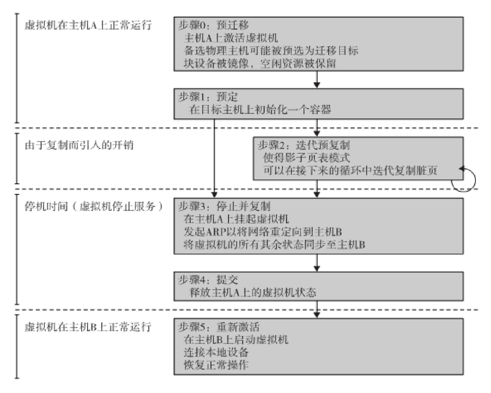

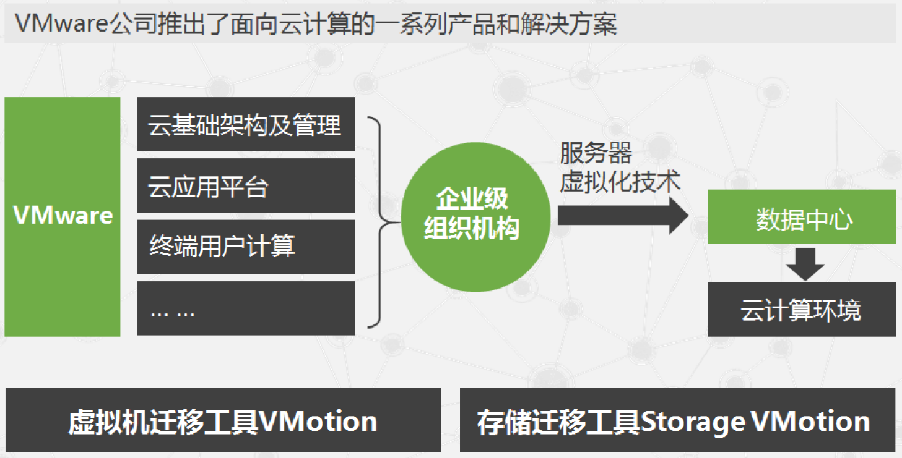

### 隔离技术

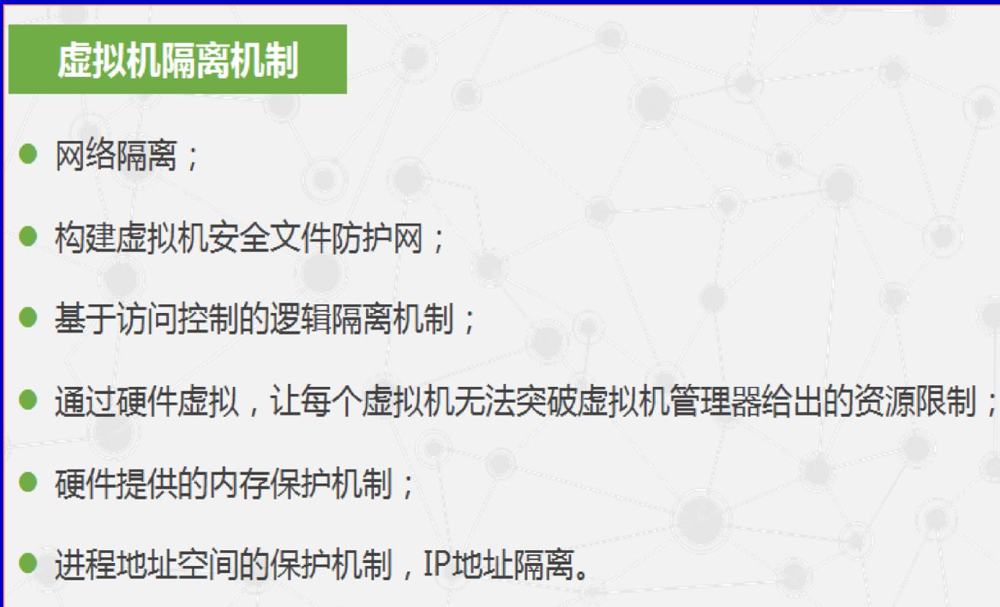

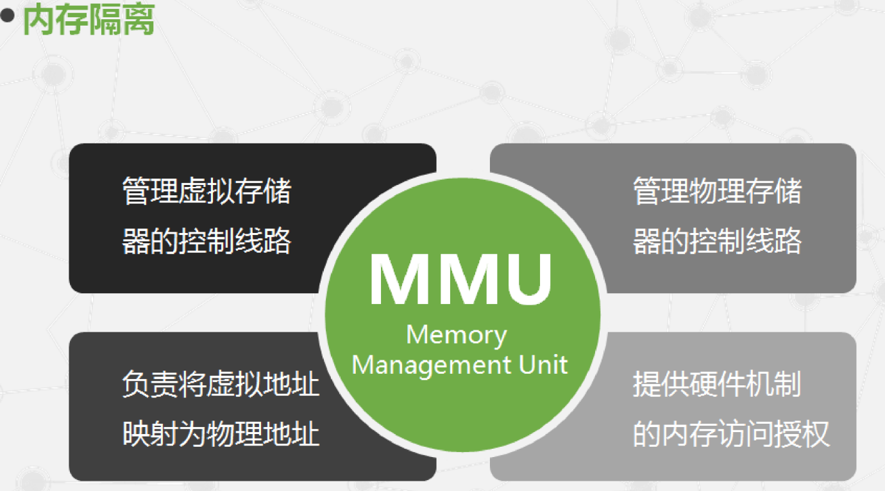

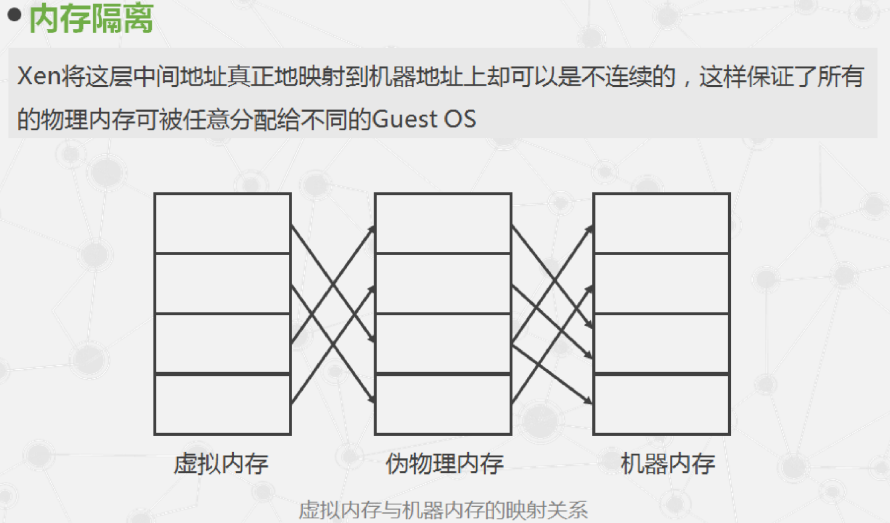

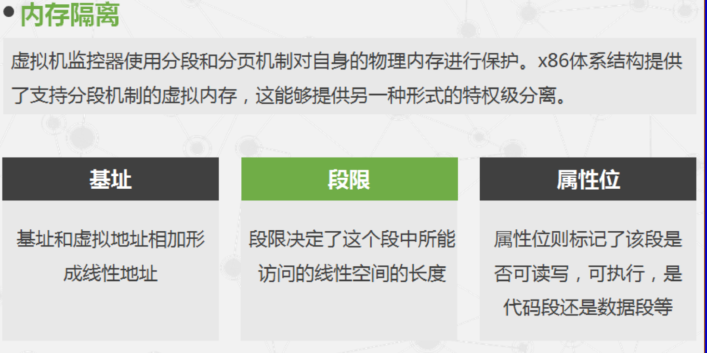

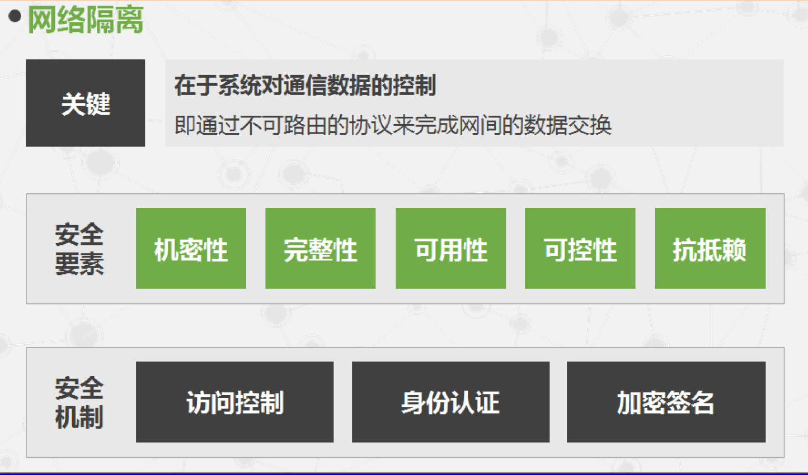

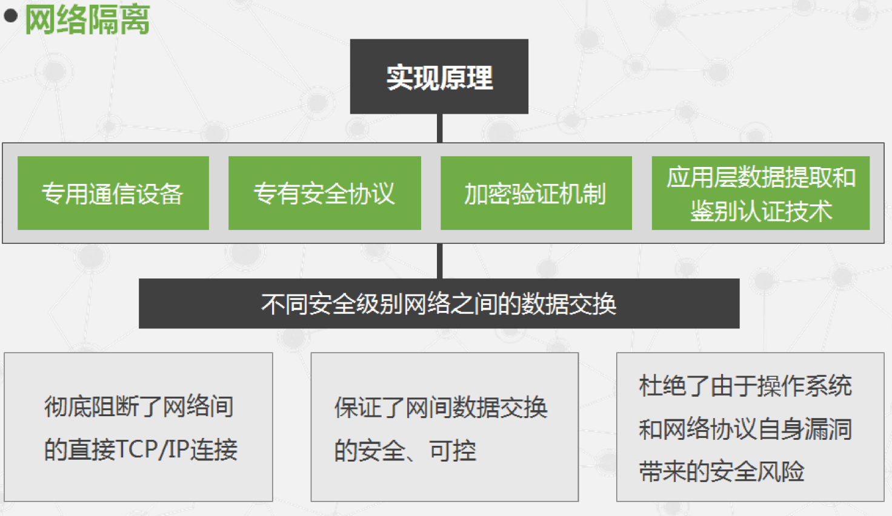

# 系统虚拟化技术应用

## 虚拟集群和资源管理

**虚拟集群**由多个客户虚拟机构成，这些客户虚拟机安 装在由一个或多个物理集群构成的分布式服务器上。在逻 辑上，处于一个虚拟集群的客户虚拟机通过一个跨越了多 个物理网络的虚拟网络互连在一起。

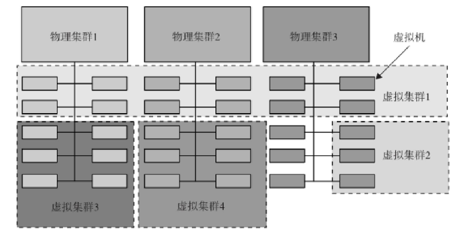

为虚拟集群提供虚拟机的过程可以动态进行：	 

1. 虚拟集群节点可以是物理机器或虚拟机器	 
2. 主机操作系统管理物理机器的资源，虚拟机运行其上，    并且可以运行与主机相异的操作系统。	 
3. 使用虚拟机的目的是合并同一台物理服务器的多个功能。	 
4. 虚拟机可以在多个物理服务器上备份，以提高分布式并行度、容错性，加快灾难恢复速度。	 
5. 虚拟集群的节点数可以动态增减，与P2P网络中覆盖网络的规模变化类似。	 
6. 物理节点的失效会使得运行在其上的虚拟机也失效，但是虚拟机的失效不会影响主机系统。

**系统应具备快速部署的能力。快速部署要求如下两点：**

1. 在集群内的物理节点上尽快构建和发布软件栈（包括操作系统、库、应用程序）
2. 运行时环境可以从一个用户虚拟集群快速切换至另一个用户虚拟集群

虚拟化的另一个优点是在虚拟集群中应用程序的负载均 衡。负载均衡可以通过使用**负载指数**和**用户登录频率**等指标来完成，虚拟集群的自动伸缩机制可以基于该模型实现。

## 虚拟化的应用场景

### 应用场景1——透明应用访问

用户仅关心软件执行效果，不关心如何安装、部署、维护软件、软件代码在哪执行、软件代码依赖何种操作系统。

### 应用场景2——软件容错执行

由于虚拟机可以快速实现迁移，所以具有较高的容错性。

### 应用场景3——独有计算环境

1. 一个独立的分布式计算环境
2. **快速部署和配置软件**：用户需要能够快速部署和配置所需的软件，无论是用于数据分析、科学计算、机器学习等领域。这可能需要一个自动化的部署和配置工具，以减少手动操作的工作量。
3. **记录和恢复环境状态**：为了方便用户记录和恢复整个计算环境的状态，需要一个环境管理系统，能够快速创建环境快照，并在需要时还原到特定的状态。这有助于确保实验和计算的可重复性。
4. **高可伸缩特性**：用户希望能够灵活地调整计算环境的参数，以满足不同工作负载的需求。这可能需要使用容器化技术，如Docker或Kubernetes，以便根据需求动态扩展或缩减计算资源。

#### 应用举例

分布式软件测试	 

软件教学实验	 

可伸缩Web Hosting