# 4.1-云计算数据中心

> 云计算数据中心——支撑云计算服务的数据中心。
>
> 数据中心往往是用大量服务器通过巨大的互连网络构建而成
>
> 

## 云数据中心设计与特征

### 相关概念

- 资源池 resource pool
  云计算数据中心提供的**物理或虚拟资源的聚合**。内部各资源池之间相互依赖相互支撑
- 弹性 elasticity
  云计算数据中心的**场地、设施和资源池按需分配、回收和调整**的能力
- 数据中心 data center
  由计算机场地、配套基础设施、信息系统硬件(物理和虚拟资源)、信息系统软件、信息资源(数据)和人员以及相应的规章制度组成的组织。
- 云计算数据中心 cloud computing data center
  支撑云计算服务的数据中心。

#### 资源池详细介绍

#### 电能使用效率

### 云计算数据中心规模巨大

数据中心通常由大量服务器通过庞大的互连网络构建而成，云计算的基础之一就是大规模的数据中心。

典型情况下，数据中心可以容纳从40万台到100万台不等的服务器。这种规模化的结构带来了成本效益，因为较大规模的数据中心通常拥有更低的单位成本。

**总结而言，数据中心的规模越大，单位成本越低。**

数据中心规模范围从“边缘”设施到超大规模（100K 到 1M 服务器）

同时，国内新建立的数据中心以大型和超大型为主。

### 云数据中心的几个特征

1. **高设备利用率**

   采用**虚拟化技术**进行系统和数据中心整合,优化资源利用率、简化管理。

2. **绿色节能**

   通过先进的**供电和散热技术**，降低数据中心的能耗。

3. **高可用性**

   当网络扩展或升级时，网络能够正常运行，对网络的性能影响不大。

4. **自动化管理**

   云数据中心应是24×7小时，无人值守并可远程管理的。

### 云计算数据中心的关键要素

### 云存储系统

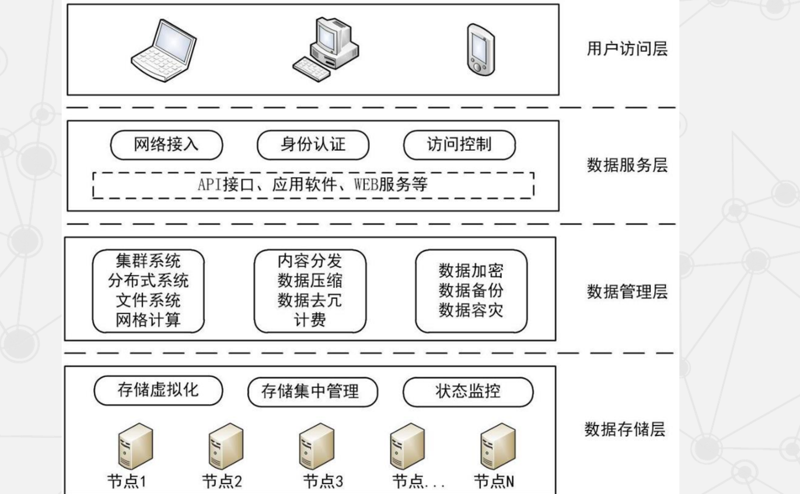

在云中存储的主要类型有三种：

1. 文件存储
2. 块存储
3. 对象存储、key-value存储

#### 常见的存储软件

• Ceph（分布式存储）对象存储、块存储和文件存储 -C++

• Redis（key-value数据库） -NoSQL支持每秒十几万次的读/写操作 -C语言

• Mongodb（内存数据库）-基于分布式文件存储的开源NoSQL数据库系统， C++

### 我国概括

## 云数据中心网络部署

### 需要满足的要求

数据中心关键的核心设计是数据中心集群中所有服 务器之间的互连网络，其中的网络设计必须满足5个特 殊要求：

1. 低延迟
2. 高带宽
3. 低成本
4. 消息传递接口（MP I） 通信支持
5. 容错

同时要满足：所有服务器节点之间的

- 点对点通信模式：在这种模式下，一个服务器节点直接与另一个服务器节点进行通信，就像两个节点之间建立了一个直接的连接。
- 群通信模式：在这种模式下，一个服务器节点可以同时与多个其他节点进行通信，形成一个群组或广播。

### 传统架构

### 不同的网络体系结构对比

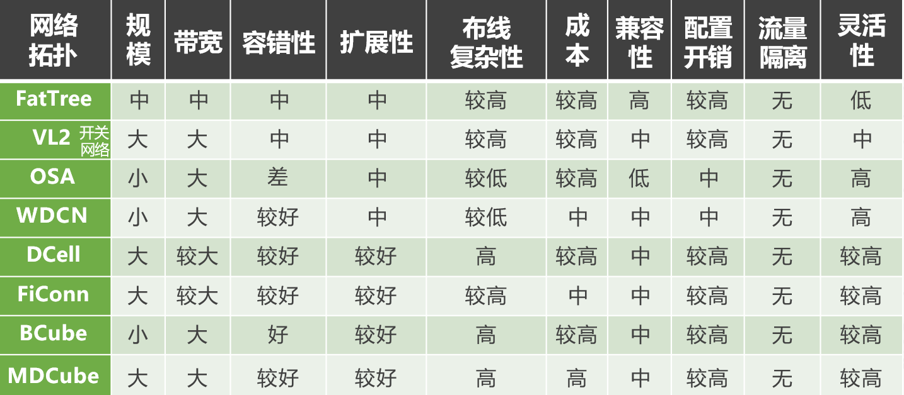

### 新型的网络部署架构

#### 改进型树结构--FatTree

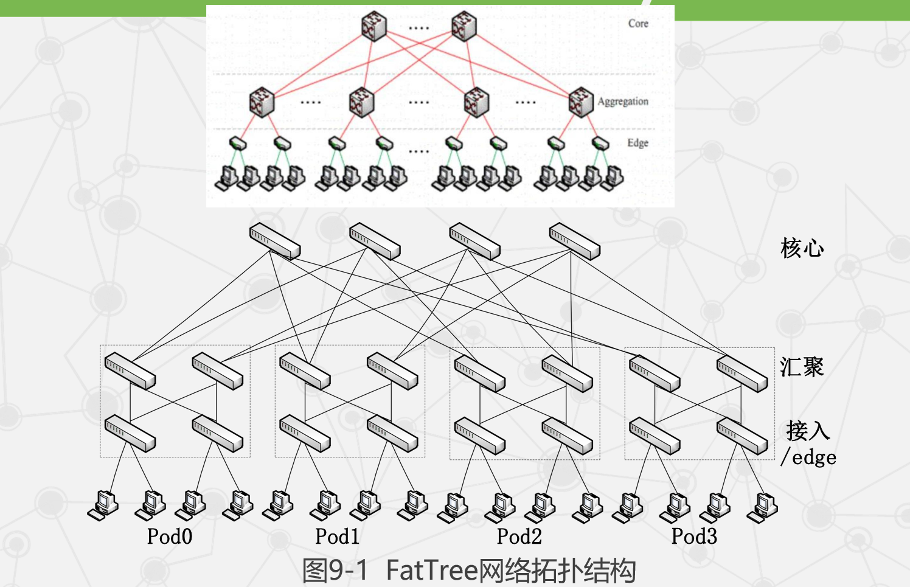

#### 递归层次结构

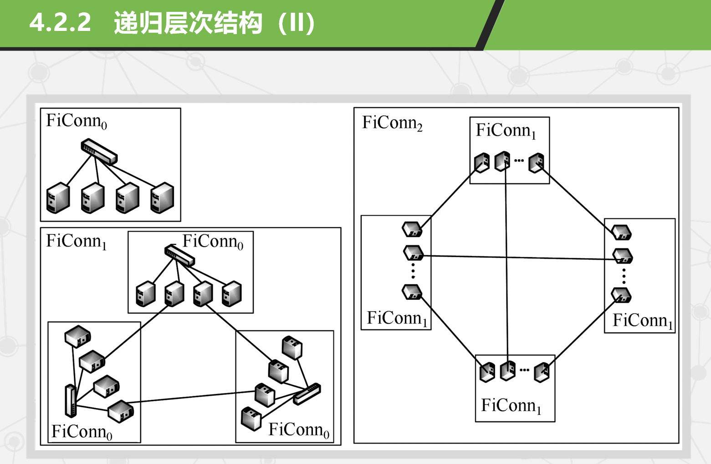

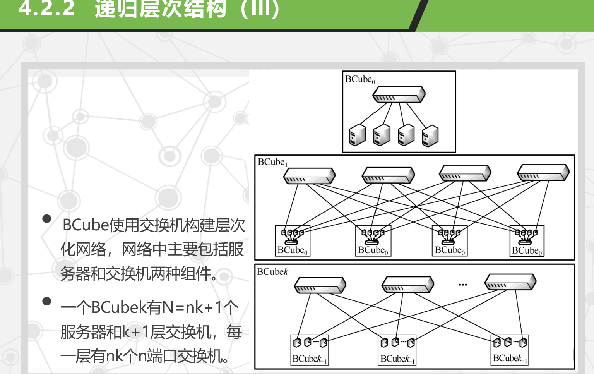

#### 光交换网络

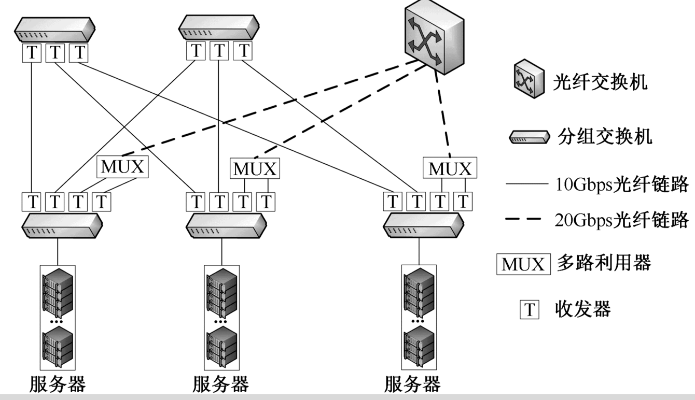

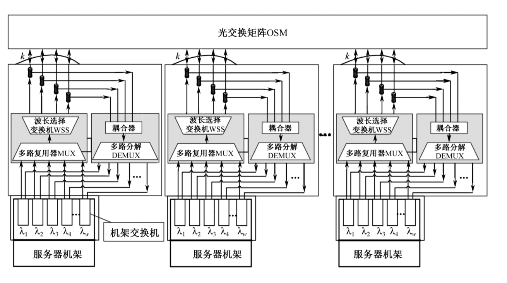

#### 无线数据中心网络

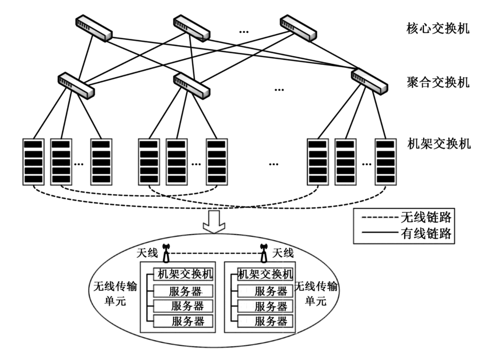

1. 优点：无线技术可以在不必进行重新布线的情况下灵活调整拓扑，省去了复杂的布线工作
2. 缺点、不足：
3. 但无线技术在提供足  够带宽的前提下，其传输距离是有限的，因而限制了其在大规模数据中心的部署。

#### 软件定义网络

分离控制平面和数据转发平面。传统网络中，网络设备（如交换机和路由器）通常集成了控制逻辑和数据处理功能，这使得网络管理和配置相对固定和复杂。SDN将这两个平面分离开来，控制平面负责网络管理和控制，而数据转发平面负责实际的数据包转发。
优点（Advantages）：

1. 灵活性：SDN允许网络管理员根据需要轻松配置和调整网络，以满足不同的应用需求。
2. 集中化管理：中心化的管理使网络更容易监控和维护。
3. 自动化：SDN能够自动响应流量和需求变化，提高网络效率。
4. **可编程性**：管理员可以使用软件定义网络的控制器来自定义网络行为。
5. 流量工程：SDN可实现流量工程以优化数据包的路由和传输。

缺点（Disadvantages）：

1. 安全风险：中心控制器成为攻击目标可能导致安全问题。
2. 高成本：部署SDN可能需要更高的初期投资。
3. 可扩展性：对于大规模网络，SDN可能需要更多的资源和规划。
4. 标准化问题：SDN标准仍在发展中，可能存在互操作性问题。
5. 服务器的处理性能可能制约其规模的发展。
6. 存在单点故障。

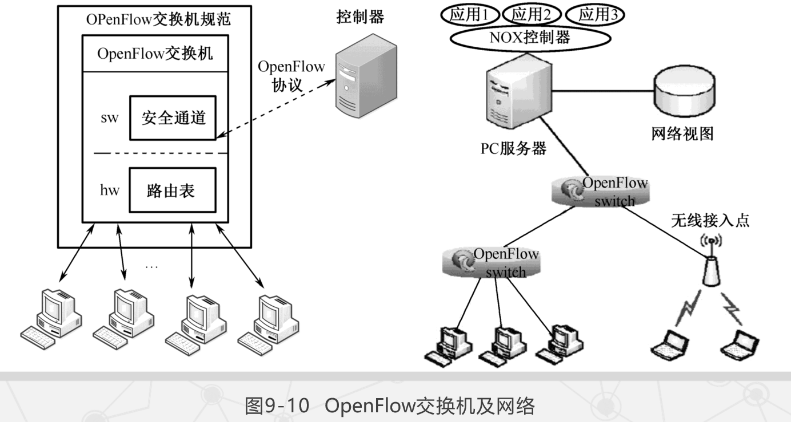

Google 在其广域网数据中心已经大规模使用基于  OpenFlow的SDN技术，通过10G网络链接分布全球的12个数据中心， 实现了  数据中心的流量工程和实  时管控功能， 使其数据中  心的核心网络带宽利用率  提高到了100% ，谷歌将自  己的SDN网络命名为为B4， 其网络结构图如图所示。

## 绿色节能技术

### 现状、电力消耗的计算公式

能耗分布

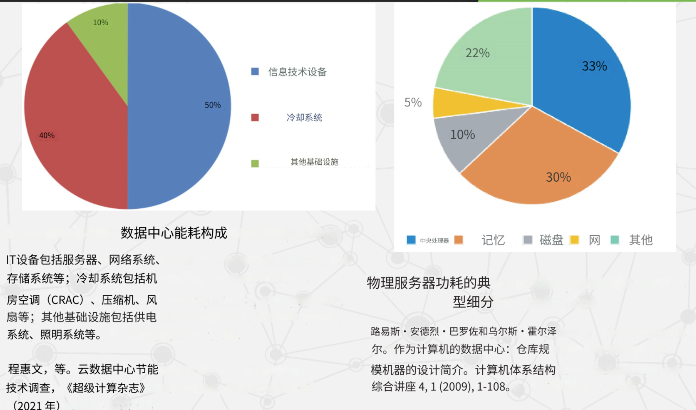

**如何进行电力成本估算：**

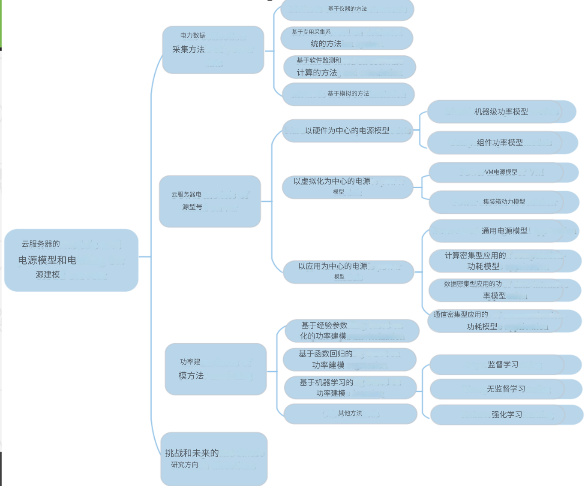

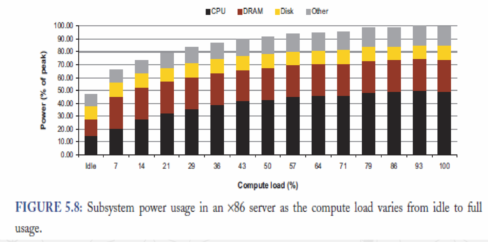

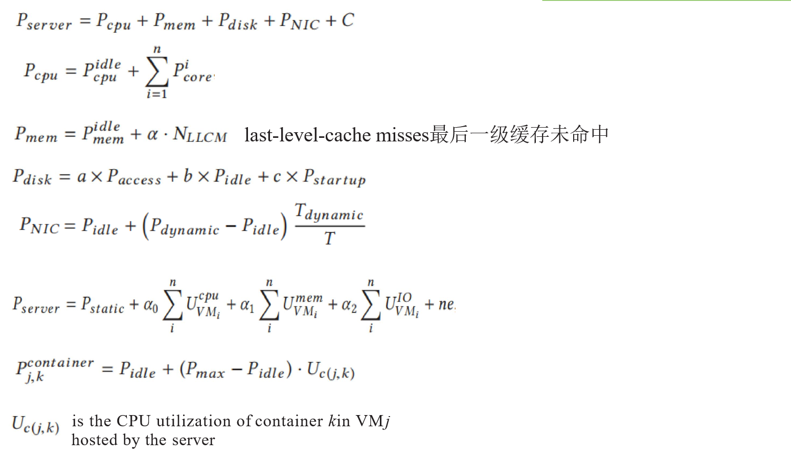

1. 能效比（EER）： 能效比是用来衡量制冷系统的效率的参数，它表示每消耗一单位电能，制冷系统能够移除多少热量。EER通常以以下公式表示：

   EER = 制冷量（BTU/h） / 功耗（瓦特）

2. PUE（Power Usage Effectiveness）： PUE是用来衡量数据中心的能效性能的参数，它表示数据中心的总能耗与计算设备的能耗之间的比值。PUE通常以以下公式表示：

   PUE = 总能耗 / 计算能耗

   这里的总能耗是数据中心的总电能消耗，包括冷却系统、照明、UPS等，而计算能耗是数据中心中用于运行计算设备的电能消耗。

3. SPUE（Site Power Usage Effectiveness）： SPUE是一种数据中心能效参数，考虑了数据中心的外部能源因素，例如供电系统的损耗。SPUE通常以以下公式表示：

   SPUE = 总能耗 / (计算能耗 + 非计算能耗)

   非计算能耗包括了数据中心运行所需的其他电能，但不包括计算设备本身的电能消耗。

4. 计算能耗（computation energy）： 计算能耗是指数据中心中用于运行计算设备的电能消耗，通常以瓦特（W）为单位表示。计算能耗直接影响数据中心的性能和能效。

5. 总能耗（Total Energy）： 总能耗是数据中心的总电能消耗，包括了计算能耗、冷却系统的电能消耗以及其他非计算设备的电能消耗。它是数据中心运行的总能量消耗。

### PUE - Power Usage Effectiveness

2006年ChristianBelady提出了数据中心能源利用率（PUE）的概念，如今， PUE已发展成为一个全球性的评价数据中心能源效率的指标。

基准是2，比值越接近1，表示数据中心的能源效率越高。

### 绿色节能技术

#### 配电系统节能技术

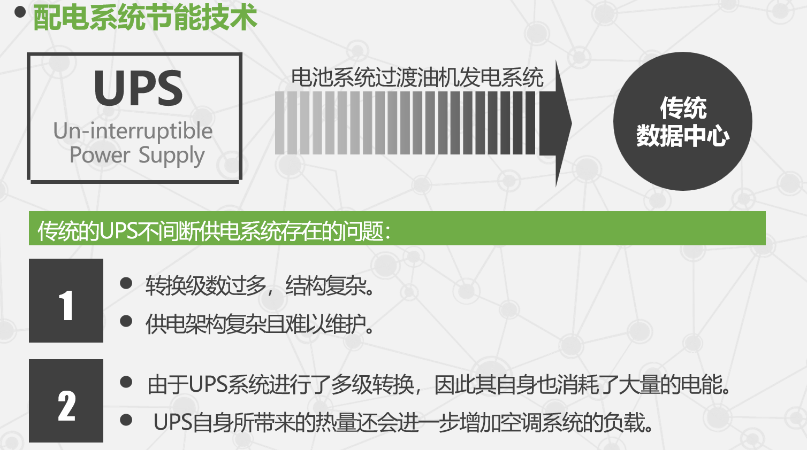

#### 空调系统节能技术

在数据中心运行过程中，服务器节点、网络设备、办公环境等时刻产生着热量，如果不能及时散发热量，数据中心将无法运行。

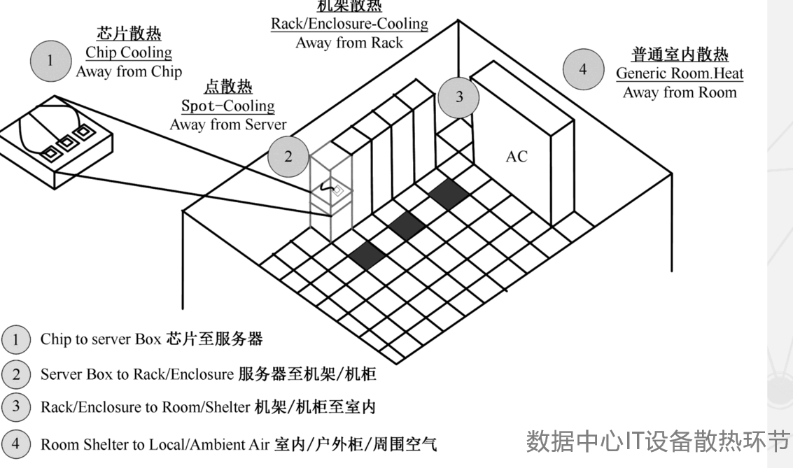

**解决的核心理念：注重IT设备的温湿度要求，高效解决区域化的制冷。——是机架级别甚至是IT设备级别的制冷解决方案，而非着眼机房环境温湿度控制。**

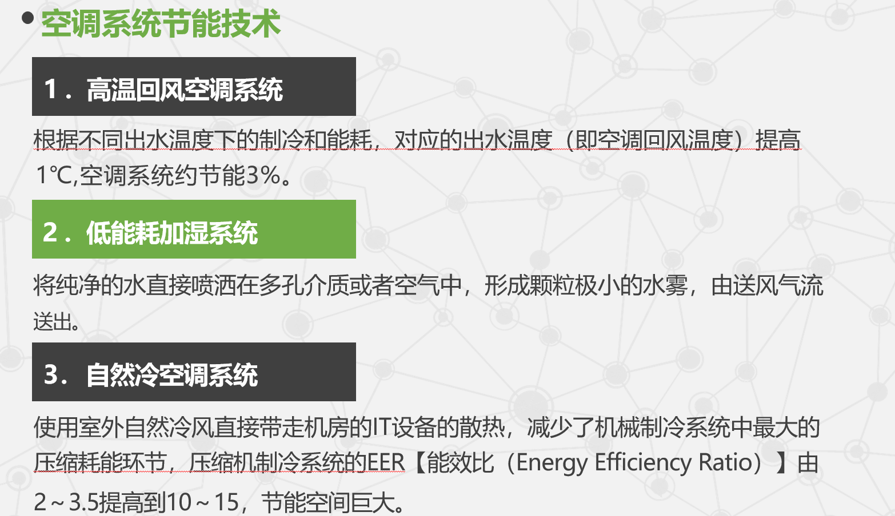

#### 集装箱数据中心节能技术

#### 数据中心节能策略和算法研究

#### 新能源的应用

#### 典型的绿色节能数据中心

## 自动化管理

## 容灾备份

