# 4.2-OpenStack

2010年7月份正式成立了OpenStack项目。OpenStack既是一个社区，也是一个项目和一个开源软件，其主要目标是提供一个部署云的操作平台或工具集，本质上是一个云操作系统。它的使命是帮助组织运行虚拟计算或存储服务的云，无论是公有云还是私有云，都能够获得可扩展和灵活的云计算解决方案。

在OpenStack项目的最初阶段，Rackspace和NASA是最重要的两个贡献者。Rackspace贡献了“云文件”平台代码（Swift），这一贡献增强了OpenStack的对象存储部分的功能。而NASA则带来了“Nebula”平台，形成了OpenStack的其他组成部分。这两家公司的贡献为OpenStack的起步打下了坚实的基础。

如今，OpenStack基金会已经拥有150多个会员，其中包括许多知名的公司，例如IBM、HP、DELL等。这些公司的加入进一步强化了OpenStack项目的发展和影响力，使其成为一个广泛支持和使用的开源云计算平台。

总的来说，OpenStack项目的成立和发展是为了满足云计算领域不断增长的需求，提供了一个开放、灵活和可扩展的解决方案，为组织和企业提供了构建和管理云计算环境的工具和平台。

## OpenStack介绍

OpenStack 是一种云操作系统，可控制整个数据中心的大型计算、存储和网络资源池，所有资源都通过 API 或仪表板进行管理。

用户能够通过Web界 面、命令行或API接 口（开发者）配置资 源。


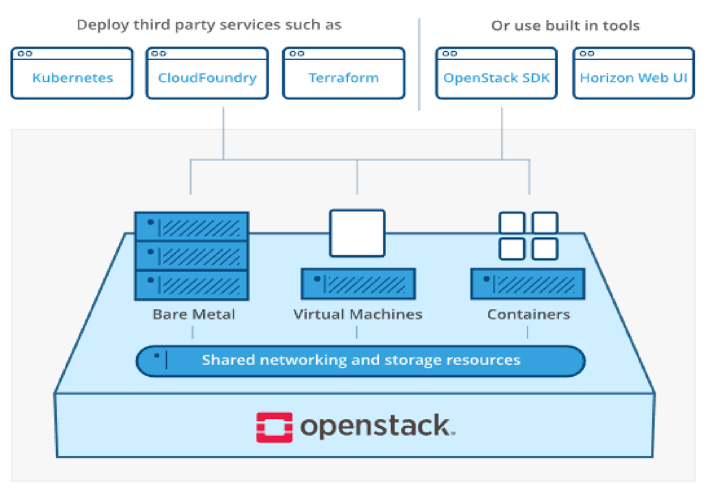


### 用途

1. **软件开发（Software Development）：** OpenStack云提供了强大的计算和资源管理能力，使其成为许多软件开发团队的首选平台。开发人员可以在OpenStack云中创建和管理虚拟机、容器等环境，以进行应用程序开发、测试和部署。这种灵活性和可伸缩性使其成为开发人员的理想选择，可以根据项目需求动态分配资源。
2. **基础设施云服务（Infrastructure as a Service - IaaS）：** OpenStack最初是作为IaaS平台而创建的，因此它在提供基础设施云服务方面表现出色。用户可以使用OpenStack云来管理虚拟机、存储、网络等基础设施资源，以构建和扩展自己的IT基础设施。这种能力对于企业和组织来说非常重要，可以根据需要灵活地扩展或缩减资源。
3. **Web服务和电商（Web Services and E-commerce）：** 在OpenStack云中托管Web服务和电子商务应用程序是常见的用例。互联网公司、电子商务平台和网站运营商使用OpenStack来部署和管理他们的在线应用程序。这包括虚拟机和容器的管理，以确保应用程序的高可用性和性能。OpenStack的可伸缩性和自动化特性使其适用于处理高流量的Web服务和电商业务。

### 其是开放的

代码开源（**Apache****2.0** **License**）

- 开放设计（半年开一次设计峰会）
- 开放开发（**Github**管理代码）
- 开放社区（邮件列表， IRC Internet Relay Chat ）
- 定期发布版本（半年**1**次）
- 约**70%**的代码（核心逻辑）使用**Python**开发


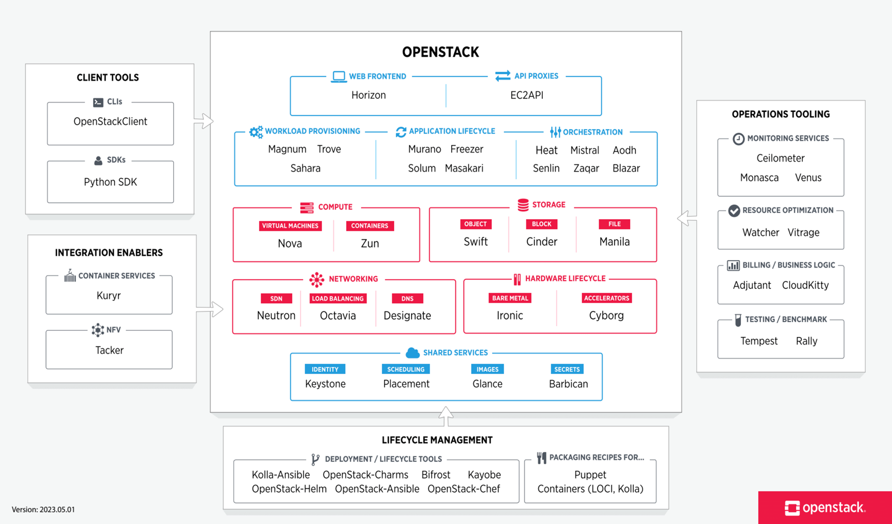

### 传统服务在OpenStack中的实现

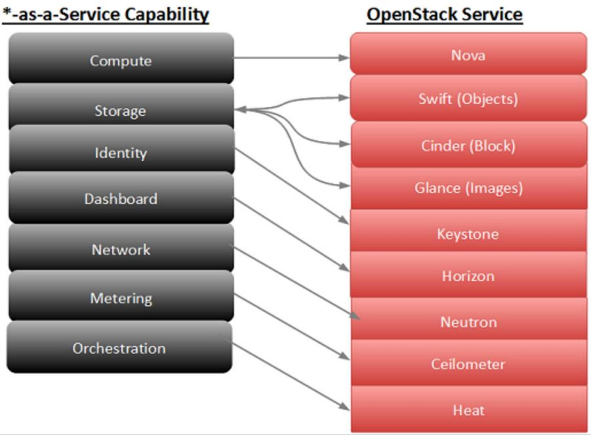

- Metering——计量
- Orchestration——编排

### 基本架构

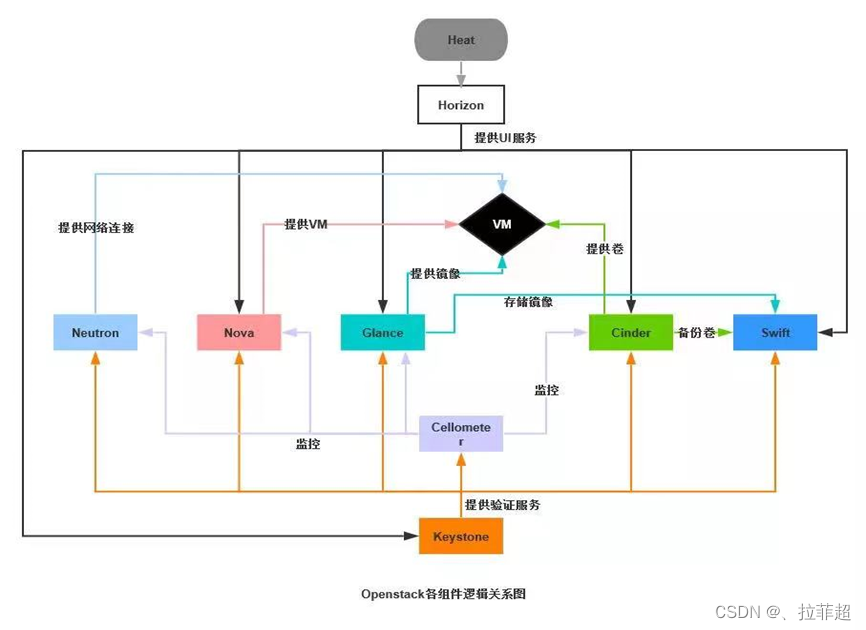

在OpenStack中，Nova被视为核心组件，负责处理工作负载的流程。这些工作负载通常需要某种形式的持久存储，可以是基于块的（Cinder）或基于对象的（Swift）。此外，Nova还需要镜像来启动实例，而Glance负责处理这个请求，并且它可以选择性地使用Swift作为其存储后端。

在OpenStack生态系统中，这三个关键元素（Nova、Cinder或Swift、Glance）相互协作，以支持系统中的所有组件。Nova管理计算实例，Cinder或Swift提供持久存储，而Glance处理镜像。这三个组件共同构成了OpenStack的计算部分。

另外，还有两个重要的组件：

1. **Horizon：** Horizon是OpenStack的图形用户界面，管理员可以轻松地使用它来管理所有项目和资源。它提供了直观的可视化工具，使管理变得更加便捷。
2. **Keystone：** Keystone负责处理授权和用户管理。它是OpenStack的身份认证服务，确保只有授权用户可以访问系统资源。

此外，还有一个名为Neutron的组件，它负责定义和管理提供组件之间连接的网络。Neutron确保各个OpenStack组件之间的通信顺畅，从而构建出一个完整的云计算环境。

----

### 独立性&集成

OpenStack的架构一直致力于使每个项目尽可能独立，这样用户可以根据自己的需求选择部署一个**功能子集**，并将其与提供**类似或互补功能的其他系统和技术进行集成**。这种灵活性和可扩展性是OpenStack的一大优势，允许用户根据特定的用例和要求来构建他们的私有云环境。

然而，需要明确的是，尽管OpenStack项目的各个组件可以独立运行，但在实际部署中，一个全功能的私有云很可能需要使用几乎所有功能才能正常运作。这是因为不同的组件之间存在紧密的依赖关系和集成需求。例如，Nova管理计算实例，这些实例通常需要持久存储，而这就需要Cinder或Swift来提供。同时，镜像的管理由Glance负责，而Keystone则管理着用户的授权和身份验证，Neutron定义了网络连接，而Horizon提供了用户界面，用于管理所有项目。

因此，在构建一个全功能的私有云时，各个元素需要被紧密地集成，以确保整个系统的协同工作和高效运行。虽然OpenStack提供了灵活性，但要满足复杂的云计算需求，通常需要各个组件的协同工作和集成。这也强调了在部署OpenStack时需要考虑综合性和整体性的因素，而不仅仅是单个组件的独立性。


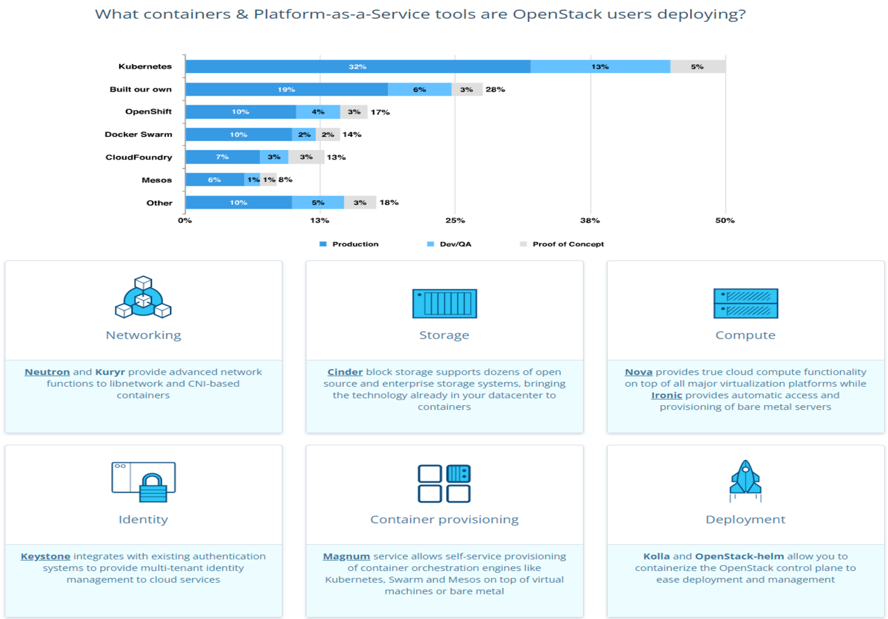

### **OpenStack**不是虚拟化&不是云计算

不是虚拟化：

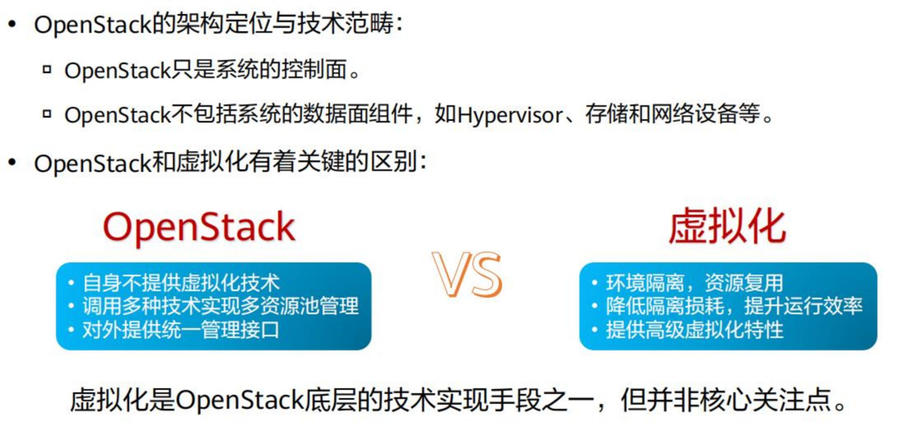

不是云计算

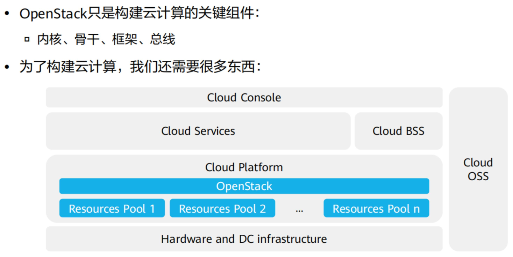

注：

1. **云服务（Cloud Service）：** 云服务是指通过云计算技术提供的各种在线服务和资源。这些服务包括计算、存储、数据库、网络、应用程序等，用户可以通过互联网访问和使用这些资源，而无需拥有自己的物理服务器或基础设施。
2. **云BSS（Cloud Business Support System云业务支持系统）：** 云BSS是指业务支持系统的云化解决方案，通常在电信和服务提供商领域使用。它包括管理客户账户、计费、客户关系以及业务流程等功能，帮助提供商更灵活地提供和管理服务。
3. **云OSS（Cloud Operations Support System云运营支持系统）：** 云OSS是指运营支持系统的云化解决方案，通常用于电信和网络服务提供商。它包括网络监控、故障管理、性能管理等功能，帮助提供商有效地运营和维护其网络基础设施。
4. **数据中心基础设施（Data Center Infrastructure）：** 数据中心基础设施是指用于支持计算、存储和网络设备的物理和逻辑资源。这包括服务器、存储设备、网络设备、电源和冷却系统等。数据中心基础设施是云计算和云服务的关键组成部分，它提供了可靠的基础设施来托管云服务和应用程序。

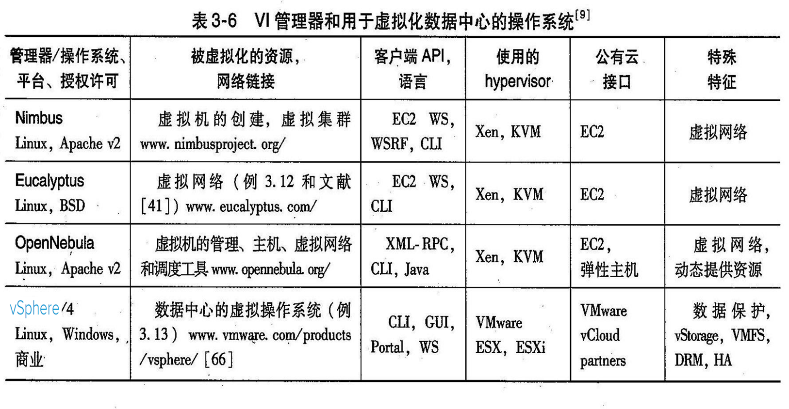

## OpenStack应用实例

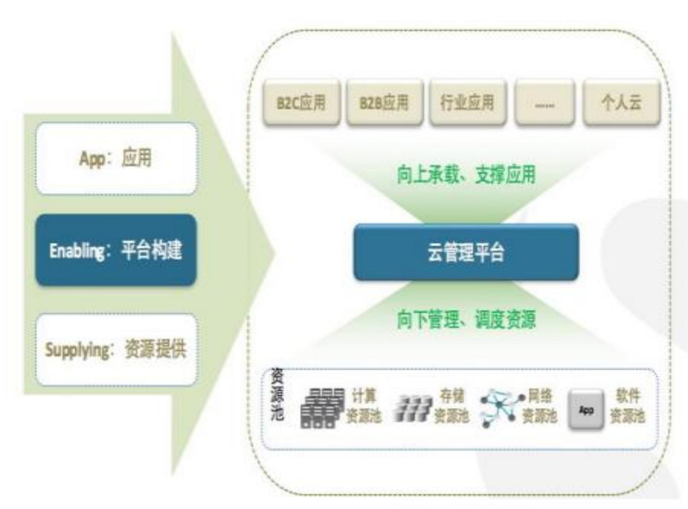

- **NASA**、欧洲核子物理研究所、美国富国银行、 **Paypal**、宝马

- 国内的腾讯、携程、苏宁、天河二号（**6000**多个节点）等案例

互联网时代，沃尔玛的电子商务业务也迅猛发展， Walmart Global eCommerce选择了OpenStack做为基础平台，支撑沃  尔玛的全球电子商务业务(Walmart Global eCommerce)与其他大型OpenStack部署不同的是，沃尔玛用OpenStack支撑的是真正关键的大规模生产系统，在2014年的感恩节日期间  , Walmart.com在美国的整个生产流量（交易平台）是跑在OpenStack环境下的（10万CPU核， Havana版）， 15年升级   到Juno版， Walmart.com网站100%云端原生架构， 20万core   。17年21万3千core 。21年超过百万OpenStack28/128

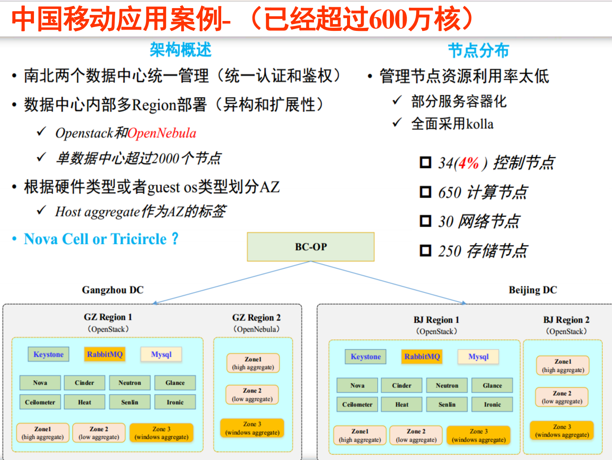

Kolla是一个开源项目，旨在简化和自动化OpenStack云平台的部署和管理。它提供了一组工具和Docker容器化的OpenStack服务，以便快速、可靠地部署和运行OpenStack云环境。

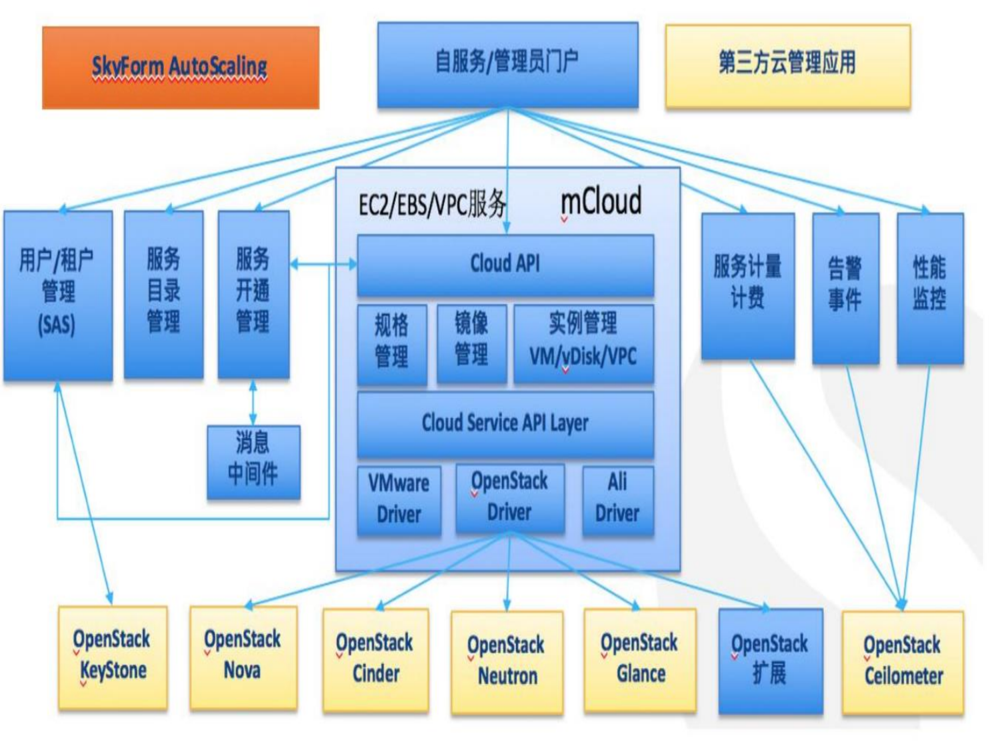

在开源社区，腾讯云TStack产品全方面得到业界认可，不仅斩  获了OpenStack 2017年度Superuser大奖，还获得了云计算开  源产业联盟混合云最佳用户奖和技术创新奖。

  腾讯云TStack是腾讯推出的私有云平台，具备高稳定性、统一  管理、可视化运营等特点

  目前，腾讯云TStack在腾讯内部的使用已经涵盖4个地区(深圳  、上海、天津、成都)、7个机房、 14个Openstack集群。总共  有6000个节点，支持约1亿用户。腾讯声称其可用性为99.99%

-服务于腾讯内部多种线上环境， 300多条业务线；

-TStack平台同时也承载着腾讯内部各产品线的开发测试服务，  比如微信， QQ，浏览器，游戏等

## **OpenStack**的架构详解

### 作用、用途

OpenStack能帮我们建立自己的IaaS

a)允许应用拥有者注册云服务，查看运行和计费情况;
b)允许Developers/DevOpsfolks创建和存储他们应用的自定义镜像;
c)允许他们启动、监控和终止实例;
d)允许Cloud Operator配置和操作基础架构

> a) **应用拥有者（Application Owner）：** 应用拥有者拥有注册云服务的权限，可以查看其应用在云中的运行情况和计费信息。他们通常是组织中的业务负责人或应用程序的所有者，关心应用程序的性能和成本。
>
> b) **开发人员/DevOps人员（Developers/DevOpsfolks）：** 开发人员和DevOps人员具有创建和存储自定义镜像的权限。他们可以构建和维护应用程序所需的镜像，确保应用程序的部署和更新是高效的。此外，他们还可以启动、监控和终止云实例，以管理应用程序的生命周期。
>
> c) **云操作员（Cloud Operator）：** 云操作员的职责是配置和操作云基础架构。他们负责确保云平台的可用性、性能和安全性。这包括管理虚拟化环境、网络设置、存储资源等。云操作员通常是IT运维团队的一部分，负责维护云基础设施的正常运行。

### 架构

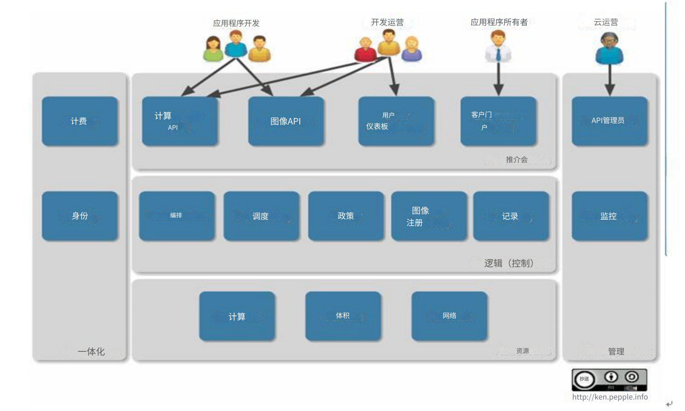

展示层，组件与用户交互，接受和呈现信息。Web portals为非 开发者提供图形界面，为开发者提供API端点。如果是更复杂的 结构，负载均衡，控制代理，安全和名称服务也都会在这层
	
逻辑层为云提供逻辑(intelligence)和控制功能。这层包括部署(   复杂任务的工作流)，调度(作业到资源的映射)，策略(配额等等)  ,镜像注册image registry(实例镜像的元数据)，日志(事件和计 量)
	
资源层。既然这是一个compute云，我们就需要实际的compute、network和storage资源，以供应给我们的客户。该  层提供这些服务，无论他们是服务器，网络交换机，NAS(network attached storage)还是其他的一些资源.

----

终端用户(DevOps, Developers 和其他的 OpenStack 组件)通 过和nova-api对话来与OpenStack Compute交互

OpenStack Compute守护进程之间通过队列(行为)和数据库(信息)来交换信息，以执行API请求


OpenStack Glance基本上是独立的基础架构， OpenStack      Compute通过Glance API来和它交互


逻辑**/**组件架构到概念**/**功能架构映射

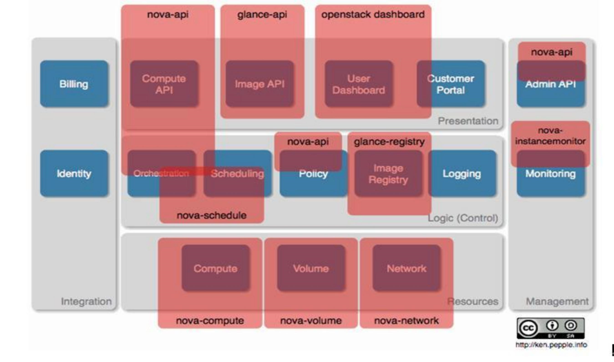

### Compute物理架构

OpenStack Compute（通常称为Nova）的物理架构可以根据部署需求分为不同类型的配置，这些配置包括：

a) **单结点配置（Single Node）：** 在单结点配置中，所有的Nova服务都运行在一台服务器上，并且这台服务器也负责驱动虚拟实例。这种配置通常用于尝试OpenStack Compute或为了开发和测试的目的。它适合小规模的部署，但不适合生产环境。

b) **双结点配置（Two Nodes）：** 在双结点配置中，有一个云控制器（Cloud Controller）结点，负责运行除了nova-compute之外的所有Nova服务，另外有一个compute结点，专门运行nova-compute服务。这种配置通常用于概念验证和开发环境的证明。客户计算机可能需要与服务器进行交互，例如打包镜像，但这不是必需的。

c) **多结点配置（Multi Nodes）：** 多结点配置允许您将nova-compute服务部署在一台或多台额外的服务器上，并通过复制nova.conf文件到这些新增的结点来扩展基础架构。您可以在双结点的基础上添加更多的compute结点，从而形成多结点部署。在更复杂的多结点部署中，还可以增加一个卷控制器（Volume Controller）和一个网络控制器（Network Controller）作为额外的结点。这种配置适用于需要大规模处理能力的场景，至少需要4个结点是最佳选择。


提供商网络选项以最简单的方式部署 OpenStack 网络服务，主要使用第 2 层（桥接/交换）服务和 VLAN 网络分段。本质上，它将虚拟网络桥接到物理网络层（路由）服务。   此外，DHCP 服务还为实例提供 IP 地址信息。

### 部署方式

多服务器部署1


多结点的部署架构2

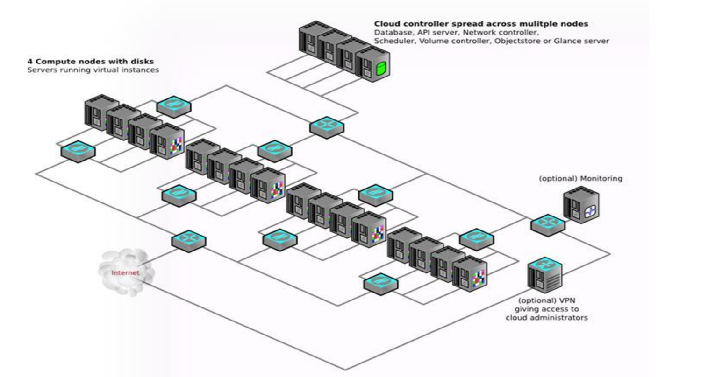

华为的部署


Web Applications

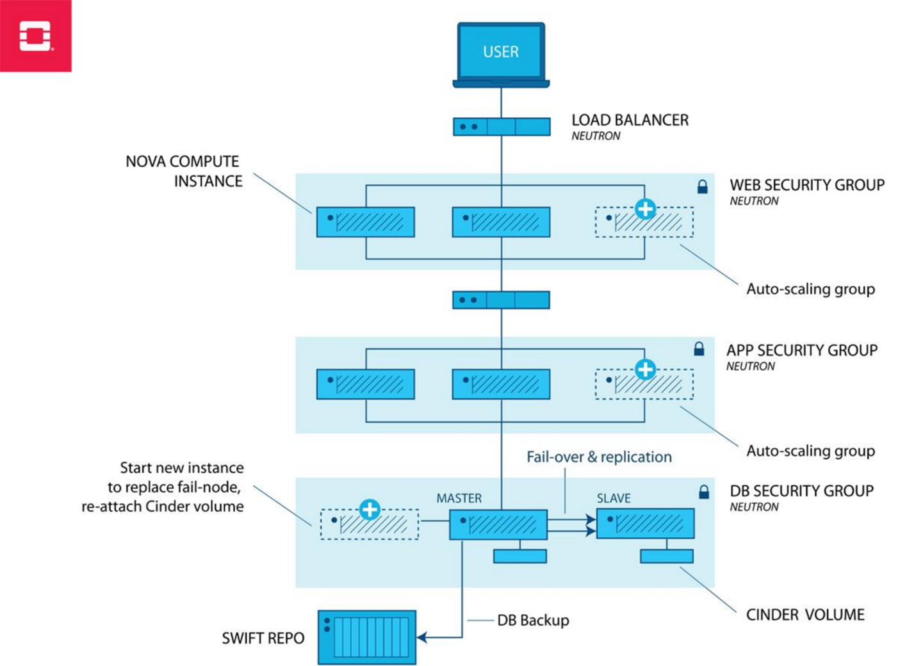

电子商务


## 安装配置

### 概述

OpenStack是**一套**用来管理虚拟机的平台软件。它不 是一个单一的软件，而是集成了很多个组件用来协同  合作。
简单来说，譬如有十台服务器， 在VMware的情况下  ,我们在每台服务器上安装esx或者esxi*（ESXi是VMware的当前主推虚拟化平台，因为它更加精简、安全，且性能较高。ESX仍然在某些环境中使用，但在新的部署中，ESXi更为常见。这两者都用于创建和管理虚拟机，）*，然后装一台 vcenter（由VMWARE提供，vCenter 可以管理多个 VMware vSphere 主机），在vcenter的管理界面里把十台服务器的esx通过域名或者ip加入，就能在vcenter里面统一管理。

### 具体的部署方法

**步骤 1 - 网络和依赖包准备：**

- 安装网桥软件 `bridge-utils`。
- 配置网络接口，通常一个用于外网连接（例如 eth0），另一个用于连接节点之间的虚拟网络（例如 eth1），这些虚拟网络通过一个交换机连接。
  （好处：内部节点  和控制器的流量都走br100的交换机，而不会影响虚拟机上的应 用使用的网络）
- 安装消息队列组件和网络时间协议（NTP）服务，如 `rabbitmq-server` 和 `ntp`。
- 安装 MySQL 数据库服务器和相关 Python 库。
- 安装 Python 依赖项，如 `python-greenlet` 和 `python-mysqldb`。

**步骤 2 - 安装 Nova 和 Glance 组件：**

- 安装 Nova 组件，包括 `nova-volume`、`nova-vncproxy`、`nova-api`、`nova-ajax-console-proxy`、`nova-doc`、`nova-scheduler`、`nova-objectstore`、`nova-network` 和 `nova-compute`。
- 安装 Glance 组件。
- 安装euca2ools和unzip

**步骤 3 - 配置 Nova 和 Glance：**

- 配置 Nova 和 Glance 的配置文件，包括 `/etc/nova/nova.conf`、`/etc/glance/glance-api-paste.ini`、`/etc/glance/glance-registry-paste.ini`、`/etc/glance/glance-registry.conf` 和 `/etc/glance/glance-api.conf`。
- 创建证书，以方便我们使用**euca**工具

**步骤 4 - 创建镜像：**

- 使用 KVM 创建一个虚拟机镜像，例如 `kvm-img create -f raw server.img 5G`。
- 使用 KVM 启动虚拟机并创建镜像，然后上传到 Glance，如 `glance --verbose add name="rhel5" disk_format=raw is_public=true < server.img`。

**步骤 5 - 启动实例：**

- 使用 `euca-describe-images` 查看可用镜像列表。
- 启动你的实例。

> euca 命令行工具集合包括一系列命令，用于管理 Eucalyptus 云平台的各个方面，包括虚拟机实例、存储、网络、安全性等。使用 euca 工具，管理员可以执行各种任务，如创建和启动虚拟机实例、管理存储卷、配置网络和安全组规则等。

**Openstack (Newton 版）部署方式**

- 手工部署方式（RDO）
  RDO是红帽Red Hat Enterprise Linux OpenStack Platform的   社区版
- Fuel 部署方式
  Fuel 是一个为openstack 端到端”一键部署“设计的工具，     其功能含盖自动的PXE方式的操作系统安装， DHCP服务，Orchestration服务 和puppet 配置管理相关服务等，此外还有    openstack 关键业务健康检查和log 实时查看等非常好用的服务。

> Fuel的优点：
>
> 1. **节点的自动发现和预校验：** Fuel 具有节点自动发现和预校验功能，可以识别并准确配置要用于 OpenStack 部署的物理服务器节点。这使得添加新节点变得更加容易，无需手动配置。
> 2. **配置简单、快速：** Fuel 提供了一个简单且直观的界面，使管理员能够轻松配置整个 OpenStack 环境。这样可以大大加快部署速度，减少了复杂的手动配置步骤。
> 3. **支持多种操作系统和发行版：** Fuel 支持多种操作系统和发行版，允许管理员选择适合他们需求的操作系统和软件版本。这提供了更大的灵活性，以满足不同的部署要求。
> 4. **支持HA部署：** Fuel 支持高可用性（HA）部署配置，可以确保 OpenStack 环境在硬件或软件故障的情况下保持可用性。这对于关键业务工作负载至关重要。
> 5. **提供API：** Fuel 提供了对外的 API，允许管理员通过编程方式管理和配置 OpenStack 环境。这使得动态添加计算和存储节点等操作更加容易。
> 6. **自带健康检查工具：** Fuel 包含健康检查工具，可帮助管理员检测和解决环境中的问题，确保 OpenStack 环境的稳定性和性能。
> 7. **支持Neutron：** Fuel 支持 OpenStack 的网络服务组件 Neutron，可以配置不同的网络模型，如 GRE 和 namespace，以适应不同的网络需求。
> 8. **子网配置灵活：** Fuel 允许管理员具体配置子网以使用特定的物理网卡或网络接口，使网络配置更灵活且适应多种网络拓扑。

## 计算服务Nova

### 概述


OpenStack Compute，通常称为Nova，是一种用Python编写的云计算控制器，它用于部署和管理云环境，包括创建和管理虚拟机实例、网络管理以及授权用户和项目对云资源的访问。Nova具有实时虚拟机管理功能，可以执行启动、调整大小、挂起、停止和重新引导等操作。这些功能是通过与一组支持的虚拟机管理程序进行集成来实现的。此外，Nova还提供了一种机制，用于在计算节点上缓存虚拟机镜像，以加快虚拟机的创建和配置过程。在运行虚拟机镜像时，可以通过应用程序编程接口（API）以编程方式管理和存储文件。

OpenStack Compute在公共云和私有云方面都具有强大的功能。在公共云中，它提供了预制的虚拟机镜像或允许用户创建自定义镜像，并提供存储机制，使用户能够轻松启动虚拟机实例。

Nova作为OpenStack计算的弹性控制器，扮演着管理平台的重要角色，负责管理整个云环境的计算资源、网络、授权和度量。虽然Nova本身并不提供虚拟化功能，但它通过与虚拟机宿主机进行交互，使用libvirt API来实现虚拟机管理。此外，Nova还通过Web服务API提供外部接口，这些接口与Amazon Web Services的API兼容，使其易于与其他云服务集成。

总之，OpenStack Compute（Nova）是一款强大的云计算控制器，可用于创建、管理和优化云环境，无论是在公共云还是私有云中都具有广泛的应用前景。它的灵活性和可扩展性使其成为云计算领域的重要工具。

### Nova功能和特点

- 实例生命周期管理
- 计算资源管理
- 网络与授权管理
- 基于REST的API
- 异步连续通信
- 支持各种宿主： Xen、XenServer/XCP、KVM、UML 、VMware vSphere及Hyper-V

### compute的架构


### Nova弹性云包含以下主要部分

1. API Server（nova-api）
   API服务器是云计算环境中**外部用户**与**云设施**进行交互的关键接口。它允许用户通过Web服务调用各种云服务API，然后将这些请求通过消息队列传递到云内部的目标设施进行处理。此外，OpenStack也提供了原生API，称为“OpenStack API”，作为EC2 API的替代选择。这些API使用户能够管理和控制云资源，包括虚拟机实例、存储资源和网络设置等。这种交互方式确保了用户可以有效地管理他们在云环境中的资源。

2. 消息队列（rabbit-mq server）
   在OpenStack内部，通信是基于AMQP（高级消息队列协议）的消息队列进行的。Nova采用了异步调用的方式来处理请求应答。当收到请求后，它会立即触发一个回调函数。这种异步通信的优势在于，不会让用户的操作长时间等待。例如，启动一个虚拟机实例或上传一个镜像可能需要一定时间来完成，但API调用不会阻塞，而是等待返回结果的同时，允许其他操作继续进行。这种异步通信机制大大提高了整个系统的效率，使其更加高效和响应快速。

3. 运算工作站（nova-compute）【用于运行虚拟机】
   运算工作站的主要任务是管理实例的整个生命周期。他们通过消息队列接收 请求并执行，从而对实例进行各种操作。在典型实际生产环境下，会架设许 多运算工作站，根据调度算法，一个实例可以在可用的任意一台运算工作站 上部署。

4. 网络控制器（nova-network）
   网络控制器处理主机的网络配置，例如**IP**地址分配，配置项目**VLAN**，设定  安全群组以及为计算节点配置网络。

5. 卷管理（nova-volume）

   卷工作站管理基于LVM的实例卷，它能够为一个实例创建、删 除、附加卷，也可以从一个实例中分离卷。
   卷管理为何如此重要？因为它提供了一种保持实例持续存储的手段。
   比如当结束一个实例后，根分区如果是非持续化的，那 么对其的任何改变都将丢失。可是，如果从一个实例中将卷分 离出来，或者为这个实例附加上卷的话，即使实例被关闭，数 据仍然保存其中。这些数据可以通过将卷附加到原实例或其他实例的方式而重新访问。
   *需要一个单独的分区做 LVM，如果系统上 没有多余的分区做 LVM的话可以用一个文件来充当硬盘应用到生产环境最好还是用物理硬盘上的分区做 LVM ：Logical Volume Manager（逻辑卷管理）*

6. 调度器（nova-scheduler）

   调度器负责把nova-API调用送达给目标。调度器以名为“nova-schedule ” 的守护进程方式运行，并根据调度算法从可用资源池中恰当地选择运算服务器。有很多因素都可以影响调度结果， 比如负载、内存、子节点的远近、CPU架构等等。强大的是nova调度器采用的是可插入式架构(允许系统的不同部分或组件可以通过插件来扩展、替换或自定义，而无需修改核心系统的源代码。)

**附：对与卷的操作：**

1. 创建一个大小为10GB的卷：
   ```
   # euca-create-volume -s 10 -z nova
   ```

2. 查看卷的状态，确认创建成功并处于"available"状态：
   ```
   # euca-describe-volumes
   ```

3. 查看当前运行的实例：
   ```
   # euca-describe-instances
   ```

4. 将卷附加到正在运行的实例上，这里将卷附加到实例i-00000031的/dev/vdb：
   ```
   # euca-attach-volume -i i-00000031 -d /dev/vdb vol-00000003
   ```

5. 再次查看卷的状态，确认它现在处于"in-use"状态，并与特定实例及设备关联：
   ```
   # euca-describe-volumes
   ```

6. 如果要从运行的实例上卸载卷，可以使用以下命令：
   ```
   # euca-detach-volume vol-00000003
   ```

7. 最后，再次查看卷的状态，确认它已变回"available"状态：
   ```
   # euca-describe-volumes
   ```

附：NOVA支持的调度算法：

- 随机化：主机随机选择可用节点；
- 可用化：与随机相似，只是随机选择的范围被指定；
- 简单化：应用这种方式， 主机选择负载最小者来运行实例。负载数据可以从别处获得，如负载均衡服务器。
