# 5.2-HADOOP

## Hadoop产生的背景

### 需求发生了变化

1. 数据爆炸
   我们比以往制造了更多的数据，生成数据的速度也更快了。同时，数据有大量附加的价值，我们需要处理这些数据以挖掘价值

2. 大数据的固有特征
   

3. 磁盘容量与价格：在机械硬盘中，6TB/8TB/12TB等超  大容量才更受欢迎，更加便宜。

4. 但是磁盘的性能并没有提升，磁盘成为了数据访问瓶颈：
   例如，读一个单块3TB的硬盘需要花费几乎4小时的时间 

   - 在整个数据读取完以前我们是无法处理的

   - 我们被单盘的速度所限制

###  传统的大型运算

传统意义上，数据的计算是绑定在处理器端的，更关注于处理小数据量。在过去的十年里，我们更注重制造更大更强的机器，包括更快的处理器和更多的内存。这种途径会有很多限制，其中包括花更多的钱以及有限的扩展能力。

### 传统的分布式计算处理模式

分布式计算处理模式包括以下步骤：

1. 第一步: 从数据存储节点拷贝数据到计算节点。
2. 第二步: 执行计算处理过程。
3. 第三步: 拷贝输出数据到存储节点。

这种模式在小数据规模的情况下表现非常出色，但是在大数据集情况下存在一些问题：

- 花费在拷贝数据的时间比处理时间还要长。
- 将数据放到计算节点成为了瓶颈。
- 更多的计算节点加入不能线性地增加计算性能，因为所有的计算节点都具有相同的带宽。
- 无法对计算节点提供更多的数据。

随着节点的增加，分布式系统的复杂程度也在增加（可用性，一致性，失败...）。这些问题使得传统的大数据处理方法在处理大规模数据时变得不够高效。因此，人们开始寻找更先进的大数据处理技术来克服这些挑战。

### 对失败的态度

### 新的期望、理想的解决方案

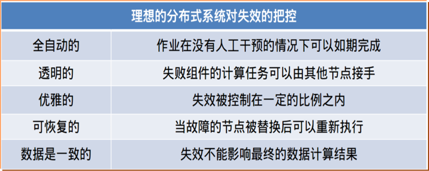

## Hadoop简介

### 简要介绍、组成部分简介

Hadoop是由**Apache**开源组织开发的一个分布式计算框架（Hadoop软件库来自Apache，**它是用Java编码和发布的**，而不是C），它旨在运行应用程序于由**大量廉价**的硬件设备组成的集群上，为这些应用程序提供了一组稳定可靠的接口，以构建一个具有**高可靠性和良好扩展性**的分布式系统。

Hadoop的核心组件包括以下部分：

1. HDFS（Hadoop Distributed File System）：HDFS是Hadoop的分布式文件系统，它旨在存储和管理大规模数据集。它的设计灵感来自Google的GFS（Google File System）。HDFS具有高容错性，能够存储大量的数据并提供高度可靠的数据访问。

2. MapReduce：MapReduce是Hadoop的计算模型和编程框架，用于处理大规模数据集的并行计算。MapReduce的设计灵感来自Google的MapReduce。它将计算任务分解成可并行处理的小任务，并将结果合并以生成最终的输出。

3. HBase：HBase是一个分布式的、面向列的**NoSQL**数据库，它是Hadoop生态系统中的一部分。它的设计受到Google的Bigtable启发，用于存储大规模的结构化数据，并提供了高度可扩展性和低延迟的访问。

总之，Hadoop是一个强大的分布式计算框架，它的核心组件借鉴了Google云计算核心技术，包括GFS、MapReduce和Bigtable的开源实现。它为大规模数据处理提供了可靠的工具和框架，使得处理和分析海量数据变得更加容易和可行。

### 与google三宝的对比

它的核心是MapReduce开源实现。Hadoop的MapReduce实现使用Hadoop分布式文件系统（HDFS）作为底层存储，而不是Google的GFS（Google File System）。

### 架构

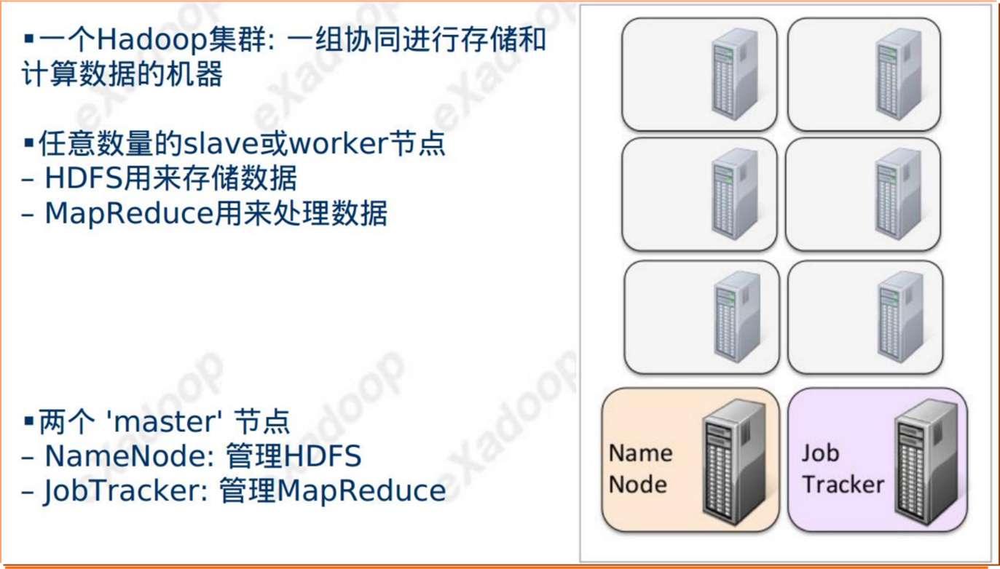

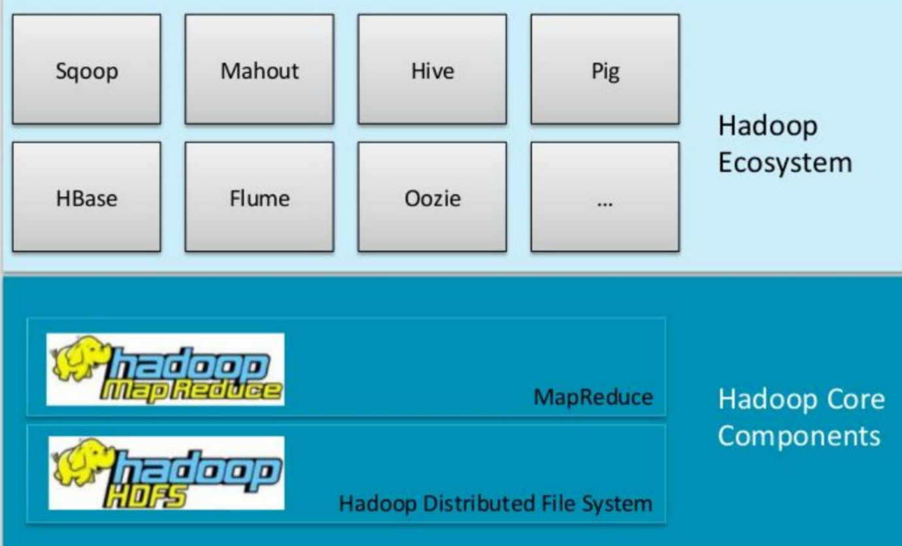

Hadoop的核心部分可以分为两个基本层：

1. MapReduce引擎：这是运行在HDFS之上的计算引擎，用于在集群上处理数据。MapReduce引擎使用HDFS作为其数据存储管理器。它负责将计算任务分解成小任务，分布式地执行这些任务，然后将结果合并以生成最终的输出。这种并行计算模型使得处理大规模数据集变得高效和可扩展。
2. HDFS（Hadoop Distributed File System）：HDFS是一个分布式文件系统，并用于管理文件和存储数据在分布式计算集群上。HDFS具有高度的容错性和可靠性，它将数据划分为块并分布式存储在多个节点上，以确保数据的安全性和可用性。

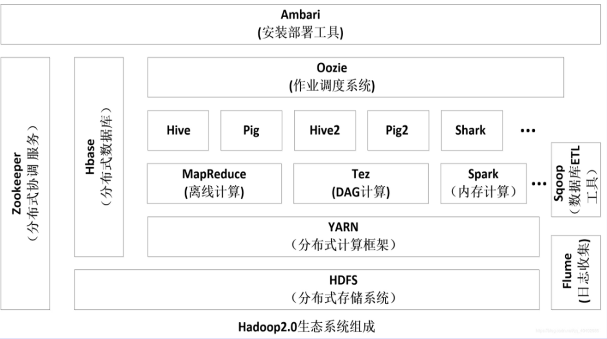

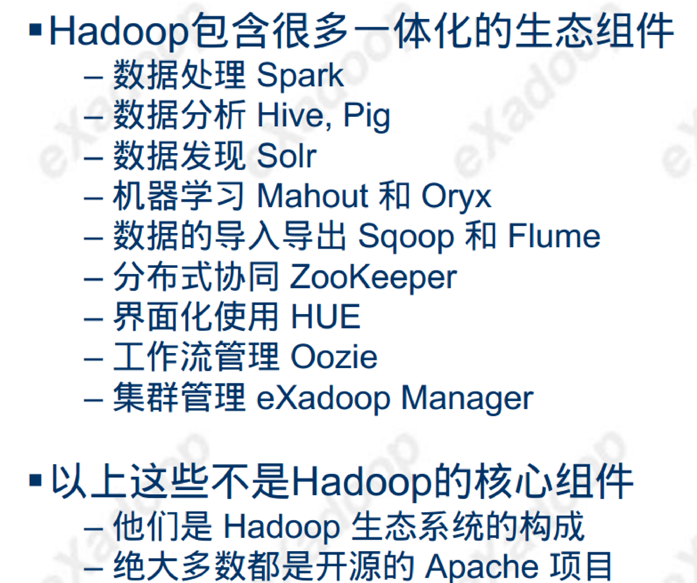

### 优点

1. 可扩展性：Hadoop的设计根本之一是可扩展性。无论是存储的可扩展性还是计算的可扩展性，Hadoop都能够轻松应对。它能够处理大规模数据集，随着数据的增长，可以简单地扩展集群规模，以满足不断增长的需求。
2. 可靠性：
   - Hadoop的分布式文件系统HDFS具有备份恢复机制，可以确保数据的可靠性和容错性。
   - MapReduce框架具备任务监控机制，能够保证分布式处理的可靠性。
3. 高效性：
   + 分布式文件系统的高效数据交互实现
   + MapReduce结合Local   Data处理模式，为高效海量信息处理做足了准备
4. 经济性：Hadoop可以运行在廉价的个人计算机（PC）上，而不需要昂贵的专用硬件。

### 对磁盘读写效率低的解决办法

-Hadoop采用将数据存储和计算放在相同机器上的办法解 决了磁盘读取慢的瓶颈问题

■解决方案:使用多块磁盘并发读写 

- 一块硬盘的传输速率可能是 210MB/秒" 
- 读取3TB需要将近4小时 
-  1000块硬盘并发的读写,每秒可以传输 210GB/秒" 
- 不到15秒就可以传输3TB的数据 

■合并存储与计算就可以让这个方式是可行的 

- 250节点的集群 每节点4块硬盘=1000块磁盘

## Hadoop分布式文件系统

### 设计目标

1. 硬件错误常态：HDFS的设计基础是硬件错误是常态而不是异常。因此，它的核心目标之一是能够检测错误并快速自动恢复，以确保数据的可靠性和稳定性。
2. 超大规模数据集：HDFS旨在支持超大规模的数据集。一个单一的HDFS实例应该能够容纳数以千万计的文件，以满足大规模数据存储和管理的需求。
3. 简单一致性模型：HDFS采用**简单一致性模型**，适用于一次性写、多次读的访问模式。这种模型使得对文件的访问更加简单和高效。
4. **移动计算比移动数据更简单**：HDFS考虑到对于大文件来说，移动数据的代价通常比移动计算的代价要高。因此，它强调数据的存储和访问，以便有效地支持数据分析和处理。
   《把代码移动到距离数据进的地方》
5. 流式数据访问：HDFS更注重数据访问的高吞吐量。这意味着它能够高效地处理流式数据，满足需要大量数据实时分析的应用程序的需求。
6. 异构软硬件平台间的可移植性：HDFS的设计追求在不同的软硬件平台之间具有可移植性。这意味着它可以在不同的环境中运行，为用户提供更大的灵活性。

### 基本概念

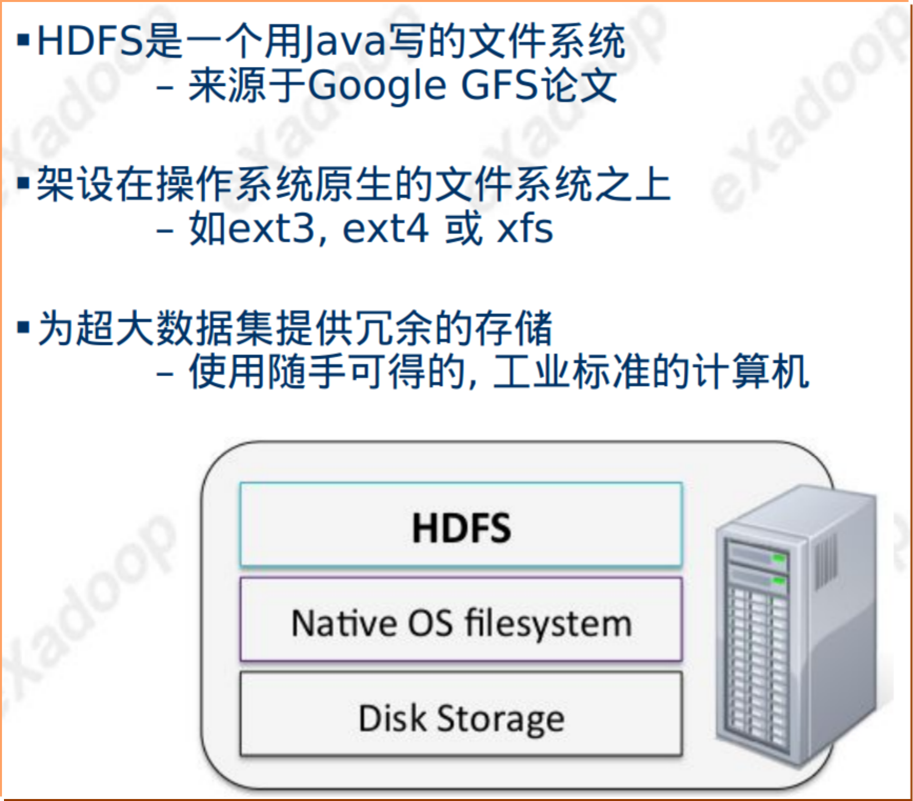

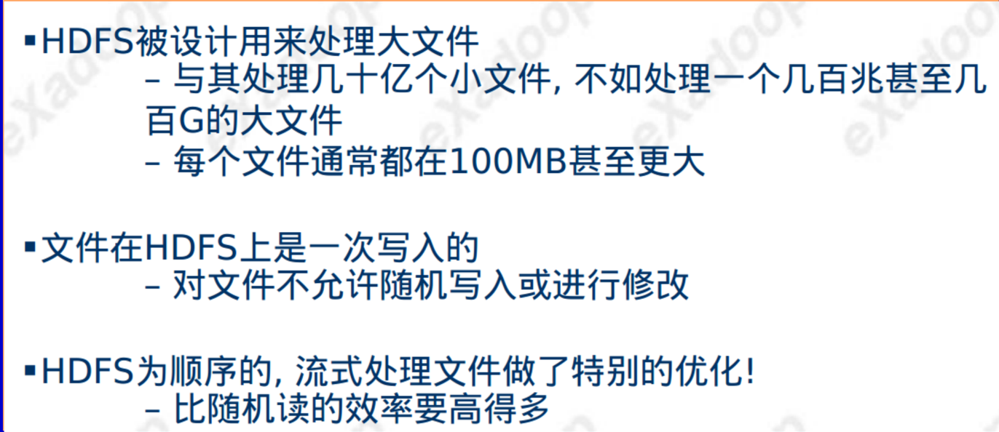

### 设计架构

#### 主要组件

NameNode和DataNode是Hadoop分布式文件系统（HDFS）的两个核心组件，它们分别负责不同的任务。

1. **NameNode（主控制服务器）**：
   - 主要职责是维护文件系统的命名空间（Namespace）。这包括管理文件和目录的创建、删除、移动等操作。
   - NameNode协调客户端对文件的访问。它记录客户端对命名空间内的任何改动，包括文件的创建、删除和属性的修改。
   - NameNode还负责记录命名空间本身的属性改动，例如文件和目录的权限。
   - NameNode通常是HDFS集群中的**单个节点，**因此是集群的中心控制节点。它的稳定性和可靠性对整个HDFS的正常运行至关重要。
   - NameNode使用事务日志（EditLog）记录HDFS元数据的变化，包括文件和目录的创建、删除、修改等操作。
   - 与此同时，文件系统的命名空间、文件的映射和属性信息等都存储在映像文件（FsImage）中。
   - 这两个关键组件（EditLog和FsImage）都存储在NameNode的本地文件系统中，NameNode启动时，根据磁盘中的映像文件和事务日志进行 检查点（Checkpoint）
2. **DataNode**：
   - DataNode负责管理它们所在的物理节点上的存储。每个数据节点负责存储HDFS中的数据块。
   - 它们处理数据块的创建、删除和复制等任务。当客户端需要访问数据时，DataNode负责提供相应的数据块。
   - DataNode会定期向NameNode报告自己所管理的数据块的信息，以便NameNode能够跟踪数据块的分布和复制状态。
   - HDFS通常有多个DataNode，它们分布在整个集群中，共同存储和管理文件数据，以提高数据的可用性和容错性。
3. **Secondary NameNode**（好像通常没有）
   - Secondary NameNode并不是一个用作故障恢复的NameNode备份，而是**辅助NameNode处理映像文件和事务日志的节点**。
   - 它周期性地从主要的NameNode上复制映像文件和事务日志到自己的临时目录。
   - 然后，Secondary NameNode会合并这些文件以生成新的映像文件，并重新上传到主要的NameNode。
   - 这有助于减少主要的NameNode的压力，同时保持元数据的一致性。1
4. NameNode的备份（与Secondary NameNode使用一个就好了）
   

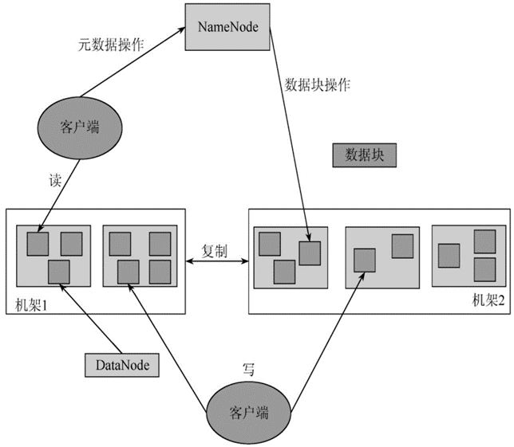

#### 文件保存方式

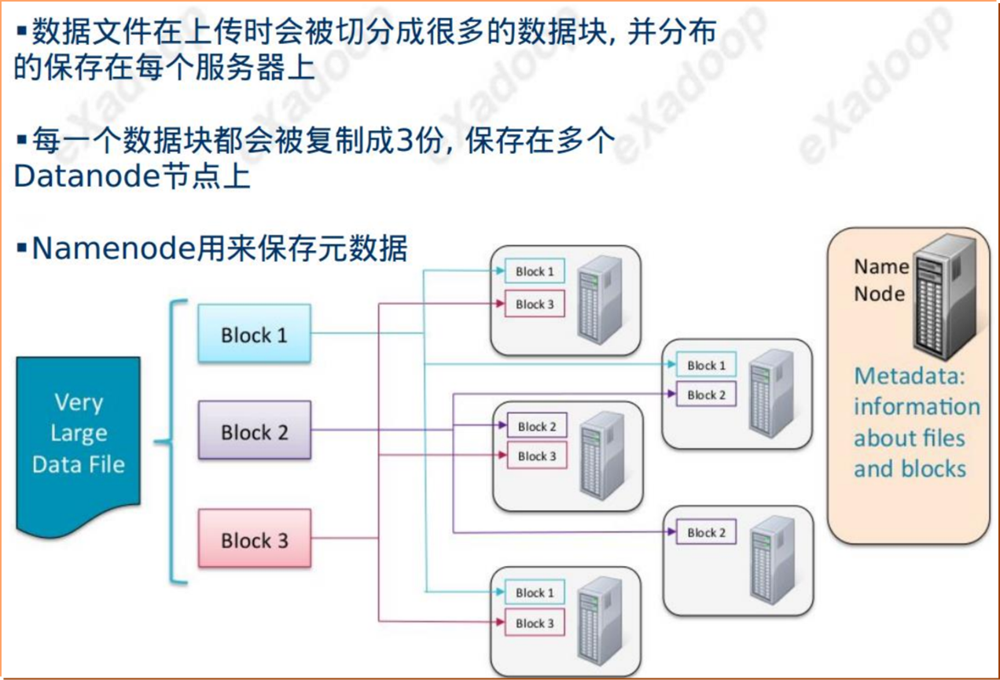

### HDFS特性

分布式文件系统为了能高效地运作，会有一些特殊的需求,比如**性能、可扩展性、并发控制、容错能力**和安全需求。其容错能力很强，因为设计时默认部署在廉价的硬件上。

然而，因为HDFS不是一个通用的文件系统，即它仅执行特 殊种类的应用，所以它不需要一个通用分布式文件系统的 所有需求。例如， **HDFS系统从不支持安全性。**

### 提供高可靠的手段

1. **块复制**：HDFS将文件存储为块集合，每个块都有备份，并分布在整个集群上，以确保数据的可靠性和容错性。
2. **备份布置（机架感知）（Rack-aware）**：
   - 它尽量确保数据副本被存储在不同的机架上，而不是随机地分布在整个集群中。这样可以提高数据的可用性和可靠性。
   - 助于减少数据在集群内部的传输开销。因为数据副本通常在同一机架内的节点之间传输开销较低。
3. **Heartbeat和Blockreport消息**：DataNodes周期性地向NameNode发送Heartbeat和Blockreport消息。Heartbeat表示DataNode正常运行，Blockreport包含了DataNode上所有块的清单，以帮助NameNode跟踪数据块的状态和位置。
4. **安全模式**：当系统启动时，NameNode会进入一个安全模式。在这个模式下，不会执行数据块的写操作。这个安全模式允许NameNode在启动过程中进行必要的检查和维护，确保文件系统的稳定性。
5. **数据完整性检测**：HDFS客户端软件实现了对HDFS文件内容的校验和（Checksum）检查。这有助于检测数据块的完整性，以确保数据在传输和存储过程中没有损坏。
6. **空间回收（相当于回收站）**：当用户或应用程序删除文件时，文件首先被移动到/trash目录中。只要文件仍然在/trash目录中，用户可以迅速恢复文件，这提供了一种回收空间的机制，以防止意外数据丢失。
7. **元数据磁盘失效**：NameNode可以配置为支持维护映像文件和事务日志的多个副本。这样，任何对映像文件或事务日志的修改都会同步到它们的副本上，以确保元数据的持久性和可用性，即使出现磁盘失效的情况也能保证数据不丢失。

### 性能提升方法

### 高可用实现方法

见设计架构->主要组件

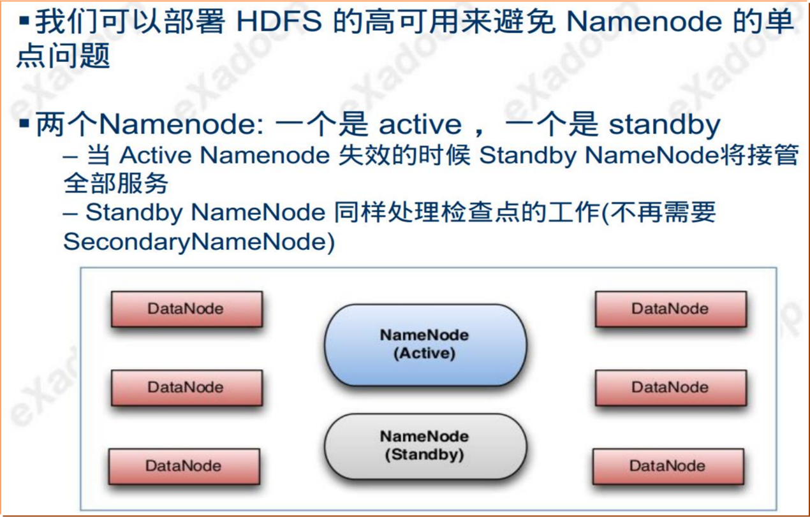

### 主要操作

HDFS操作涉及NameNode和DataNodes的协同工作，以下是读取和写入文件的控制流：

- **读取文件**：要在HDFS中读取文件，用户首先向NameNode发送一个 "open" 请求，以获取文件块的位置信息。NameNode会告知客户端哪些DataNodes存储了文件的块，然后客户端可以直接与这些DataNodes通信以获取数据块，并在需要时合并块以重建完整文件。

- **写入文件**：为了在HDFS中写入文件，用户发送一个 "create" 请求给NameNode，以在文件系统命名空间中创建一个新的文件。然后，用户开始向DataNodes写入文件的内容。数据块被写入DataNodes，而NameNode负责跟踪文件的元数据信息和块的位置信息。

需要注意的是，**NameNode不会成为瓶颈**，因为**数据不会流经NameNode**（类似于google的GFS，NameNode仅仅管理元数据信息）。读取、写入、复制和重新复制操作都是直接与DataNodes进行通信的，而NameNode主要负责维护元数据信息，如文件和块的位置。这种分布式架构使得HDFS能够有效地处理大规模数据的存储和检索。

读文件流程

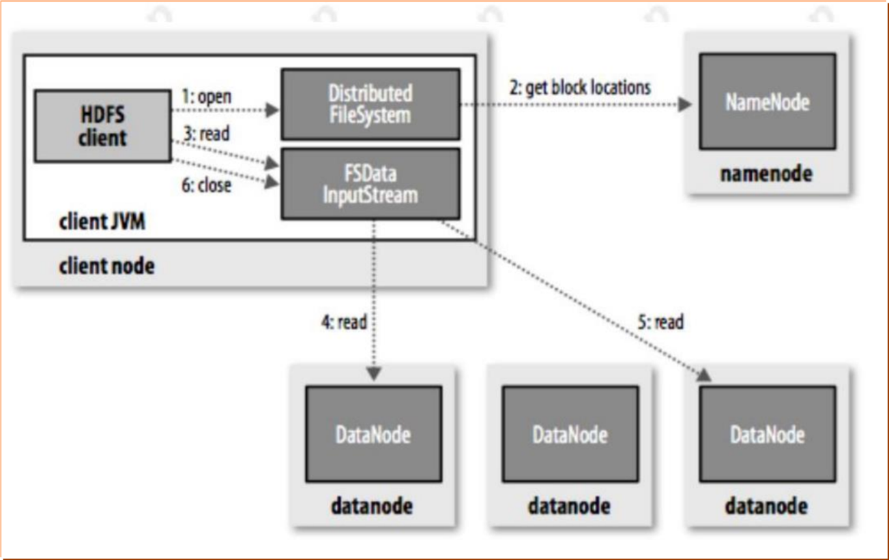

写文件流程

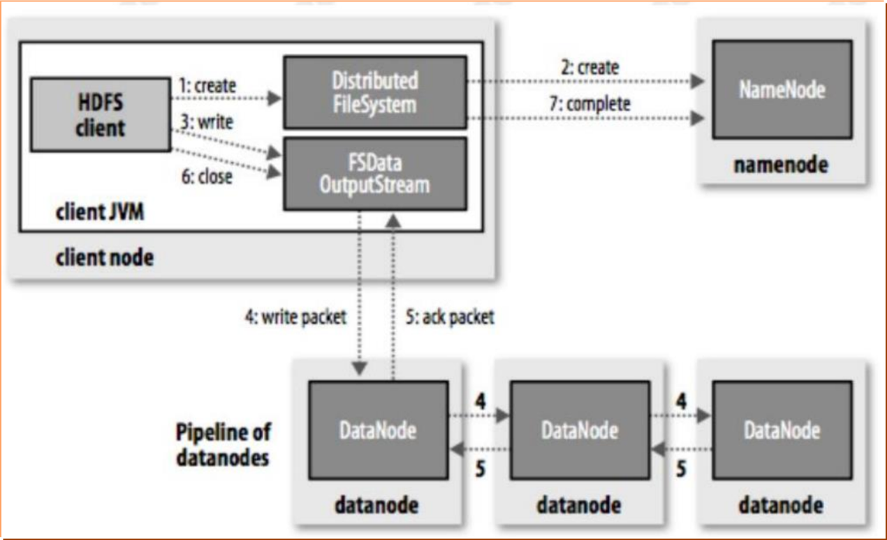

### 访问接口

#### API

Hadoop API: org.apache.hadoop.conf, org.apache.hadoop.dfs, org.apache.hadoop.fs, org.apache.hadoop.io, org.apache.hadoop.ipc, org.apache.hadoop.mapred, org.apache.hadoop.metrics, org.apache.hadoop.record, org.apache.hadoop.tools, org.apache.hadoop.util

#### 浏览器接口

典型HDFS安装会配置一个Web服务器开放自己的命名空 间，其TCP端口可配 默认配置下http://namenode-name:50070这个页面列出了集 群里的所有DataNode和集群  的基本状态

#### 命令行

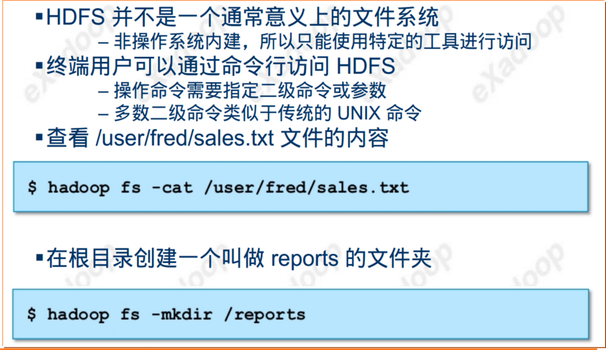

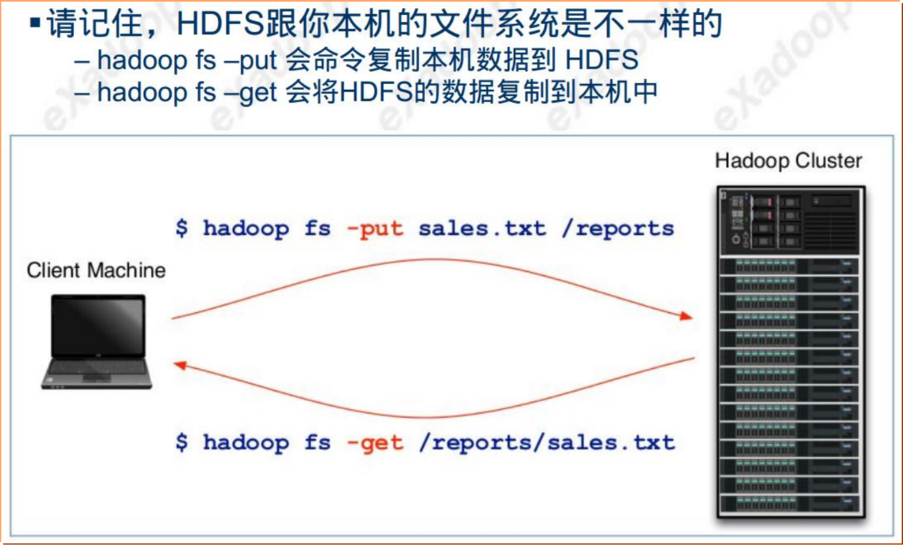

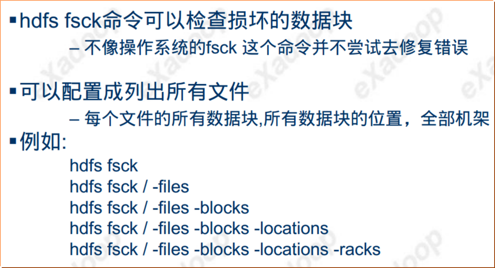

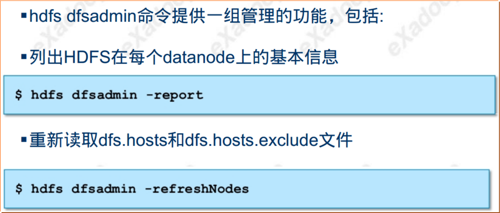

### Flume与HDFS结合

Flume是一个开源的Apache项目

. Flume 是一个分布式的，可靠地，高可用的服务 ,用来收集设备产生的大数据

. Flume通常被用来收集实时系统产生的日志文件 并导入到HDFS，例如Web 服务器日志，防火墙 日志和邮件服务器日志

### **Sqoop**从关系型数据库获取、导出数据

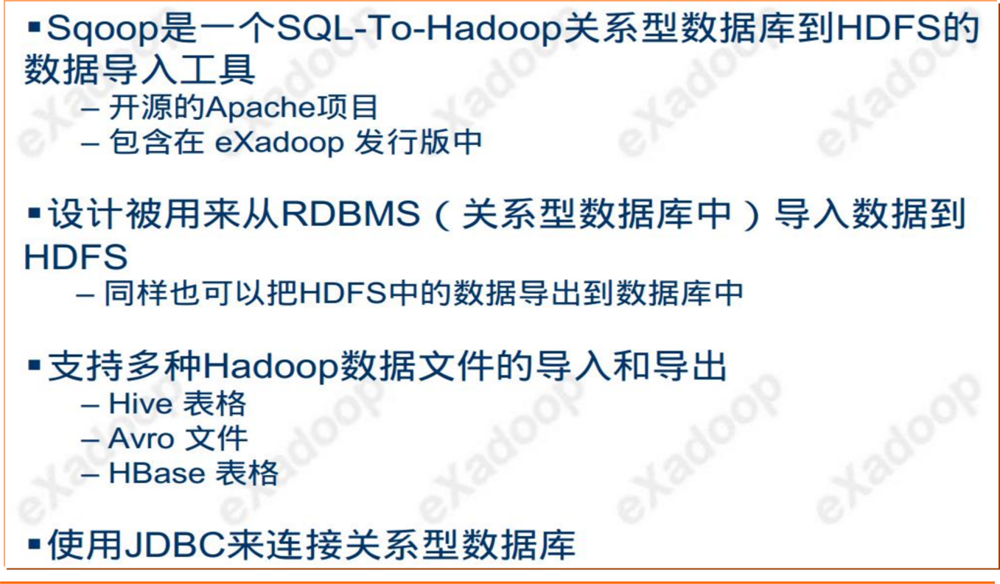

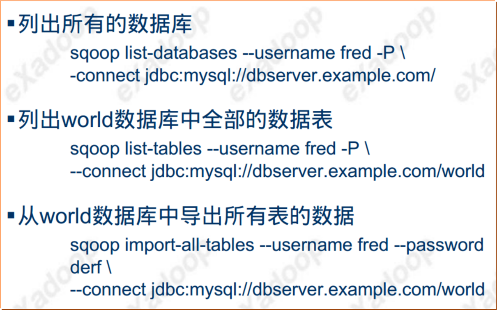

## 分布式数据处理MapReduce

### 逻辑模型

**任务基本要求：**

- 待处理的数据集可以分解成许多小的数据集。
- 每一个小数据集都可以完全并行地进行处理。

**MapReduce操作的两个阶段**：

- **映射阶段**：在这个阶段，用户输入的数据被分割成M个片断，每个片断对应一个Map任务。每个Map任务接收数据片断中的键值对<K1, V1>集合，并通过用户定义的Map函数将其转化为中间态的键值对<K2, V2>集合。然后，根据中间态的K2将输出的数据集进行排序，并生成一个新的元组<K2, list(V2)>，将这些元组按照K2的范围分割为R个片断。
- **化简阶段**：在这个阶段，每个Reduce操作的输入是一个<K2, list(V2)>片断，Reduce操作调用用户定义的Reduce函数，生成用户需要的键值对<K3, V3>进行输出。

> 总的来说，就是google的mapreduce的翻版

### 实现架构

- **Client**：Client是Hadoop MapReduce的用户或应用程序，它向JobTracker提交MapReduce作业，并监视作业的执行过程。Client负责将作业的输入数据分片分配给不同的TaskTracker，并接收作业的输出结果。
- **JobTracker**：JobTracker是Master节点的组件，负责协调和管理整个MapReduce作业的执行。它接收来自Client的作业请求，将作业拆分成多个Map和Reduce任务，并分配这些任务给不同的TaskTracker进行执行。JobTracker还负责监控任务的进度，处理任务失败的情况，并最终汇总和输出作业的结果。
- **TaskTracker**：TaskTracker是Slave节点的组件，每个Slave节点上都运行着一个TaskTracker。TaskTracker负责执行由JobTracker分配的Map和Reduce任务。它从JobTracker获取任务信息，然后启动相应的任务。一旦任务完成，TaskTracker将结果返回给JobTracker，并向其报告任务的状态。
- **Task**：Task是具体的执行单元，分为Map任务和Reduce任务。Map任务负责处理输入数据的分片，生成中间结果，并输出给Reduce任务。Reduce任务负责对中间结果进行汇总和处理，最终生成作业的最终输出结果。

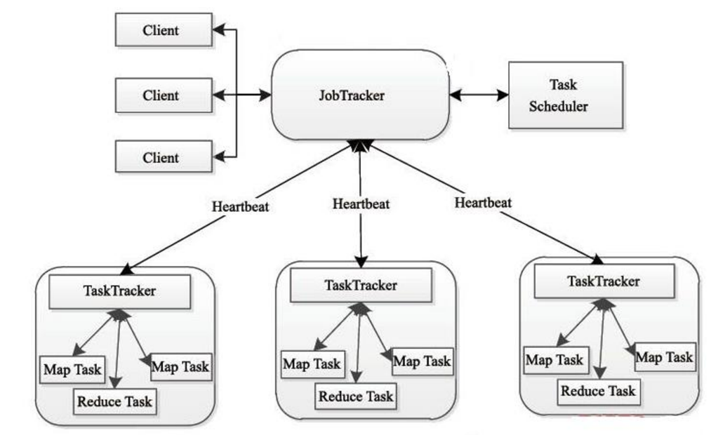

每个TaskTracker节点都有许多同时**运行槽**，每个运行是 映射任务或者化简任务。插槽是由TaskTracker 节点的  CPU支持同时运行的线程数量来确定的。比如， 一个带有N个CPU的TaskTracker节点，每个都支持M 个线程，共有M×N个同时运行的槽。需要注意的是，每个 数据块都是由运行在单独的一个槽上的映射任务处理的。

  **所以， 在TaskTracker上的映射任务和在各个DataNode上 的数据块之间存在一一对应关系。**

### 实现机制

1. **分布式并行计算**：MapReduce采用分布式并行计算的模型，其中一个JobTracker协调多个TaskTracker节点的执行。这两级调度机制允许作业被分割成多个任务，并并行执行，从而提高了计算效率。
2. **本地计算**：MapReduce任务通常在与数据存储节点相同的位置执行，以减少数据传输的开销。这意味着计算节点和存储节点通常在一起，允许在本地访问数据而不需要跨网络传输。
   （**移动计算比移动数据更加容易**）
3. **任务粒度**：MapReduce任务的粒度通常很小，特别是对于小数据集，任务的大小一般小于或等于HDFS中数据块的大小，这有助于实现更细粒度的并行计算。
4. **Combine（连接）**：Combine是一种在映射阶段执行的可选操作，它允许在映射任务输出中执行本地汇总，以减少数据传输到Reduce任务的数据量。这可以提高效率，特别是对于大量数据的情况。
5. **Partition（分区）**：Partition是指将中间结果按照某个键（Key）的规则分割成多个分区，每个分区将被一个Reduce任务处理。这有助于确保每个Reduce任务处理的数据量均匀分布，以实现负载均衡。
6. **读取中间结果**：在Reduce阶段，Reduce任务需要读取中间结果，这些结果是由映射任务生成的。中间结果按照键值对的键进行排序，以便Reduce任务能够有效地处理它们。
7. **任务管道**：每个TaskTracker节点都有多个同时运行的槽，每个槽可以执行映射任务或化简任务。槽的数量取决于节点的CPU支持的同时运行的线程数量。这个机制允许多个任务同时运行，从而提高了计算效率。

### 运行一个作业的过程

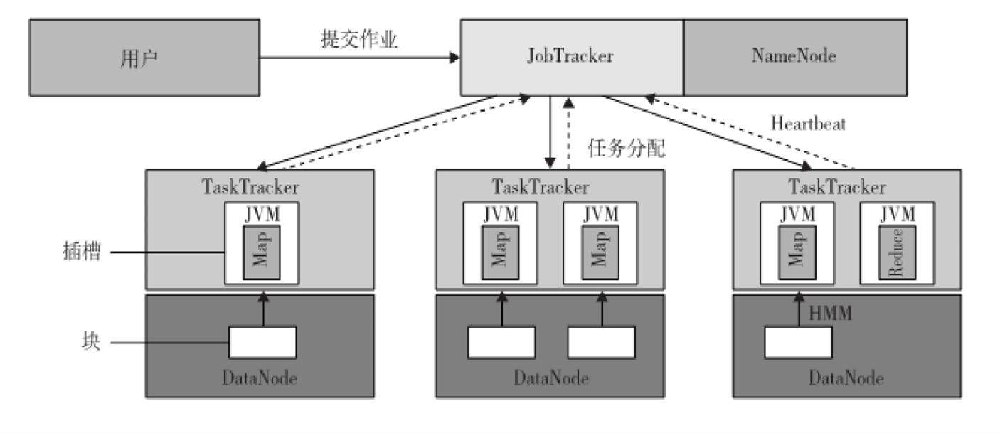

在这个系统中有三个部分共同完成一个作业的运行：**用户节点、 JobTracker和数个TaskTracker**。

1. 数据流最初 是在运行于用户节点上的用户程序中调用runJob(conf) 函数，其中conf是MapReduce 框架和HDFS中一个对象， 它包含了一些调节参数。
   runJob(conf)函数和conf如同谷歌MapReduce第一次实 现中的MapReduce(Spec, &Results) 函数和Spec。
2. **作业提交**：

    - 用户节点向JobTracker请求一个新的作业ID。这个作业ID将用于唯一标识用户提交的作业。
    - 用户节点复制所需的资源，如用户自己的JAR文件（包含Map和Reduce函数的代码）、配置文件和计算输入数据分块，将它们上传到JobTracker的文件系统。这些资源是作业的必要组成部分。
    - 用户节点通过调用`submitJob()`函数将作业提交给JobTracker。在提交作业时，用户可以指定作业的各种配置参数，包括输入路径、输出路径、作业的名称等。
3. **任务分配**

    - 一旦作业被提交，JobTracker开始为作业的每个计算输入块建立一个映射任务。这意味着每个输入数据块都将对应一个映射任务。
    - JobTracker考虑数据的定位，尽量将映射任务分配给距离数据块所在节点较近的TaskTracker。这有助于减少数据传输的开销，提高任务执行效率。
    - 对于每个映射任务，JobTracker将任务分配给可用的TaskTracker的执行槽（slot）。每个TaskTracker通常具有多个执行槽，允许同时运行多个任务。
    - 同时，JobTracker还会创建化简任务（Reduce任务），并将其分配给可用的TaskTracker。化简任务的数量通常与映射任务的数量有关，但可以根据作业的需求进行配置。
4. 任务执行
    把作业JAR文件复制到其文件系统之后，在TaskTracker 执行一个任务（不管映射还是化简）的控制流就开始了。在 启动Java虚拟机（Java Virtual Machine，JVM）来运行它的映射或化简任务后，就开始执行作业JAR文件里的指令。
5. 任务运行校验
    通过接收从TaskTracker到JobTracker的周期性心跳监 听消息来完成任务运行校验。每个心跳监听会告知JobTracker传送中的TaskTracker是可用的，以及传送中的 TaskTracker是否准备好运行一个新的任务。

### 作业生命周期

1. **作业提交与初始化**：用户提交作业后，JobTracker接收到作业请求。在此阶段，JobTracker分配一个唯一的作业ID，并对作业进行初始化。这包括读取作业的配置，确定输入数据和输出路径，以及为每个计算输入块创建映射任务。
2. **任务调度与监控**：在这个阶段，JobTracker开始将映射任务和化简任务分配给可用的TaskTracker。任务的分配过程考虑了数据本地性和任务的可用性。JobTracker还监控任务的进度和状态，处理任务失败，并实时更新作业的状态。
3. **任务运行环境准备**：一旦任务被分配给TaskTracker，TaskTracker会为每个任务创建一个执行环境。这包括设置任务的运行环境，加载必要的资源，如JAR文件和配置文件，以及准备任务的输入数据。
4. **任务执行**：在这个阶段，TaskTracker执行映射任务和化简任务。映射任务处理输入数据块，生成中间结果，并将其传递给化简任务。化简任务汇总中间结果并生成最终输出。
5. **作业完成**：一旦所有任务都成功完成，作业被标记为完成状态。此时，JobTracker会将作业的输出数据复制到指定的输出路径，供用户检索和使用。

### YARN

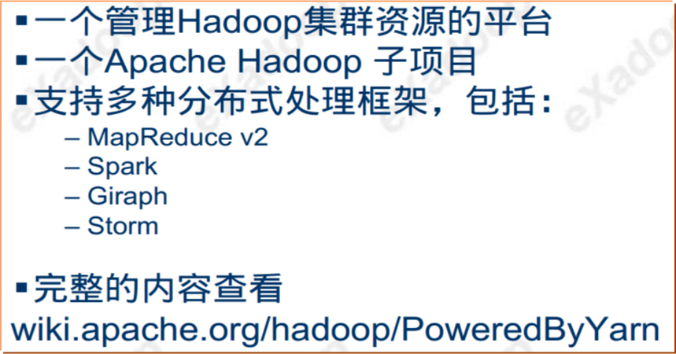

#### 组成部分

##### Resource manager（RM）

**Resource Manager (RM)**：RM是一个全局的资源管理器，集群中只有一个，它负责整个系统的资源管理和分配。其主要职责包括处理客户端请求、启动和监控应用程序的主节点（Application Master）、监控NodeManager、以及资源的分配与调度。

**调度器 (Scheduler)**：调度器是RM的一部分，负责根据资源需求和策略来分配资源给不同的应用程序。它决定了哪个应用程序可以在集群中运行以及如何分配资源。

**应用程序管理器 (Applications Manager，ASM)**：ASM是RM的一部分，用于管理不同应用程序的生命周期。它协调应用程序的提交、启动、监控和完成。

##### NodeManager（NM）

每个节点上都有一个NodeManager，它负责管理该节点上的资源和任务。其功能包括单个节点上的资源管理和任务处理，执行来自RM和应用程序主节点的命令。NodeManager还定期向RM报告节点上的资源使用情况和各个Container的运行状态。

##### Application Master（AM）

AM是YARN内运行的应用程序的管理实例，负责协调应用程序的执行。其功能包括数据切分、为应用程序申请资源并将资源分配给内部任务、任务监控和容错。

##### Container

Container是YARN中的资源抽象，它封装了某个节点上的多维度资源，如内存、CPU、磁盘和网络等。每个任务都会被分配一个Container，该任务只能使用该Container中描述的资源。Container是动态生成的资源划分单位，根据应用程序的需求动态生成。它不同于MRv1中的槽（slot），并使用Cgroups等机制进行资源隔离。

## 分布式结构化数据表Hbase

## Spark