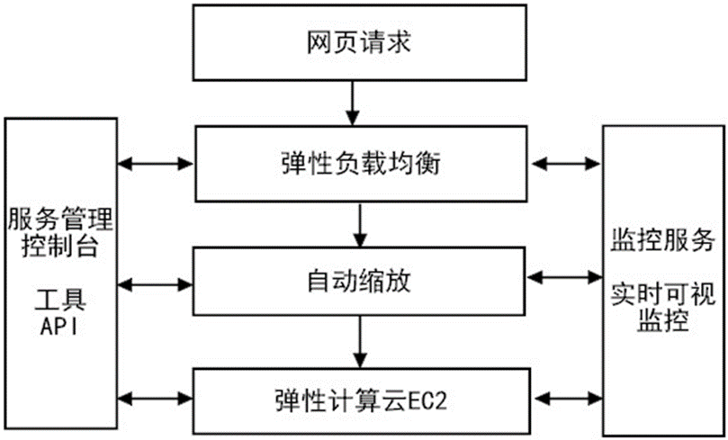
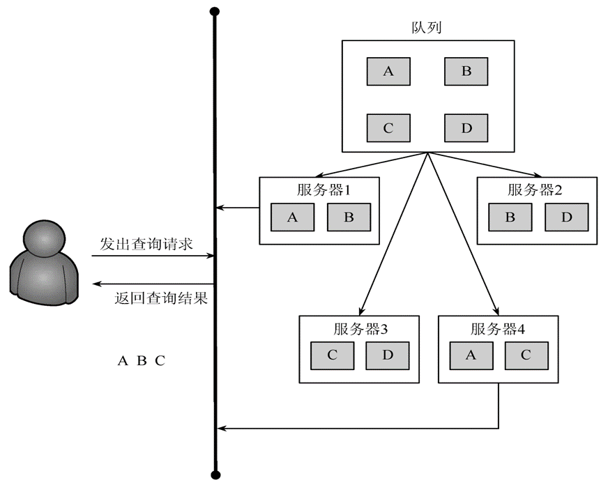
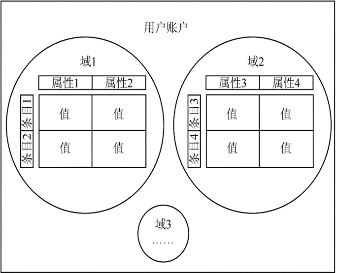
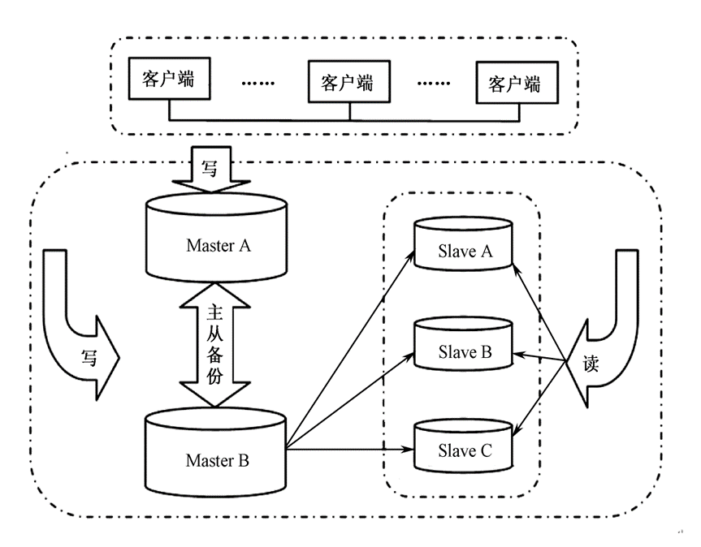

# 6.2-Amazon云计算AWS

Amazon平台的架构是完全的分布式、去中心化 。

## 云服务中的常识

### 区域的划分

- 地理区域（Region Zone）：美东、美西、欧盟、亚太

- 可用区域（Availability Zone）：根据是否存在独立的供电系统和冷却系统 

## Amazon平台基础存储架构：Dynamo 

Amazon平台的架构是完全的分布式、去中心化。Amazon平台中有很多服务对存储的需求只是读取、写入，（满足简单的键/值式存储）

### Dynamo的特征

1. 简单的键/值方式存储数据，不支持复杂的查询
2. 存储的是数据值的原始形式（bit），不解析数据的具体内容、不识别任何数据结构。
   这使得它几乎可以处理所有的数据类型 

### Dynamo所使用到的技术

| **问题**             | **采取的相关技术**                                           |
| -------------------- | ------------------------------------------------------------ |
| 数据均衡分布         | 改进的一致性哈希算法，数据备份                               |
| 数据冲突处理         | 向量时钟（vector  clock）                                    |
| 临时故障处理         | Hinted  handoff（数据回传机制），参数（W,R,N）可调的弱quorum机制 |
| 永久故障后的恢复     | Merkle哈希树                                                 |
| 成员资格以及错误检测 | 基于gossip的成员资格协议和错误检测                           |

#### 一致性哈希算法

为了解决因特网中的热点(Hot spot)问题.

##### 四个要求

**平衡性：** 哈希的结果能够尽可能**平均地**分布在所有的缓冲中，以确保充分利用所有缓冲空间。

**单调性：** 如果已经有一些内容被分配到特定的缓冲区，并且新的缓冲区被添加到系统中，哈希的结果应该保证以前分配的内容可以映射到新的缓冲区，而不会映射到旧的缓冲区。哈希结果的变化意味着在缓冲空间发生变化时需要更新系统内的所有映射关系。简单的哈希算法如 `hash(object)%N` 很难满足单调性要求。
即：单调性要求在系统进行扩展或修改时，已有的数据映射关系应该保持不变。

**分散性：** 在分布式环境中，不同的终端可能只看到整个缓冲区的一部分。这可能导致相同的内容被不同的终端映射到不同的缓冲区中，降低了系统存储的效率。分散性度量了这种情况发生的严重程度。一致性哈希算法要求尽量避免和降低分散性。

**负载：**对于特定的缓冲区来说，可能被不同的用户映射为不同的内容。与分散性一样，这种情况也是应该避免的，因此良好的哈希算法应该尽量降低缓冲的负载。

##### 一般步骤

1. 求出设备节点的哈希值，并配置到环上的一个点；
2. 接着计算数据的哈希值，按顺时针方向将其映射到环上距其最近的节点

数据和设备采用一样的哈希算法

##### 添加、删除节点的操作

添加新节点时(如Node4)，按照顺时针迁移规则，调整相关数据到新的节点上。

删除节点时(如Node2)，和添加节点过程相反，调整相关数据的映射问题。

！仅仅调整会改变的。

##### 优点以及缺点

优点：

1. 分散性（一般Hash算法具备）
2. 单调性
3. 负载均衡性

缺点：

1. 节点少的时候负载不均衡
2. 没有考虑到节点性能差异

#### 改进的一致性哈希算法

改进方面：

1. 虚拟节点
2. 数据分区和等份存储

Hash环分为Q个**等份**，每个等份为一个**数据分区**，有S个虚拟节点，Q>>S。

**每个虚拟节点**对应的分区数为**Q/S**,两个虚拟节点之间的所有分区称为一个**键值区间**。

好处：

1.数据划分和数据存储的分离；

2.删除节点：数据会均匀分摊到其它节点；增加节点：数据会均匀转移到新节点

3.通过虚拟节点和物理节点多对一配置实现处理能力权重配置。

注意：Q值的选择

#### 数据备份

当数据被均匀存储到环上各节点后，Dynamo将冗余存储数据（备份数据）

数据副本数N，Preference list大于N并且只存储物理节点。Dynamo中N=3（数据副本数），键k存储于A，顺时针备份于B,C；键值区间存储的是它和它的前N-1个前驱键值区间的数据。

为提高性能，1个副本写硬件，N-1写内存 

#### 数据冲突

Dynamo系统选择牺牲一致性来换取系统的可靠性和可用性 。

其数据冲突的解决办法：

- 最终一致性模型（Eventual Consistency）：不在意数据更新过程中的一致性问题，只要所有数据副本最终能够保证一致性即可。

- 向量时钟（node,counter）对 

#### 容错机制（包含弱quorum，Merkle）

1. 临时故障处理机制 
   在数据读写中采用了一种称为弱quorum（Sloppy quorum）的机制，涉及三个参数W、R、N
   W—代表一次成功的写操作至少需要写入的副本数
   R—代表一次成功读操作需由服务器返回给用户的最小副本数
   N—每个数据存储的副本数 
   满足R+W>N，用户即可自行配置R和W，保证用户读数据时可以获得一个最新的数据副本
   优势：**实现可用性与容错性之间的平衡**
   弱quorum采用带监听的数据回传机制。每个数据的存储副本数仍为N，N限制为preference list的前N个正常节点，前N个节点出现故障时，由后面的正常节点接替其工作，并记录失效节点；并对失效节点进行检测，一旦其重新可用，则将自己保存的最新数据回传给它，并删除自己开辟的临时数据空间。

2. 永久性故障处理机制

   **反熵协议（Anti-Entropy Protocol）：**
   反熵协议是一种用于分布式系统中维护数据的一致性和同步性的协议。反熵协议定期检查和比较数据副本之间的差异，然后采取措施使它们保持一致。通常，这涉及到数据的比较和传输，以确保每个副本都包含相同的数据。

   **Merkle哈希树技术（加快检测速度）：**
   Merkle哈希树是一种数据结构，通常用于验证数据的完整性和支持高效的同步检测。它的主要特点是将数据分层组织，每一层都包含哈希值，而最底层包含实际数据。以下是关于Merkle哈希树技术的详细解释：

   - **每个虚拟节点保存三颗Merkle树：** 在分布式系统中，通常有多个虚拟节点，每个节点负责管理一部分数据。为了确保数据的完整性和同步，每个虚拟节点会维护三颗Merkle树，这意味着每个键值区间（一部分数据的范围）都会建立一个Merkle树。

   - **哈希树的叶子节点存储数据哈希值：** 在Merkle树的最底层，叶子节点存储了数据分区内所有数据对应的哈希值。这些哈希值是通过对数据进行哈希运算得到的，用于验证数据的完整性。

   - **父节点存储子节点的哈希值：** 在Merkle树的上层，每个父节点存储其所有子节点的哈希值的组合。这意味着树的每一层都有哈希值，从叶子节点到根节点，以便高效地验证数据的一致性。

   Merkle哈希树技术的优势在于它可以高效地检测数据的不一致性，因为只需比较树的哈希值而不是整个数据集。当进行数据同步检测时，系统可以交换各级哈希值以检查数据的一致性，从而减少了传输的数据量和提高了检测速度。

#### 成员资格及错误检测 

基于Gossip协议的成员资格检测机制

Dynamo中每个成员都要保存其它节点的路由信息

- Gossip（闲聊）协议：所有节点每个固定时间利用一种类似于Gossip协议任意选择一个与之通信的节点。如果连接成功，双方交换各自保存的信息。
- 错误检测机制：简单、实用。一旦发现对方没有回应，则认为该节点失效。同时定期象失效节点发出消息，如对方有回应则重新建立通信。
- 为了加快建立联系，可以采用种子节点为新加入的节点分发信息。

## 弹性计算云EC2 

### 主要特征

1. **灵活性**：EC2允许用户对运行实例类型、数量自行配置，还可以选择实例运行的地理位置，根据用户的需求随时改变实例的使用数量
2. **低成本**：EC2使得企业不必为暂时的业务增长而购买额外的服务器等设备。EC2的服务都是按小时来收费，而且价格非常合理 
3. **安全性**：EC2向用户提供了一整套安全措施，①包括基于密钥对机制的SSH方式访问、②可配置的防火墙机制等，③同时允许用户对它的应用程序进行监控 
4. **易用性**：用户可以根据Amazon提供的模块自由构建自己的应用程序，同时EC2还会对用户服务请求自动进行负载平衡 
5. **容错性**：利用系统提供的诸如弹性IP地址之类的机制，在故障发生时EC2能最大程度地保证用户服务仍能维持在稳定的水平 

### 基本架构

### 关键技术

#### Amazon机器映像（AMI）

AMI（Amazon Machine Image）是一个可以将用户的应用程序、配置等一起打包的加密机器映像

AMI是用户云计算平台运行的基础，用户使用EC2服务的第一步就是要创建一个自己的AMI 

Amazon提供的AMI有四种类型

（1）公共AMI：由亚马逊提供，可免费使用。

（2）私有AMI：用户本人和其授权的用户可以进入。

（3）付费AMI：向开发者付费购买的AMI。

（4）共享AMI：开发者之间相互共享的一些AMI。

#### 实例（Instance）

 用户创建好AMI后，实际运行的系统称为一个实例。

Amazon EC2 提供多种经过**优化**，适用于不同使用案例的实例类型以供选择。实例类型由 CPU、内存、存储和网络容量组成不同的组合，可让您灵活地为您的应用程序选择适当的资源组合。每种实例类型都包括一种或多种实例大小，从而使您能够扩展资源以满足目标工作负载的要求。 

- 通用：通用实例提供计算、内存和联网资源三方面的平衡，可用于各种不同的工作负载。这些实例非常适合于以相同比例使用这些资源的应用程序，如 Web 服务器和代码存储库。 

- 计算优化型：计算优化型实例非常适用于从**高性能处理器**获取的受计算限制的应用程序。属于此系列的实例非常适用于批处理工作负载、媒体转码、高性能 Web 服务器、高性能计算 (HPC)、科学建模、专用游戏服务器和广告服务器引擎、机器学习推理和其他计算密集型应用程序。

- 内存优化型：内存优化型实例旨在提高可处理内存中**大型数据集**的工作负载的性能。

- 加速计算：加速计算实例使用**硬件加速器**或**协同处理器**来执行**浮点数计算、图形处理或数据模式匹配**等功能，比使用在 CPU 上运行的软件更高效。
  其中有一个F1类型，提供FPGA

- 存储优化：存储优化型实例旨在用于需要对本地存储上的大型数据集进行高速连续读写访问的工作负载。它们经过了优化，每秒可以向应用程序交付数以万计的低延迟、随机 I/O 操作 (IOPS)。

#### 弹性块存储（EBS）

长期保存或比较重要的数据，需要用弹性块存储（Elastic Block Store，EBS），Amazon限制每个EBS最多创建20个卷（类似于移动硬盘） 
如果是实例的系统盘，那么在销毁实例之后，其对应的内容也会销毁，但是卷是长期的，可以挂载到实例上。

快照（Snapshot）：捕捉当前卷的状态，然后数据就可以被存储在S3中

#### 通信机制（弹性IP地址）

EC2服务中，系统各模块之间及系统和外界之间的信息交互是通过IP地址进行

- 公共IP地址（Public IP Address）

- 私有IP地址（Private IP Address）公共IP地址和私有IP地址通过NAT转换

- 弹性IP地址（Elastic IP Address）专为动态云计算设计的静态 IP 地址。借助 EIP，您可以快速将地址重新映射到您的账户中其他实例

弹性IP地址和**用户账号绑定**而不是和某个特定的实例绑定，这给系统的容错带来极大的方便，每个账号默认绑定5个弹性IP地址。

当系统正在使用的实例出现故障时，用户只需要将弹性IP地址通过网络地址转换技术转换为新实例所对应的私有IP地址，这样就将弹性IP地址与新的实例关联起来，**访问服务时不会感觉到任何差异** 

#### 弹性负载平衡（Elastic Load Balancing）

允许EC2实例自动分发应用流量，从而保证工作负载不会超过现有能力，并且在一定程度上支持容错

1. 更好地利用服务器集群
2. 具有一定的容错性

#### 监控服务（CloudWatch））

Amazon CloudWatch是一个Web服务，提供了AWS资源的可视化检测功能

包括EC2实例状态、资源利用率、需求状况、CPU利用率、磁盘读取、写入和网络流量等指标

Cloudwath可自动收集和存储监测数据；用户可通过AWS服务管理控制台和命令行工具来维护和处理这些监测数据

#### 自动缩放（AutoScaling）

自动缩放可以按照用户自定义的条件，自动调整EC2的计算能力 

#### 服务管理控制台（AWS Management Console）

服务管理控制台是一种基于Web的控制环境，可用于启动、管理EC2实例和提供各种管理工具和API接口 

#### 安全组

允许用户随时更新实例状态，用户可以随时加入或删除实例，实例状态的动态变化方便了用户，但是却给防火墙的配置带来了麻烦。

EC2引入了**安全组**（Security Group）概念

安全组其实就是一组规则，用户利用这些规则来决定哪些网络流量会被实例接受，其他则全部拒绝

一个用户目前最多可以创建100个安全组。当用户的实例被创建时，如果没有指定安全组，则系统自动将该实例分配给一个默认组（Default Group） 

- 安全组内部自由通信
- 非安全组访问会经过规则过滤
- 各个服务器的防火墙关闭，用安全组代替防火墙

#### SSH

SSH（Secure Shell）密钥对（Key Pair）来登录服务

密钥对的**名称（Key Pair Name）**和**公钥（Public Key）**储存在EC2中

用户创建新实例时，EC2会将它保存的信息复制一份放在实例的元数据（Metadata）中，然后用户使用自己保存的**私钥（Private Key）**就可以安全地登录EC2并使用相关服务

## 简单存储服务S3

### 相关概念介绍

S3是构建在Dynamo之上，采取的并不是传统的关系数据库存储方式

原因：

1. 使文件操作尽量简单、高效；
2. 使用关系数据库只会增加系统的复杂性

#### 对象

> 传统的文件系统元数据是属于文件系统的。

包含两部分

1. 数据（任意类型）
2. 元数据：描述数据的数据
   使用键值对来进行表示

S3默认的元数据：

| 元数据名称     | 名 称 含 义                                                  |
| -------------- | ------------------------------------------------------------ |
| last-modified  | 对象被最后修改的时间                                         |
| ETag           | 利用MD5哈希算法得出的对象值                                  |
| Content-Type   | 对象的MIME（多功能网际邮件扩充协议）类型，默认为二进制/八位组 |
| Content-Length | 对象数据长度，以字节为单位                                   |

#### 键

对象的唯一标识符

#### 桶

存储对象容器（最多创建100个桶，不限桶中数量）

### 基本操作

| 操 作 目标 | Get                  | Put            | List           | Delete   | Head           |
| ---------- | -------------------- | -------------- | -------------- | -------- | -------------- |
| 桶         | 获取桶中对象         | 创建或更新桶   | 列出桶中所有键 | 删除桶   | 无             |
| 对象       | 获取对象数据和元数据 | 创建或更新对象 | 无             | 删除对象 | 获取对象元数据 |

### 冗余存储

多个副本，保存在多个服务器上

- 优势：某些服务器出现故障时用户仍然可以对其数据进行操作

- 弊端：数据被充分传播到所有的存放节点之前返回给用户的仍是原数据
  （1）一个进程写入一个新的对象并立即尝试读取它，但在该改变被传送到S3的多个服务器前，服务器对该操作可能返回“键不存在”

  （2）一个进程写入一个新的对象并立即尝试列出桶中已有的对象，但在该改变被传送到S3的多个服务器前，该对象很可能不会出现在列表中

  （3）一个进程用新数据替换现有的对象并立即尝试读取它，但在该改变被传送到S3的多个服务器前，S3可能会返回以前的数据

  （4）一个进程删除现有的对象并立即尝试读取它，但在该改变被传送到S3的多个服务器前，S3可能会返回被删除的数据

  （5）一个进程删除现有的对象并立即尝试列出桶中的所有对象，但在该改变被传送到S3的多个服务器前，S3可能会列出被删除的对象 

弊端出现的原因：S3为了**保证用户数据的一致性**而采取的一种折中手段，即在数据被**充分传播到所有的存放节点之前**返回给用户的仍是**原数据**

### 安全措施 

#### 身份认证

基于HMAC-SHA1的数字签名方式来确定用户身份
HMAC-SHA1：一种安全的基于加密hash函数和共享秘钥的消息认证协议，可以有效**防止数据在传输过程中被截获和篡改**，维护了数据的完整性、可靠性和机密性。
一个加密的Hash函数、一个加密的随机秘钥和一个安全的秘钥交换机制。
Amazon用户：
Access Key ID：由字母和数字组成的20位的串，用来确定服务请求的发送者。
Secret Access Key：40位的字符串，参与数字签名过程，证明发送服务请求的账户的合法拥有者。

#### 访问控制列表

提供的可供用户自行定义的访问控制策略列表 。

1）所有者:桶或对象的创建者
2）个人授权用户：通过电子邮件地址授权、通过用户ID授权
3）组授权用户：

## 简单队列服务SQS （Simple Queue Service，SQS）

Amazon（低耦合系统）为解决其云计算平台之间**不同组件**的**高效安全的通信**而专门设计开发

### SQS由三个基本部分组成

#### 系统组件（Component）：SQS的服务对象，消息发送者、消息接受者

#### 队列（Queue）

**存放消息的容器**，类似于S3中的桶，队列的数目也是任意的，创建队列时用户必须给其指定一个在SQS账户内**唯一的名称** 

#### 消息（Message） 

消息是**发送者创建**的具有**一定格式**的**文本数据**，接收对象可以是一个或多个组件。

- 消息的大小是有限制的，目前Amazon规定每条消息不得超过8KB
- 但是消息的数量并未做限制 

消息的格式：

（1）消息ID（Message ID）
（2）接收句柄（Receipt Handle）
（3）消息体（Body）
（4）消息体MD5摘要（MD5 of Body）

消息的取样：

队列中的消息冗余存储，目的是为了保证系统的高可用性 。

基于加权随机分布（Based on a Weighted Random Distribution）的消息取样 

消息的可见性

计时器两种操作：扩展（Extend）和终止（Terminate） 

消息的安全性由数字签名保证，和S3的差不多

## 简单数据库服务Simple DB 

主要用于存储**结构化的数据**，并为这些数据提供**查找、删除**等**基本**的数据库功能。

### 组成结构、架构

1．用户账户（Customer Accout）

2．域（Domain）

 数据容器，具有一定关联关系的字符串容器
3．条目（Item）

一个实际的对象

4．属性（Attribute）

条目的特征 

5．值（Value）

 每个条目的某属性的具体内容，每个属性值的大小不能超过1KB

### 与传统数据库的区别

|            | SDB                                                          | 传统数据库                                         |
| ---------- | ------------------------------------------------------------ | -------------------------------------------------- |
| 数据模型   | 键-值存储的方式组织。这意味着您可以将数据视为一组项目（Items），每个项目都有一个唯一的标识符，称为项目名。每个项目可以包含多个属性（Attributes），而属性存储键值对数据。 | 数据以表格的形式存储                               |
| 无模式     | 可以随时向数据库添加新的域，而不需要在预定义的模式中进行更改。 | 预定义表格结构，并需要严格遵循模式。               |
| 扩展性     | 自动处理数据分区和负载均衡                                   | 扩展性方面可能需要更多的配置和管理工作             |
| 查询语言   | 执行一些基本查询，但不支持复杂的SQL查询                      | 支持更复杂和灵活的查询操作                         |
| 数据一致性 | 最终一致性模型，这意味着在写入数据后，不会立即在所有节点上可见，但最终会达到一致状态。 | 强一致性模型，写入操作在提交后立即对所有用户可见。 |

ØSDB数据库采用树状结构、最终一致性数据模型，每次操作设定了超时值，同时SDB也对关系数据库做了一些有益的改进，如多值属性

### 存在问题&解决方法

存在的问题

1. 支持的操作类型不够：不支持连接操作、对结果排序
2. 存储方式简单：以字符串存储，查询操作时取字典顺序，比较操作会有问题

**解决方式（对以字符串存储的数字进行优化）**

- 整数补零 
- 负整数集添加正向偏移量 
- ISO 8601对日期进行转换 

## 关系数据库服务RDS 

### 相关原理

RDS—一种**云中的MySQL数据库系统**，采用集群方式将MySQL数据库移植到云中，在**一定的范围**内解决了关系数据库的**可扩展性**问题 。

MySQL集群采用了**Share-Nothing**架构 ：各个节点在处理数据时不共享硬件资源或存储

**可拓展性的实现方法：**

集群MySQL通过表单划分（Sharding）的方式将一张大表划分为若干个小表，分别存储在不同的数据库服务器上，从逻辑上保证了数据库**可扩展性**

集群MySQL通过主从备份和读副本技术提高可靠性和数据处理能力 

### SQL与NOSQL的比较

|            | sql                                                          | Nosql                                                    |
| ---------- | ------------------------------------------------------------ | -------------------------------------------------------- |
| 数据模型   | 严格约束                                                     | 无约束                                                   |
| 数据处理   | 一致性（C）     可用性（A）                                  | 可用（A）分区容忍性（P）                                 |
| 接口层     | SQL语言访问                                                  | API实现                                                  |
| 优势、劣势 | 高一致性，ACID能力非常强，移植性很高；但在可扩展性方面能力较弱 | 高可扩展性，并发处理能力强；缺乏数据一致性保证，查询困难 |

### RDS的使用方式

Amazon将RDS中的MySQL服务器实例称做DB Instance，通过基于**Web的API**进行创建和管理，其余的操作可以通过**标准的MySQL**通信协议完成 

可以通过两种工具对RDS进行操作

- 命令行工具：Amazon提供的Java应用套装，负责处理DB Instance的管理，比如创建、参数调整、删除等
- MySQL客户端：可以与MySQL服务器进行通信的应用程序，比如MySQL Administrator客户端

## 内容推送服务CloudFront

## 其他Amazon云计算服务

## AWS应用实例  

## 小结 