# 6.2-Amazon云计算AWS

Amazon平台的架构是完全的分布式、去中心化 。

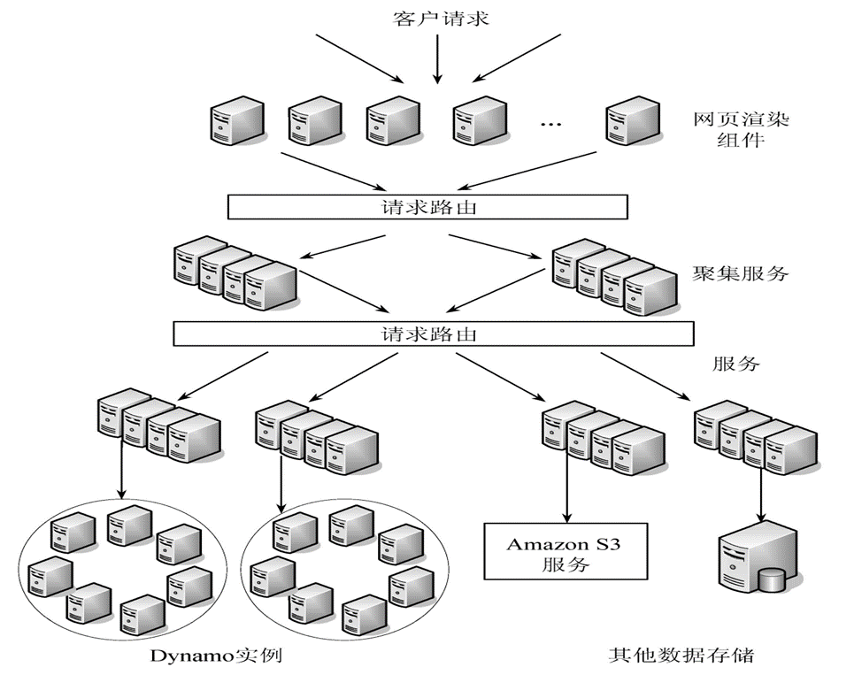

## 云服务中的常识

### 区域的划分

- 地理区域（Region Zone）：美东、美西、欧盟、亚太

- 可用区域（Availability Zone）：根据是否存在独立的供电系统和冷却系统 

## Amazon平台基础存储架构：Dynamo 

Amazon平台的架构是完全的分布式、去中心化。Amazon平台中有很多服务对存储的需求只是读取、写入，（满足简单的键/值式存储）

### Dynamo的特征

1. 简单的键/值方式存储数据，不支持复杂的查询
2. 存储的是数据值的原始形式（bit），不解析数据的具体内容、不识别任何数据结构。
   这使得它几乎可以处理所有的数据类型 

### Dynamo所使用到的技术

| **问题**             | **采取的相关技术**                                           |
| -------------------- | ------------------------------------------------------------ |
| 数据均衡分布         | 改进的一致性哈希算法，数据备份                               |
| 数据冲突处理         | 向量时钟（vector  clock）                                    |
| 临时故障处理         | Hinted  handoff（数据回传机制），参数（W,R,N）可调的弱quorum机制 |
| 永久故障后的恢复     | Merkle哈希树                                                 |
| 成员资格以及错误检测 | 基于gossip的成员资格协议和错误检测                           |

#### 一致性哈希算法

为了解决因特网中的热点(Hot spot)问题.

##### 四个要求

**平衡性：** 哈希的结果能够尽可能**平均地**分布在所有的缓冲中，以确保充分利用所有缓冲空间。

**单调性：** 如果已经有一些内容被分配到特定的缓冲区，并且新的缓冲区被添加到系统中，哈希的结果应该保证以前分配的内容可以映射到新的缓冲区，而不会映射到旧的缓冲区。哈希结果的变化意味着在缓冲空间发生变化时需要更新系统内的所有映射关系。简单的哈希算法如 `hash(object)%N` 很难满足单调性要求。
即：单调性要求在系统进行扩展或修改时，已有的数据映射关系应该保持不变。

**分散性：** 在分布式环境中，不同的终端可能只看到整个缓冲区的一部分。这可能导致相同的内容被不同的终端映射到不同的缓冲区中，降低了系统存储的效率。分散性度量了这种情况发生的严重程度。一致性哈希算法要求尽量避免和降低分散性。

**负载：**对于特定的缓冲区来说，可能被不同的用户映射为不同的内容。与分散性一样，这种情况也是应该避免的，因此良好的哈希算法应该尽量降低缓冲的负载。

##### 一般步骤

1. 求出设备节点的哈希值，并配置到环上的一个点；
2. 接着计算数据的哈希值，按顺时针方向将其映射到环上距其最近的节点

数据和设备采用一样的哈希算法

##### 添加、删除节点的操作

添加新节点时(如Node4)，按照顺时针迁移规则，调整相关数据到新的节点上。

删除节点时(如Node2)，和添加节点过程相反，调整相关数据的映射问题。

！仅仅调整会改变的。

##### 优点以及缺点

优点：

1. 分散性（一般Hash算法具备）
2. 单调性
3. 负载均衡性

缺点：

1. 节点少的时候负载不均衡
2. 没有考虑到节点性能差异

#### 改进的一致性哈希算法

改进方面：

1. 虚拟节点
2. 数据分区和等份存储

Hash环分为Q个**等份**，每个等份为一个**数据分区**，有S个虚拟节点，Q>>S。

**每个虚拟节点**对应的分区数为**Q/S**,两个虚拟节点之间的所有分区称为一个**键值区间**。

好处：

1.数据划分和数据存储的分离；

2.删除节点：数据会均匀分摊到其它节点；增加节点：数据会均匀转移到新节点

3.通过虚拟节点和物理节点多对一配置实现处理能力权重配置。

注意：Q值的选择

#### 数据备份

当数据被均匀存储到环上各节点后，Dynamo将冗余存储数据（备份数据）

数据副本数N，Preference list大于N并且只存储物理节点。Dynamo中N=3（数据副本数），键k存储于A，顺时针备份于B,C；键值区间存储的是它和它的前N-1个前驱键值区间的数据。

为提高性能，1个副本写硬件，N-1写内存 

#### 数据冲突

Dynamo系统选择牺牲一致性来换取系统的可靠性和可用性 。

其数据冲突的解决办法：

- 最终一致性模型（Eventual Consistency）：不在意数据更新过程中的一致性问题，只要所有数据副本最终能够保证一致性即可。

- 向量时钟（node,counter）对 

#### 容错机制（包含弱quorum，Merkle）

1. 临时故障处理机制 
   在数据读写中采用了一种称为弱quorum（Sloppy quorum）的机制，涉及三个参数W、R、N
   W—代表一次成功的写操作至少需要写入的副本数
   R—代表一次成功读操作需由服务器返回给用户的最小副本数
   N—每个数据存储的副本数 
   满足R+W>N，用户即可自行配置R和W，保证用户读数据时可以获得一个最新的数据副本
   优势：**实现可用性与容错性之间的平衡**
   弱quorum采用带监听的数据回传机制。每个数据的存储副本数仍为N，N限制为preference list的前N个正常节点，前N个节点出现故障时，由后面的正常节点接替其工作，并记录失效节点；并对失效节点进行检测，一旦其重新可用，则将自己保存的最新数据回传给它，并删除自己开辟的临时数据空间。

2. 永久性故障处理机制

   **反熵协议（Anti-Entropy Protocol）：**
   反熵协议是一种用于分布式系统中维护数据的一致性和同步性的协议。反熵协议定期检查和比较数据副本之间的差异，然后采取措施使它们保持一致。通常，这涉及到数据的比较和传输，以确保每个副本都包含相同的数据。

   **Merkle哈希树技术（加快检测速度）：**
   Merkle哈希树是一种数据结构，通常用于验证数据的完整性和支持高效的同步检测。它的主要特点是将数据分层组织，每一层都包含哈希值，而最底层包含实际数据。以下是关于Merkle哈希树技术的详细解释：

   - **每个虚拟节点保存三颗Merkle树：** 在分布式系统中，通常有多个虚拟节点，每个节点负责管理一部分数据。为了确保数据的完整性和同步，每个虚拟节点会维护三颗Merkle树，这意味着每个键值区间（一部分数据的范围）都会建立一个Merkle树。

   - **哈希树的叶子节点存储数据哈希值：** 在Merkle树的最底层，叶子节点存储了数据分区内所有数据对应的哈希值。这些哈希值是通过对数据进行哈希运算得到的，用于验证数据的完整性。

   - **父节点存储子节点的哈希值：** 在Merkle树的上层，每个父节点存储其所有子节点的哈希值的组合。这意味着树的每一层都有哈希值，从叶子节点到根节点，以便高效地验证数据的一致性。

   Merkle哈希树技术的优势在于它可以高效地检测数据的不一致性，因为只需比较树的哈希值而不是整个数据集。当进行数据同步检测时，系统可以交换各级哈希值以检查数据的一致性，从而减少了传输的数据量和提高了检测速度。

#### 成员资格及错误检测 

基于Gossip协议的成员资格检测机制

Dynamo中每个成员都要保存其它节点的路由信息

- Gossip（闲聊）协议：所有节点每个固定时间利用一种类似于Gossip协议任意选择一个与之通信的节点。如果连接成功，双方交换各自保存的信息。
- 错误检测机制：简单、实用。一旦发现对方没有回应，则认为该节点失效。同时定期象失效节点发出消息，如对方有回应则重新建立通信。
- 为了加快建立联系，可以采用种子节点为新加入的节点分发信息。

## 弹性计算云EC2 

### 主要特征

1. **灵活性**：EC2允许用户对运行实例类型、数量自行配置，还可以选择实例运行的地理位置，根据用户的需求随时改变实例的使用数量
2. **低成本**：EC2使得企业不必为暂时的业务增长而购买额外的服务器等设备。EC2的服务都是按小时来收费，而且价格非常合理 
3. **安全性**：EC2向用户提供了一整套安全措施，①包括基于密钥对机制的SSH方式访问、②可配置的防火墙机制等，③同时允许用户对它的应用程序进行监控 
4. **易用性**：用户可以根据Amazon提供的模块自由构建自己的应用程序，同时EC2还会对用户服务请求自动进行负载平衡 
5. **容错性**：利用系统提供的诸如弹性IP地址之类的机制，在故障发生时EC2能最大程度地保证用户服务仍能维持在稳定的水平 

### 基本架构

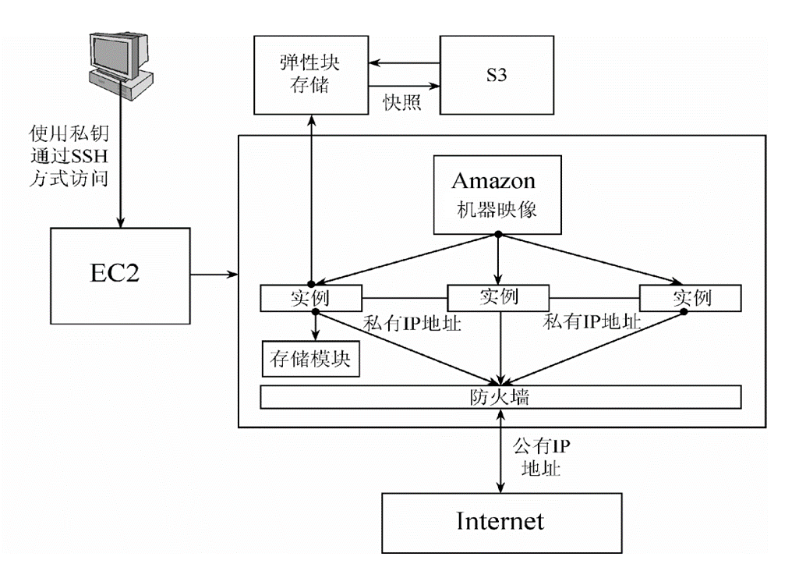

### 关键技术

#### Amazon机器映像（AMI）

AMI（Amazon Machine Image）是一个可以将用户的应用程序、配置等一起打包的加密机器映像

AMI是用户云计算平台运行的基础，用户使用EC2服务的第一步就是要创建一个自己的AMI 

Amazon提供的AMI有四种类型

（1）公共AMI：由亚马逊提供，可免费使用。

（2）私有AMI：用户本人和其授权的用户可以进入。

（3）付费AMI：向开发者付费购买的AMI。

（4）共享AMI：开发者之间相互共享的一些AMI。

#### 实例（Instance）

 用户创建好AMI后，实际运行的系统称为一个实例。

Amazon EC2 提供多种经过**优化**，适用于不同使用案例的实例类型以供选择。实例类型由 CPU、内存、存储和网络容量组成不同的组合，可让您灵活地为您的应用程序选择适当的资源组合。每种实例类型都包括一种或多种实例大小，从而使您能够扩展资源以满足目标工作负载的要求。 

- 通用：通用实例提供计算、内存和联网资源三方面的平衡，可用于各种不同的工作负载。这些实例非常适合于以相同比例使用这些资源的应用程序，如 Web 服务器和代码存储库。 

- 计算优化型：计算优化型实例非常适用于从**高性能处理器**获取的受计算限制的应用程序。属于此系列的实例非常适用于批处理工作负载、媒体转码、高性能 Web 服务器、高性能计算 (HPC)、科学建模、专用游戏服务器和广告服务器引擎、机器学习推理和其他计算密集型应用程序。

- 内存优化型：内存优化型实例旨在提高可处理内存中**大型数据集**的工作负载的性能。

- 加速计算：加速计算实例使用**硬件加速器**或**协同处理器**来执行**浮点数计算、图形处理或数据模式匹配**等功能，比使用在 CPU 上运行的软件更高效。
  其中有一个F1类型，提供FPGA

- 存储优化：存储优化型实例旨在用于需要对本地存储上的大型数据集进行高速连续读写访问的工作负载。它们经过了优化，每秒可以向应用程序交付数以万计的低延迟、随机 I/O 操作 (IOPS)。

#### 弹性块存储（EBS）

长期保存或比较重要的数据，需要用弹性块存储（Elastic Block Store，EBS），Amazon限制每个EBS最多创建20个卷（类似于移动硬盘） 
如果是实例的系统盘，那么在销毁实例之后，其对应的内容也会销毁，但是卷是长期的，可以挂载到实例上。

快照（Snapshot）：捕捉当前卷的状态，然后数据就可以被存储在S3中

#### 通信机制（弹性IP地址、公共IP、私有IP、弹性IP）

EC2服务中，系统各模块之间及系统和外界之间的信息交互是通过IP地址进行

- 公共IP地址（Public IP Address）

- 私有IP地址（Private IP Address）公共IP地址和私有IP地址通过NAT转换

- 弹性IP地址（Elastic IP Address）专为动态云计算设计的静态 IP 地址。借助 EIP，您可以快速将地址重新映射到您的账户中其他实例

弹性IP地址和**用户账号绑定**而不是和某个特定的实例绑定，这给系统的容错带来极大的方便，每个账号默认绑定5个弹性IP地址。

当系统正在使用的实例出现故障时，用户只需要将弹性IP地址通过网络地址转换技术转换为新实例所对应的私有IP地址，这样就将弹性IP地址与新的实例关联起来，**访问服务时不会感觉到任何差异** 

#### 弹性负载平衡（Elastic Load Balancing）

允许EC2实例自动分发应用流量，从而保证工作负载不会超过现有能力，并且在一定程度上支持容错

1. 更好地利用服务器集群
2. 具有一定的容错性

#### 监控服务（CloudWatch））

Amazon CloudWatch是一个Web服务，提供了AWS资源的可视化检测功能

包括EC2实例状态、资源利用率、需求状况、CPU利用率、磁盘读取、写入和网络流量等指标

Cloudwath可自动收集和存储监测数据；用户可通过AWS服务管理控制台和命令行工具来维护和处理这些监测数据

#### 自动缩放（AutoScaling）

自动缩放可以按照用户自定义的条件，自动调整EC2的计算能力 

#### 服务管理控制台（AWS Management Console）

服务管理控制台是一种基于Web的控制环境，可用于启动、管理EC2实例和提供各种管理工具和API接口 

#### 安全组

允许用户随时更新实例状态，用户可以随时加入或删除实例，实例状态的动态变化方便了用户，但是却给防火墙的配置带来了麻烦。

EC2引入了**安全组**（Security Group）概念

安全组其实就是一组规则，用户利用这些规则来决定哪些网络流量会被实例接受，其他则全部拒绝

一个用户目前最多可以创建100个安全组。当用户的实例被创建时，如果没有指定安全组，则系统自动将该实例分配给一个默认组（Default Group） 

- 安全组内部自由通信
- 非安全组访问会经过规则过滤
- 各个服务器的防火墙关闭，用安全组代替防火墙

#### SSH

SSH（Secure Shell）密钥对（Key Pair）来登录服务

密钥对的**名称（Key Pair Name）**和**公钥（Public Key）**储存在EC2中

用户创建新实例时，EC2会将它保存的信息复制一份放在实例的元数据（Metadata）中，然后用户使用自己保存的**私钥（Private Key）**就可以安全地登录EC2并使用相关服务

## 简单存储服务S3

### 相关概念介绍

S3是构建在Dynamo之上，采取的并不是传统的关系数据库存储方式

原因：

1. 使文件操作尽量简单、高效；
2. 使用关系数据库只会增加系统的复杂性

#### 对象

> 传统的文件系统元数据是属于文件系统的。

包含两部分

1. 数据（任意类型）
2. 元数据：描述数据的数据
   使用键值对来进行表示

S3默认的元数据：

| 元数据名称     | 名 称 含 义                                                  |
| -------------- | ------------------------------------------------------------ |
| last-modified  | 对象被最后修改的时间                                         |
| ETag           | 利用MD5哈希算法得出的对象值                                  |
| Content-Type   | 对象的MIME（多功能网际邮件扩充协议）类型，默认为二进制/八位组 |
| Content-Length | 对象数据长度，以字节为单位                                   |

#### 键

对象的唯一标识符

#### 桶

存储对象容器（最多创建100个桶，不限桶中数量）

### 与传统存储的区别

| 特征/属性        | Amazon S3                                               | 传统文件系统                     |
| ---------------- | ------------------------------------------------------- | -------------------------------- |
| 数据存储模型     | 对象存储                                                | 文件和目录                       |
| 数据访问         | HTTP协议、API、Web界面                                  | 本地文件路径、文件名             |
| 可扩展性         | 高度可扩展，自动管理存储容量                            | 受硬件限制，需要手动管理容量     |
| 数据冗余和可用性 | 复制数据至多个数据中心和可用区                          | 需要额外配置来实现冗余和可用性   |
| 数据一致性       | 最终一致性和强一致性选项                                | 通常提供强一致性，可能有性能开销 |
| 备份和恢复       | 自动备份和版本控制                                      | 需要手动设置备份和版本控制       |
| 访问控制         | 灵活的存储桶和对象级别权限控制                          | 通常基于操作系统级别的权限管理   |
| 数据管理         | 提供数据生命周期管理工具                                | 需要手动管理数据的生命周期       |
| 元数据           | 对象包含元数据                                          | 元数据属于文件系统               |
| 命名空间         | 扁平的存储结构，每个对象都有一个唯一的键（Key）来标识它 | 层次化结构                       |

### 基本操作

| 操 作 目标 | Get                  | Put            | List           | Delete   | Head           |
| ---------- | -------------------- | -------------- | -------------- | -------- | -------------- |
| 桶         | 获取桶中对象         | 创建或更新桶   | 列出桶中所有键 | 删除桶   | 无             |
| 对象       | 获取对象数据和元数据 | 创建或更新对象 | 无             | 删除对象 | 获取对象元数据 |

### 冗余存储

多个副本，保存在多个服务器上

- 优势：某些服务器出现故障时用户仍然可以对其数据进行操作

- 弊端：数据被充分传播到所有的存放节点之前返回给用户的仍是原数据
  （1）一个进程写入一个新的对象并立即尝试读取它，但在该改变被传送到S3的多个服务器前，服务器对该操作可能返回“键不存在”

  （2）一个进程写入一个新的对象并立即尝试列出桶中已有的对象，但在该改变被传送到S3的多个服务器前，该对象很可能不会出现在列表中

  （3）一个进程用新数据替换现有的对象并立即尝试读取它，但在该改变被传送到S3的多个服务器前，S3可能会返回以前的数据

  （4）一个进程删除现有的对象并立即尝试读取它，但在该改变被传送到S3的多个服务器前，S3可能会返回被删除的数据

  （5）一个进程删除现有的对象并立即尝试列出桶中的所有对象，但在该改变被传送到S3的多个服务器前，S3可能会列出被删除的对象 

弊端出现的原因：S3为了**保证用户数据的一致性**而采取的一种折中手段，即在数据被**充分传播到所有的存放节点之前**返回给用户的仍是**原数据**

### 安全措施 

#### 身份认证

基于HMAC-SHA1的数字签名方式来确定用户身份
HMAC-SHA1：一种安全的基于加密hash函数和共享秘钥的消息认证协议，可以有效**防止数据在传输过程中被截获和篡改**，维护了数据的完整性、可靠性和机密性。
一个加密的Hash函数、一个加密的随机秘钥和一个安全的秘钥交换机制。
Amazon用户：
Access Key ID：由字母和数字组成的20位的串，用来确定服务请求的发送者。
Secret Access Key：40位的字符串，参与数字签名过程，证明发送服务请求的账户的合法拥有者。

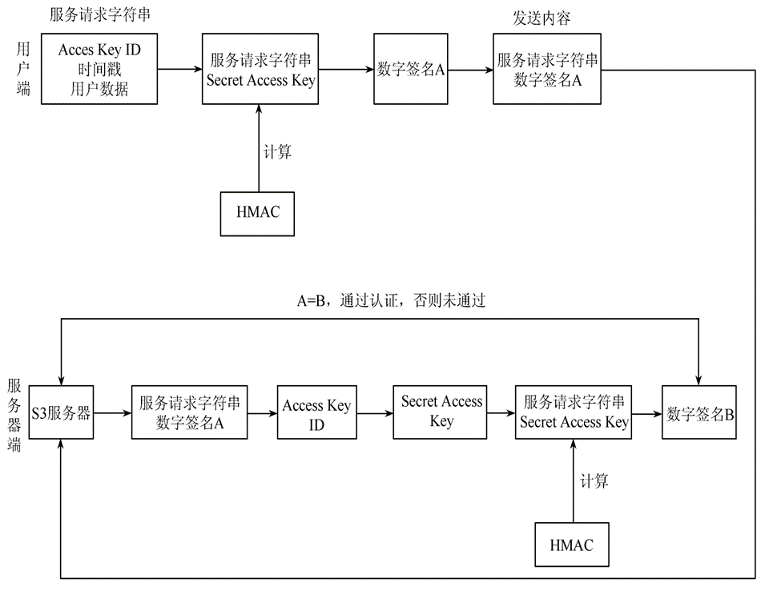

#### 访问控制列表

提供的可供用户自行定义的访问控制策略列表 。

1）所有者:桶或对象的创建者
2）个人授权用户：通过电子邮件地址授权、通过用户ID授权
3）组授权用户：

## 简单队列服务SQS （Simple Queue Service，SQS）

Amazon（低耦合系统）为解决其云计算平台之间**不同组件**的**高效安全的通信**而专门设计开发

### SQS由三个基本部分组成

#### 系统组件（Component）：SQS的服务对象，消息发送者、消息接受者

#### 队列（Queue）

**存放消息的容器**，类似于S3中的桶，队列的数目也是任意的，创建队列时用户必须给其指定一个在SQS账户内**唯一的名称** 

#### 消息（Message） 

消息是**发送者创建**的具有**一定格式**的**文本数据**，接收对象可以是一个或多个组件。

- 消息的大小是有限制的，目前Amazon规定每条消息不得超过8KB
- 但是消息的数量并未做限制 

消息的格式：

（1）消息ID（Message ID）
（2）接收句柄（Receipt Handle）
（3）消息体（Body）
（4）消息体MD5摘要（MD5 of Body）

消息的取样：

队列中的消息冗余存储，目的是为了保证系统的高可用性 。

基于加权随机分布（Based on a Weighted Random Distribution）的消息取样 

消息的可见性

计时器两种操作：扩展（Extend）和终止（Terminate） 

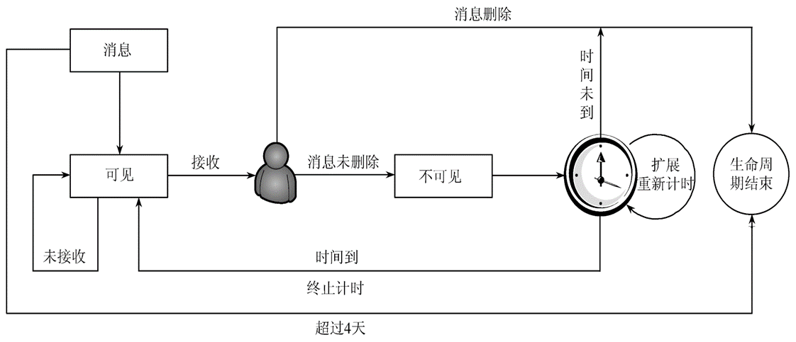

消息的安全性由数字签名保证，和S3的差不多

### 在AWS云中的作用

1. **消息传递**：SQS允许不同的组件和服务在分布式环境中相互通信，通过将消息放入队列和从队列中获取消息，实现异步通信。这使得不同部分的应用程序能够协同工作，无需直接依赖于彼此的可用性和性能。
2. **松耦合架构**：SQS帮助构建松耦合的架构，因为发送者和接收者之间没有直接的依赖关系。这意味着即使某个组件出现故障或不可用，消息仍然可以在队列中等待被处理，从而增加了系统的可靠性和弹性。
3. **扩展性**：SQS是高度可扩展的服务，能够处理大规模消息传递需求。它能够适应不断增长的消息量，而无需用户自行管理底层的消息传递基础设施。
4. **削峰填谷**：SQS还可用于处理突发流量。当应用程序面临突然的高负载时，消息队列可以充当缓冲区，暂时存储请求，以防止系统过载，然后逐渐处理这些请求。
5. **异步任务处理**：开发人员可以使用SQS来创建后台任务队列，以异步地处理一些耗时的工作，如图像处理、数据分析或批量处理。这提高了应用程序的响应速度，因为主要请求不会被这些耗时任务阻塞。
6. 我认为：用户也可以通过SQS来对AWS中的服务进行访问。

## 简单数据库服务Simple DB 

主要用于存储**结构化的数据**，并为这些数据提供**查找、删除**等**基本**的数据库功能。

### 组成结构、架构

1．用户账户（Customer Accout）

2．域（Domain）

 数据容器，具有一定关联关系的字符串容器
3．条目（Item）

一个实际的对象

4．属性（Attribute）

条目的特征 

5．值（Value）

 每个条目的某属性的具体内容，每个属性值的大小不能超过1KB

### 与传统数据库的区别

|            | SDB                                                          | 传统数据库                                         |
| ---------- | ------------------------------------------------------------ | -------------------------------------------------- |
| 数据模型   | 键-值存储的方式组织。这意味着您可以将数据视为一组项目（Items），每个项目都有一个唯一的标识符，称为项目名。每个项目可以包含多个属性（Attributes），而属性存储键值对数据。 | 数据以表格的形式存储                               |
| 无模式     | 可以随时向数据库添加新的域，而不需要在预定义的模式中进行更改。 | 预定义表格结构，并需要严格遵循模式。               |
| 扩展性     | 自动处理数据分区和负载均衡                                   | 扩展性方面可能需要更多的配置和管理工作             |
| 查询语言   | 执行一些基本查询，但不支持复杂的SQL查询                      | 支持更复杂和灵活的查询操作                         |
| 数据一致性 | 最终一致性模型，这意味着在写入数据后，不会立即在所有节点上可见，但最终会达到一致状态。 | 强一致性模型，写入操作在提交后立即对所有用户可见。 |

ØSDB数据库采用树状结构、最终一致性数据模型，每次操作设定了超时值，同时SDB也对关系数据库做了一些有益的改进，如多值属性

### 传统数据库可拓展性能力弱

1. **垂直扩展限制**：传统数据库通常是在单一服务器上运行的，因此其性能和容量受到硬件的限制。当数据库负载增加时，唯一的解决方案是垂直扩展，即升级服务器的硬件，如增加CPU、内存或存储容量。这种方式的扩展有限，因为硬件资源是有限的，而且成本高昂。
2. **难以水平扩展**：相对于垂直扩展，水平扩展是通过添加更多的服务器来增加系统的容量和性能。然而，传统数据库通常不容易实现水平扩展，因为它们的架构和数据模型往往不支持跨多个节点的数据分布和并行处理。这使得水平扩展变得复杂和昂贵。
3. **数据一致性和复杂性**：传统数据库强调强一致性，要求数据在写入和读取时保持一致。这会增加数据库的复杂性，并使其更难以水平扩展，因为在分布式环境中实现强一致性通常需要额外的开销和复杂的协调机制。

### 存在问题&解决方法

存在的问题

1. 支持的操作类型不够：不支持连接操作、对结果排序
2. 存储方式简单：以字符串存储，查询操作时取字典顺序，比较操作会有问题

**解决方式（对以字符串存储的数字进行优化）**

- 整数补零 
- 负整数集添加正向偏移量 
- ISO 8601对日期进行转换 

## 关系数据库服务RDS （包含NoSql内容）

### 相关原理

RDS—一种**云中的MySQL数据库系统**，采用集群方式将MySQL数据库移植到云中，在**一定的范围**内解决了关系数据库的**可扩展性**问题 。

MySQL集群采用了**Share-Nothing**架构 ：各个节点在处理数据时不共享硬件资源或存储

**可拓展性的实现方法：**

集群MySQL通过表单划分（Sharding）的方式将一张大表划分为若干个小表，分别存储在不同的数据库服务器上，从逻辑上保证了数据库**可扩展性**

集群MySQL通过主从备份和读副本技术提高可靠性和数据处理能力 

### Share-Nothing架构的特点

1. **分离的节点**：Share-Nothing架构中的每个节点都是相对独立的，它们不共享内存或存储资源。每个节点拥有自己的计算资源和存储，相互之间没有共享状态。
2. **水平扩展性**：这种架构可以轻松实现水平扩展，通过添加更多的节点来增加系统的容量和性能。节点的添加不需要共享状态或全局协调，因此非常容易扩展。
3. **容错性**：由于节点之间没有共享状态，因此一个节点的故障不会对其他节点产生影响。这提高了系统的容错性和可用性，因为故障节点可以被替换或隔离，而不会导致整个系统崩溃。
4. **并行处理**：由于每个节点都有自己的计算资源，因此Share-Nothing架构可以实现高度的并行处理。不同节点可以独立执行任务，从而提高了系统的性能和吞吐量。
5. **简化管理**：因为节点之间没有共享状态，所以系统管理变得相对简单。不需要复杂的数据同步或一致性协议，减少了管理和维护的复杂性。
6. **适用于大规模分布式系统**：Share-Nothing架构特别适用于大规模分布式系统，例如分布式数据库、云计算平台和大数据处理系统。它可以应对大量的数据和请求，同时保持高度的可扩展性和性能。

### SQL与NOSQL的比较

|            | sql                                                          | Nosql                                                    |
| ---------- | ------------------------------------------------------------ | -------------------------------------------------------- |
| 数据模型   | 严格约束                                                     | 无约束                                                   |
| 数据处理   | 一致性（C）     可用性（A）                                  | 可用（A）分区容忍性（P）                                 |
| 接口层     | SQL语言访问                                                  | API实现                                                  |
| 优势、劣势 | 高一致性，ACID能力非常强，移植性很高；但在可扩展性方面能力较弱 | 高可扩展性，并发处理能力强；缺乏数据一致性保证，查询困难 |

### Nosql保持一致性的方法

1. **分布式架构**：NoSQL数据库通常采用分布式架构，可以水平扩展，将数据存储在多个节点上。这使得它们能够处理大规模数据和高并发请求，而不受单一服务器性能的限制。
2. **数据分片**：NoSQL数据库将数据分成多个分片（shards），每个分片存储部分数据。这样可以均匀地分布负载，并允许添加新的分片来增加容量和性能。数据分片还有助于提高可用性，因为单个分片的故障不会影响整个系统。
3. **灵活的数据模型**：NoSQL数据库通常支持灵活的数据模型，如文档存储、键值存储、列存储和图数据库。这使得它们适用于不同类型的数据和应用程序需求。应用程序可以选择最适合其数据结构的数据库类型。
4. **弱一致性和最终一致性**：一些NoSQL数据库放宽了一致性要求，采用弱一致性或最终一致性，允许在分布式环境中更高的性能和可用性，而不需要严格的强一致性。这种权衡可以在处理大规模数据时提供更好的性能。
5. **自动数据分发和负载均衡**：NoSQL数据库通常具有自动数据分发和负载均衡功能，它们可以自动将数据和查询请求分发到适当的节点，以确保均匀的负载和最佳性能。
6. **无单点故障**：NoSQL数据库设计为无单点故障，通常在多个数据中心和可用区中进行数据复制，以提高可用性和数据冗余。

### RDS的使用方式

Amazon将RDS中的MySQL服务器实例称做DB Instance，通过基于**Web的API**进行创建和管理，其余的操作可以通过**标准的MySQL**通信协议完成 

可以通过两种工具对RDS进行操作

- 命令行工具：Amazon提供的Java应用套装，负责处理DB Instance的管理，比如创建、参数调整、删除等
- MySQL客户端：可以与MySQL服务器进行通信的应用程序，比如MySQL Administrator客户端

## CDN内容推送服务CloudFront

CloudFront——一个基于Amazon云计算平台实现的内容分发网络（Content Delivery Network，CDN）

### 原理、优点

①CDN通过将网站内容发布到靠近用户的边缘节点，②使不同地域的用户在访问相同网页时可以就近获取。

- 这样既可以减轻源服务器的负担
- 也可以减少整个网络中流量分布不均的情况，进而改善整个网络性能 

**以云服务方式提供，还具备下面的优点：**

1. 收费方式：和Amazon的其他云计算收费方式一样是按用户实际使用的服务来收费，这尤其适合那些资金缺乏的中小企业
2. 使用非常简单：只要配合S3再加上几个简单的设置就可以完成CDN的部署 

**CDN使用的技术有：**

1. 负载均衡技术
2. 分布式存储
3. 缓存技术

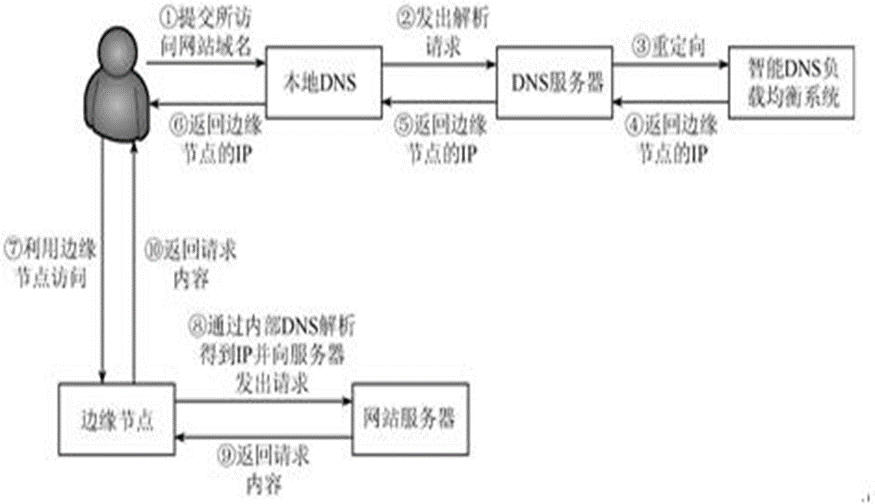

### 传统通过DNS解析直接访问的缺点

- 用户和内容提供商位于**网络的两端** 
- 网站服务器可以容纳的**访问量是有限**
- 没有考虑访问者的**地域问题**
- **不同网络服务提供商**服务的用户之间的互访速度也会受到限制 

### 基本概念

1．对象（Object）
利用CloudFront进行分发的任意一个文件（存储在S3中且公开可读）
 2．源服务器（Origin Server）
存储需要分发文件的位置，对CloudFront服务而言就是S3中的桶
 3．分发（Distribution）
CloudFront服务和源服务器之间建立一条通道
 4．别名指向（CNAME）
系统分配给用户域名的一个别名
 5．边缘节点位置（Edge Location）
实际的边缘节点服务器位置
 6．有效期（Expiration）
文件副本在边缘节点上的存放时间

### 安全措施

1. 可以开启访问日志，访问日志会记录所有通过CloudFront服务访问用户分发的文件的行为
2. 只接受安全的HTTPS方式而不接受HTTP方式进行访问

## 机器学习Amazon SageMaker

Amazon SageMaker 是一项**完全托管**的服务，支持开发人员和数据科学家**构建、训练和部署机器学习模型**。
Amazon SageMaker 包括三个模块：构建、训练和部署。

### 构建

- 构建模块提供了一个托管环境，用于处理用户的数据、进行算法实验和呈现输出结果。

#### 内置的高性能算法

**DeepAR**: 通过使用递归神经网络从很多相关的**时间序列中学习模式**来生成准确预测结果的一种算法。

**图像分类 (ResNet)**:一种常见神经网络，用于开发图像分类系统。

**K 均值聚类分析**: 一种最简单的 ML 算法。用于在未标记数据中查找群体。

**主成分分析 (PCA)**:该算法常用于数据预处理，可将一个表格或矩阵的多个特征整合为较少的典型特征。（位数缩减）

**随机森林**: 用于异常检测的自主机器学习算法。

**Seqence2Sequence**: 一种通用的文本编解码器，常用于机器翻译、文本摘要等。

#### 广泛的框架支持

Amazon SageMaker 自动配置和优化 TensorFlow 和 Apache MXNet，因此无需进行任何设置便可开始使用这些框架，而且Amazo们将在未来添加其他大型框架。当然，您始终可以将所需的任何框架添加到 Amazon SageMaker，方法是将其构建到您存储在 Amazon EC2 容器注册表中的 Docker 容器。 

### 训练

- 训练模块可实现大规模、低成本的一键式模型训练和优化。

**一键式训练：**当用户准备好在 Amazon SageMaker 中训练时

1. 只需指定数据在 Amazon S3 中的位置
2. 注明所需的 Amazon SageMaker ML 实例类型和数量
3. 然后在控制台中单击一下即可开始。

Amazon SageMaker 设置分布式计算集群、执行训练、将结果输出至 Amazon S3，然后在完成后销毁集群。

自动模型调整**Amazon SageMaker** 可以通过调整数千个不同的算法参数组合来校正模型，从而达到模型能够实现的最精准预测。

### 部署

- 部署模块提供了一个托管环境，便于用户托管和测试模型，以低延迟安全地执行推断。

#### 一键式部署 

可以跨多个可用区在自动扩展的 Amazon ML 实例上一键部署模型。只需指定实例类型以及所需的最小和最大数量，Amazon SageMaker 将负责其余工作。它将启动实例、部署模型并针对应用程序设置安全的 HTTPS 终端节点。应用程序只需为该终端节点提供 API 调用，即可实现低延迟/高吞吐量推理。借助此架构，可以在几分钟内将新模型集成到应用程序，这是因为模型变化不再要求应用程序代码随之变化。

#### 自动 A/B 测试 

Amazon SageMaker 还可以为管理模型 A/B 测试。用户可以配置终端节点以在多达五个不同模型上传输流量，然后设置每个模型处理的推断调用比例。可以随时更改所有设置、灵活地做实验，然后确定现实中哪个模型能够生成最精准的结果。

#### 完全托管与自动扩展 

Amazon SageMaker 能够代您管理生产计算基础设施以执行运行状况检查、应用安全补丁，并执行其他例行维护，以上操作均需通过内置的 Amazon CloudWatch 监控和日志记录功能实现。

## 网络适配器服务EFA (Elastic Fabric Adapter) 、MPI

弹性织物适配器（Elastic Fabric Adapter，EFA）是Amazon EC2实例的网络接口，允许在AWS上运行需要高级别节点间通信的应用程序。与以前在基于云的HPC系统中使用的TCP传输相比，EFA 提供更低的延迟和更高的吞吐量，提高了实例间通信的性能，这对于扩展HPC应用程序是至关重要的。

EFA可以用于扩展使用消息传递接口（MPI）的高性能计算（HPC）应用程序和使用Nvidia集合通信库（NCCL：Nvidia Collective multi-GPU Communication Library）的机器学习（ML）应用程序，使它们能够在数千个CPU或GPU上运行。因此，可以利用AWS云的按需弹性和灵活性来获得本地HPC集群的应用性能。

1. **免费启用**：EFA作为可选的EC2网络功能，可以在任何支持EC2的实例上免费启用。
2. **支持的实例类型**：EFA支持特定的EC2实例类型，包括c5n.18xlarge、i3en.24xlarge和p3dn.24xlarge等。

### MPI(Message Passing Interface)

Message Passing Interface，MPI是一种在**高性能计算领域**应用广泛的通信协议，旨在支持**并行编程**。它提供的功能允许在一组紧耦合的计算机上运行的进程以独立于语言的方式进行通信。

Libfabric：此库适用于几种不同类型的网络结构provider（包括EFA）和更高级别的库（如MPI）

### SRD协议（Scalable Reliable Datagram）

AWS Elastic Fabric中基于可扩展可靠数据报（SRD：Scalable Reliable Datagram）协议的QP(Queue Pair)传输服务。

1. 节省了QP数目
   大型集群在每个终端节点(endnode)上会运行大量进程，使用SRD可以显著地节省在大型集群中建立所有的进程连接所需的QP数量。
   - 使用传统RC传输服务（面向连接的可靠服务），每个终端节点上需实现完整的进程到进程连接所需的QP和连接上下文的数量，等于（N-1）XpXp（其中N是集群中节点的数量，p是每个节点上的进程数）。
   - 可靠数据报（RD）模型将上述场景中完全连接所需的QP数量减少到p，从而显著提高了大型多核节点集群解决方案的可扩展性。
2. 使用SRD，线路上的outstanding消息数量没有限制。（允许在通信线路上没有限制地存在大量未确认的消息）
3. SRD QP提供了无序传送的功能，这意味着消息可以以任意顺序传送，而不会因为消息的到达顺序不同而产生阻塞。这就避免了传统通信协议中可能出现的"head-of-line"阻塞问题，确保了消息能够按照其自身的速度传送和处理。
4. 每个SRD WR（**Work Request**）包括远程目标的AH（地址句柄），每个AH隐式地与一个SRD上下文相关联，SRD上下文用于向远程节点提供可靠的通信。SRD上下文由AH和QP管理操作隐式的控制。如果QP被销毁，则该QP上的所有待发送的WR会被隐式取消，并且它们的传输处理会被中止，但这些不影响其他WR的SRD处理。如果AH被销毁，那么使用该AH的任何outstanding WR都会发生错误。
5. 除了可靠性和保序性之外，SRD QP类型在请求端和响应端提供类似于UD的语义。每个工作请求包含AH，SRD会重传丢失的数据包，并且可以乱序地传送数据包。

**注：RD：可信数据报。UD：不可靠数据报**

#### 工作请求(WR)处理

1.队列对操作

(1) 提交(post)发送请求

对于SRD QP，提交发送请求与UD QP相同。

(2) 提交接收请求

对于SRD QP，提交接收请求与UD QP相同。

2.完成队列操作

 poll for completion

将send WR提交到SRD QP类似于将WR提交到常规的QP。

- 在响应者回应WR之后报告成功。
- 除了本地错误之外，还将为请求者返回新类型的远程错误（例如:目标QP不存在或处于错误状态，或者没有提交WR时，可能会导致这些错误），会使响应者发送带有丢弃指示的确认（ack）。这些错误不会影响SRD上下文状态或本地QP状态。

提交到SRD RQ的接收WR的完成与提交到UD RQ的WR相同。

> TMMD，说了一大段，就是和UD是一样的，凸(艹皿艹 )

## 其他Amazon云计算服务

### 快速应用部署Elastic Beanstalk

一种简化在AWS上部署和管理应用程序的服务。**用户只需上传自己的程序，系统会自动地进行**需求分配、负载均衡、自动缩放、监督检测等一些**具体部署细节**
Elastic Beanstalk虚拟机是一种运行Apache Web Server、Tomcat 和 the Enterprise Edition of the Java platform的AMI虚拟机

### 服务模板CloudFormation 

就是一个模版。。。。

AWS CloudFormation——为开发者和系统管理员提供一个**简化的、可视的AWS资源调用方式**。开发者可以直接利用CloudFormation提供的**模板**或自己创建的**模板**方便地建立自己的服务 
模板包含了AWS资源及相关的参数设置、应用程序的调用方式。用户不需要了解AWS的资源及其依赖关系，CloudFormation可以自动处理完成。

### DNS服务Router 53 

1. **传统DNS服务器**存在问题：域名对应IP地址变更传播非常缓慢

2. Router 53——管理DNS、处理DNS请求的全新AWS。该服务运行在Amazon的云中，提供了DNS授权服务器的功能，可以通过REST API进行访问，API允许用户创建管理区（Zone），并在区中保存DNS记录

   为了提供高可用、低延迟的DNS服务，Amazon在全球分布了多台服务器。Route53会把DNS请求路由到最近的服务器，以便快速地响应用户请求

### 虚拟私有云VPC 

旨在提供安全、可靠且可扩展的云计算网络环境。VPC允许用户在AWS云平台上**创建和配置自己的虚拟网络**，从而可以将云资源无缝连接到企业现有的基础设施（可以通过VPN（虚拟专用网络）或AWS Direct Connect来实现），实现混合云部署。

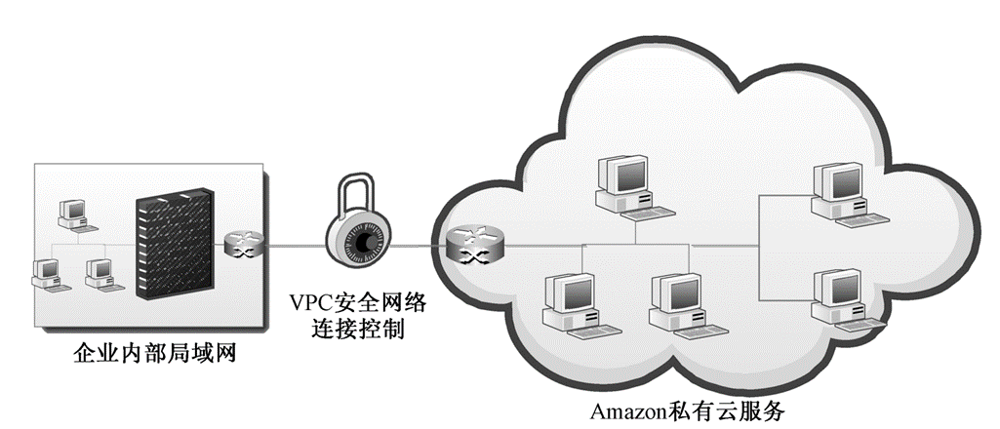

### 简单通知服务（Simple Notification Service，SNS）

**提供方便的信息发布平台，具有高的可扩展性和成本优势。**

 应用程序通过SNS发布消息，快速地传送给用户或其他应用程序开发人员。用户可以直接通过SNS创建高可靠的、事件驱动的工作流程和信息应用，使得通过网络进行大规模的计算和程序开发变得更容易。

  潜在用途：监控应用、工作流系统、事件敏感的信息更新、移动应用等

例如：
  1）运行在EC2上应用程序发布更新版，通过发布SNS信息，传递给其它应用程序和终端用户。
  2）用SNS作为SQS的传输协议，将SQS消息传递到消息队列，保证消息的传递和持久性。
  3）Amazon的SNS将整合到如Amazon S3和Simple DB的其他AWS服务中

### Amazon简单邮件服务（Simple Email Service，SES）

**一个简单的高扩展性和具有成本优势的电子邮件发送服务**

1. **消除了**建立企业内部电子邮件系统的**复杂性**。
2. 将**高效率、低成本**的优势转移到用户身上。
3. SES采用了**内容过滤技术**，有效地阻止垃圾邮件

### 弹性MapReduce服务 

通过在EC2上部署Hadoop实现了MapReduce的功能，Amazon将这项服务整合到AWS之中，为需要进行海量数据处理的用户提供了极大便利（把EC2和Hadoop进行整合，最终提供为一项服务）

- **弹性MapReduce的运行过程非常简单**，用户根本不需要考虑计算中涉及的服务器部署、维护及软件环境的配置，只需将精力集中在对数据的处理和研究中。 
- **可靠性、安全性：**子数据集被分发到多个从节点；允许用户对数据加密并通过安全的Https协议上传；实例被划分为两个安全组：主节点安全组和从节点安全组。

**任务流**——由一系列前后相关的处理过程组成，可以与线性链表的结构类比，除了第一个节点和最后一个节点，每个节点既是前一个节点的后继也是后一个节点的前驱，Amazon的弹性MapReduce将数据的实际计算过程都看成是**任务流中的某一个步骤**

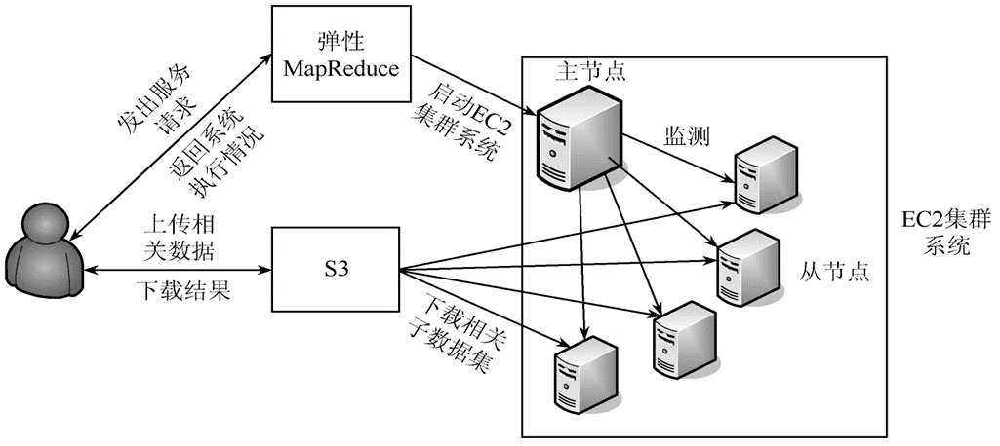

### 电子商务服务DevPay

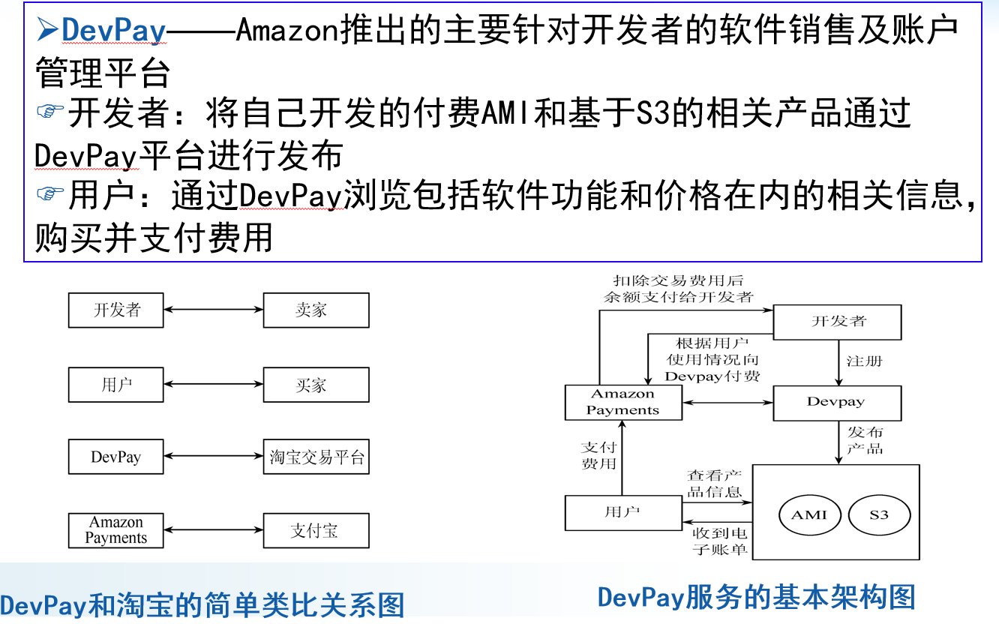

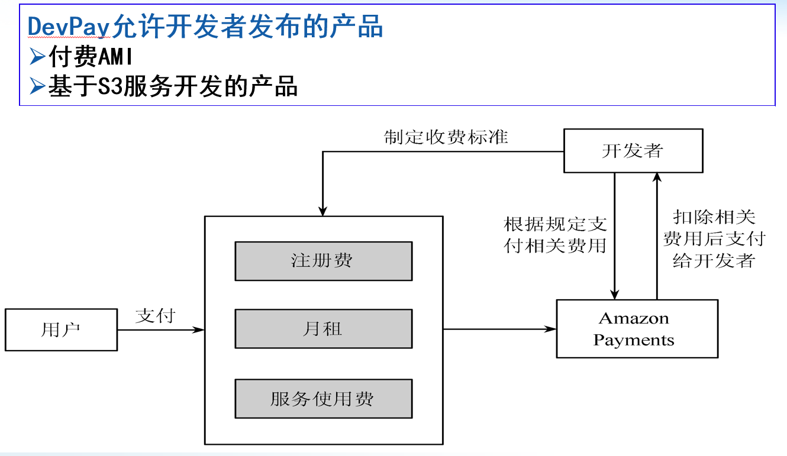

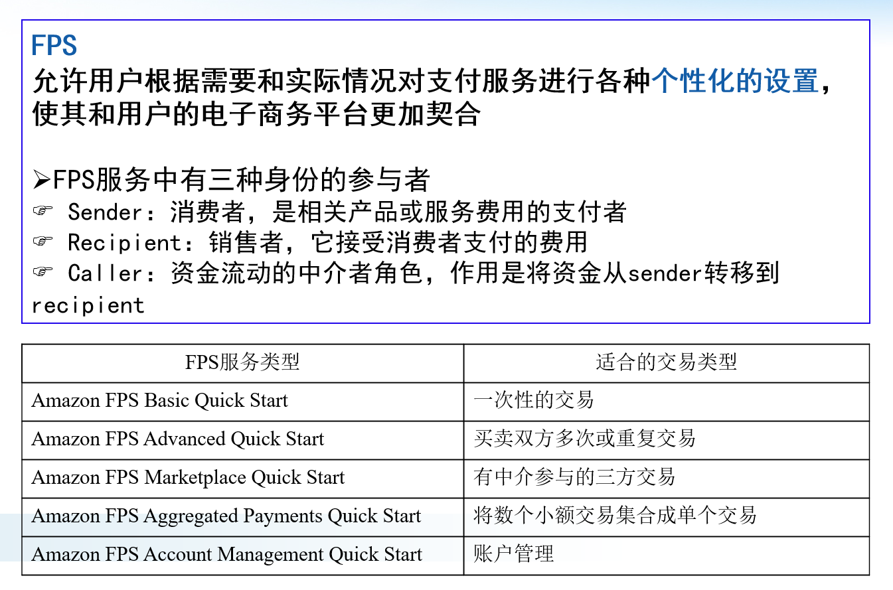

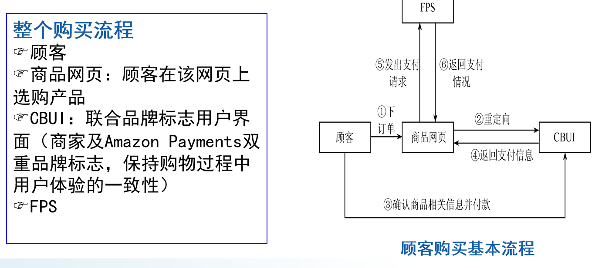

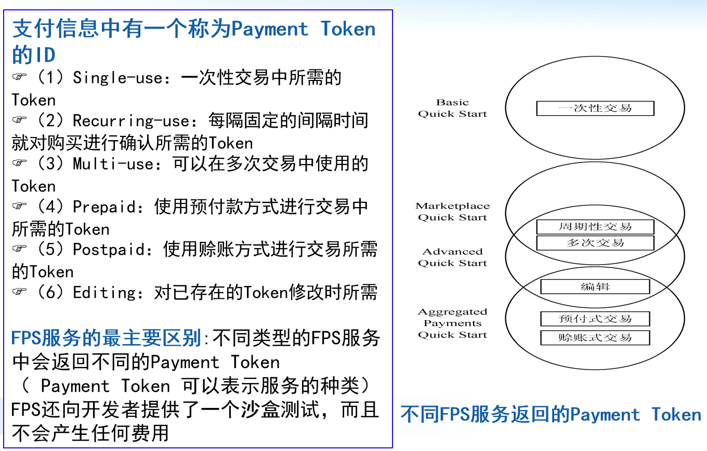

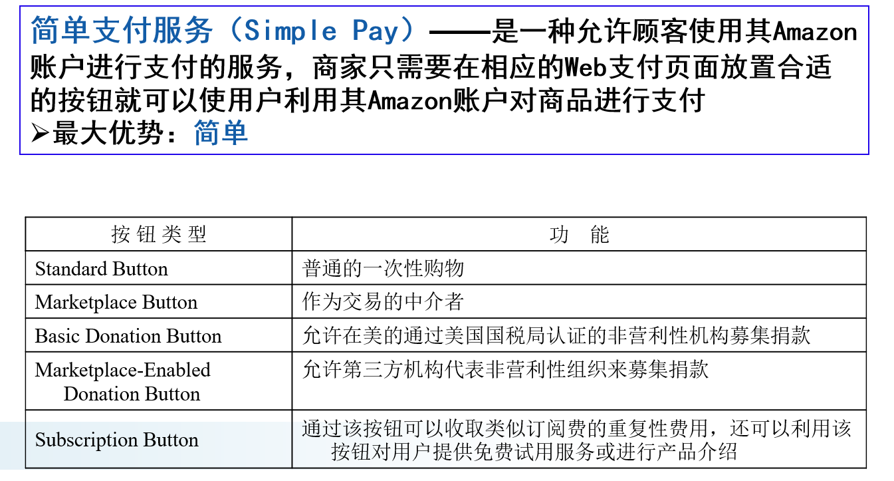

### 执行网络（Fulfillment Web Service，FWS）

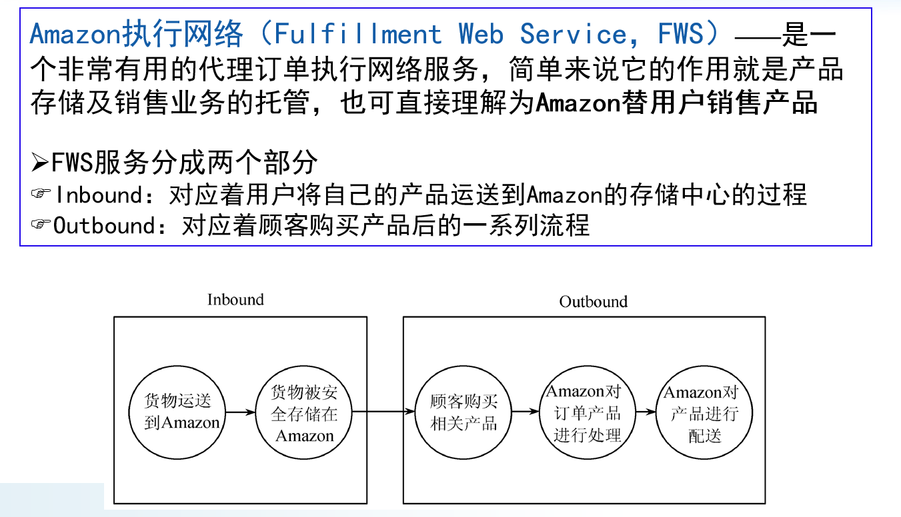

### 土耳其机器人 

土耳其机器人的推出就是为了解决计算机对写作、翻译等具有高度灵活性且无固定规律可循的任务则显得无能为力的问题。

主要概念
（1）Requester：任务的发布者
（2）HIT：Requester发布的任务
（3）Worker：任务的接受者
（4）Assignment：可以用来监督HIT的完成情况，对于每个Worker都会创建一个assignment。
（5）Reward：Worker成功完成HIT后需要支付给其的奖励 

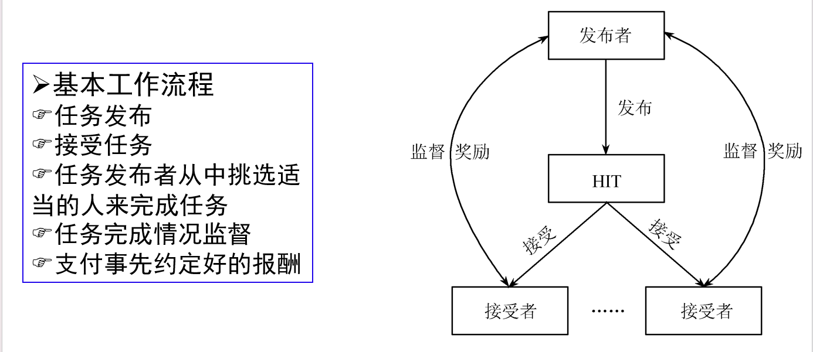

### Alexa Web服务 

Alexa Web服务是由Alexa公司提供的一项服务，旨在为用户提供关于全球网站排名和网站统计信息的数据。这项服务在1999年被Amazon收购，通过监测网民的浏览习惯和利用其发布的Alexa Toolbar来获取有关网站流量和排名的信息。

Alexa的主要作用包括以下几个方面：

1. **网站排名监测**：Alexa Web服务可以帮助用户监测和了解全球范围内网站的排名情况。这包括综合排名和分类排名，允许用户比较不同网站在其特定领域内的表现。
2. **网站流量统计**：通过Alexa的数据，用户可以获取有关网站的访问率、页面浏览数和用户行为等信息。这些统计数据对于网站所有者和市场营销人员来说非常有价值，可以帮助他们了解其目标受众和网站表现。
3. **排名因素分析**：Alexa不仅提供了排名数据，还通过引入更多排名因素来不断改进其排名算法。这可以帮助用户更准确地了解网站的排名背后的因素，而不仅仅是访问用户数和页面浏览数。
4. **市场竞争分析**：通过Alexa Web服务，用户可以比较自己的网站排名和流量与竞争对手的情况。这有助于制定市场策略和改进网站性能，以提高竞争力。
5. **趋势分析**：Alexa还可以提供有关网站排名和流量的趋势分析，用户可以跟踪网站在一段时间内的表现，以制定未来的发展计划。

## AWS应用实例  

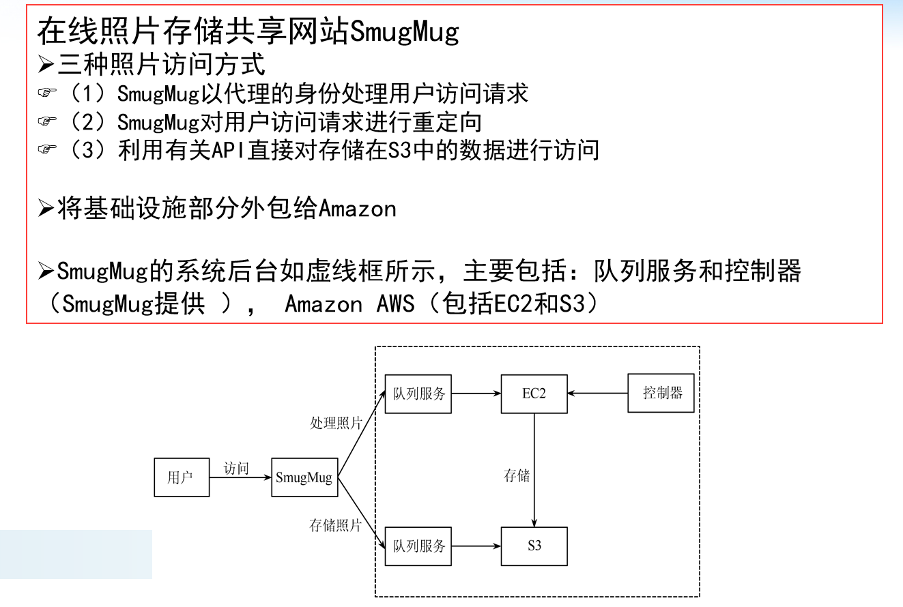

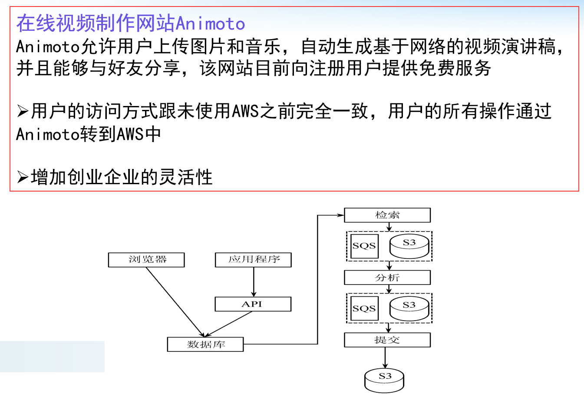

## 小结 

ØAmazon要保持其云计算领域的优势，只能通过两个途径：① 采用开放式的架构；② 提供更为丰富的云服务，满足用户的需求 

Ø**Dynamo****架构**是学习和掌握的重点。Dynamo是一个开放式的架构，开发者可以在其节点中使用其他的存储引擎，例如S3、SimpleDB、MySQL等其他存储系统 

Ø**Cassandra**是Dynamo和Bigtable的一种结合，对Dynamo感兴趣的可以继续学习Cassandra 

